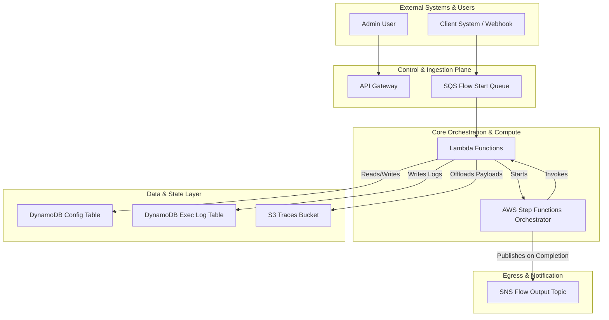

# Allma: The Serverless AI Orchestration Platform

<p align="center">
  
</p>

<h3 align="center">Build, execute, and manage complex, AI-powered workflows on a 100% serverless AWS stack.</h3>

<p align="center">
  <a href="https://github.com/ALLMA-dev/allma-core/stargazers"></a>
  <a href="URL_TO_DISCORD_INVITE"></a>
  <a href="https://docs.allma.dev"></a>
  <a href="https://github.com/ALLMA-dev/allma-core/blob/main/LICENSE"></a>
  <a href="URL_TO_CI_CD_PIPELINE"></a>
</p>

---

Allma is a serverless, event-driven platform designed to be a "digital factory" for your most complex business processes. It combines a visual flow editor, robust data integration, and first-class AI capabilities in a scalable and observable environment, allowing you to focus on your business logic, not your infrastructure.

### See Allma in Action

<p align="center">
  
  <em>A brief look at the visual editor, execution monitoring, and the 'Time Machine' debugger.</em>
</p>

## ✨ Why Allma? Key Features

Allma is built for developers who need to ship resilient, scalable, and observable AI-powered automations without the operational overhead.

| Feature                      | Description                                                                                                                                                                                                |
| ---------------------------- | ---------------------------------------------------------------------------------------------------------------------------------------------------------------------------------------------------------- |
| 🚀 **True Serverless Scale**         | Built on AWS Step Functions & Lambda. Scales from zero to millions of executions with no servers to manage. Pay-per-use model means you only pay for what you run.                                          |
| 🐛 **"Time Machine" Debugging**   | **Stateful Redrive** lets you restart a failed flow from any step with corrected data. **Sandbox Execution** lets you test a single step in isolation. Debug in seconds, not hours.                         |
| 🏛️ **Built-in Governance**       | Enforced `Draft` vs. `Published` lifecycle and immutable versioning for every Flow and Prompt. Safely develop and deploy changes with a full audit trail, just like Git.                               |
| 🤖 **First-Class AI Integration**    | Native `LLM_INVOCATION` step with multi-provider support (Bedrock, Gemini), versioned prompt templates, guaranteed JSON output mode, and built-in security validators.                                   |
| 🔌 **Extensible By Design**      | Use Allma as a central orchestrator. Call your own `CUSTOM_LAMBDA_INVOKE` functions to run proprietary code, or integrate with any service via the `API_CALL` step.                                         |
| 🔭 **Deep Observability**        | Get a detailed, step-by-step execution log for every run. Inspect the exact Input/Output context for every step and see precisely what changed with the **Context Diff Viewer**.                            |
|  parallelism **Massive Parallelism**        | Natively process millions of items from S3 using AWS Step Functions' Distributed Map. Ideal for large-scale data processing, enrichment, or batch AI inference tasks.                             |

## 🚀 Getting Started: Deploy in 5 Minutes

Deploy the core Allma backend to your AWS account in minutes using our `basic-deployment` example.

**1. Clone the Repository**
```bash
git clone https://github.com/ALLMA-dev/allma-core.git
cd allma-core
```

**2. Install Dependencies**
```bash
npm install
```

**3. Configure Your Deployment**
Navigate to the example project and edit the configuration file.
```bash
cd examples/basic-deployment
```
Open `config/allma.config.ts` and update the `awsAccountId`, `awsRegion`, and `aiApiKeySecretArn` with your own values.

**4. Deploy the Platform**
This command deploys the entire Allma backend stack to your AWS account.
```bash
npm run deploy
```

After a successful deployment, the CDK output will provide the URL for your Admin API endpoint.

For detailed instructions, including how to deploy the Admin UI and documentation site, please see the full [**Quick Start Guide**](https://docs.allma.dev/getting-started/quick-start).

## Core Concepts

*   **Flow**: A versioned, declarative JSON definition of a business process, designed in the visual editor.
*   **Step**: A single unit of work within a Flow, such as an `API_CALL` or `LLM_INVOCATION`.
*   **Context**: The central JSON object (`currentContextData`) that carries state and data throughout a Flow's execution.
*   **Mappings**: Powerful **JSONPath** expressions that let you shape and transform data as it moves between the Context and each Step.

For a deeper dive, check out our [**Full Documentation**](https://docs.allma.dev).

## 🏛️ Architecture Overview

Allma is built entirely on a serverless-first AWS stack, ensuring scalability, resilience, and minimal operational overhead.


*For a detailed breakdown, see the [Architecture Design Document](docs.allma.dev/docs/community/architecture-deep-dive).*

## 💬 Community & Support

Join the community to ask questions, share your projects, and shape the future of Allma.

*   💬 **Discord:** [Join our Discord Server](URL_TO_DISCORD_INVITE) for live discussions with the community and team.
*   🐞 **Bug Reports:** [Submit a GitHub Issue](https://github.com/ALLMA-dev/allma-core/issues/new/choose) to report bugs or problems.
*   💡 **Feature Requests:** [Start a Discussion](https://github.com/ALLMA-dev/allma-core/discussions/new?category=ideas) to propose new features and ideas.

## 🤝 Contributing

We welcome contributions of all kinds! Whether you're fixing a bug, improving documentation, or adding a new feature, your help is appreciated.

Please read our [**CONTRIBUTING.md**](CONTRIBUTING.md) guide to learn about our development process, how to propose bugfixes and improvements, and how to build and test your changes.

## 📜 License

Allma is licensed under the [Apache 2.0 License](https://github.com/ALLMA-dev/allma-core/blob/main/LICENSE).
