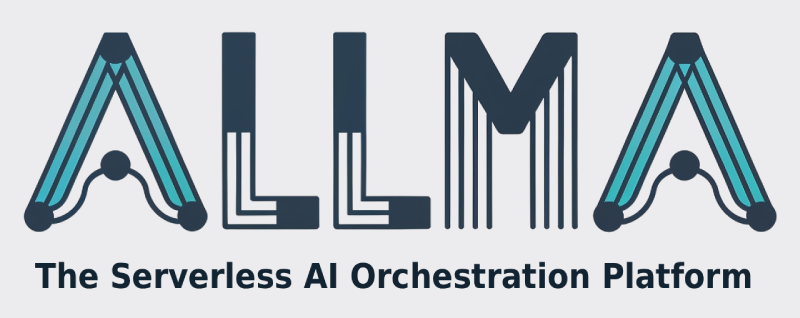
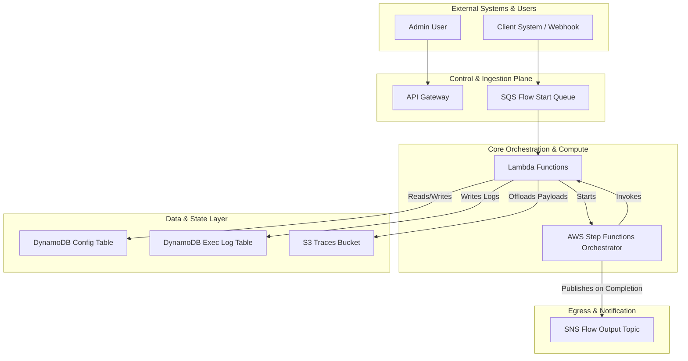

# Allma: The Serverless AI Orchestration Platform

<p align="center">
  
</p>


<h3 align="center">Build, execute, and manage complex, AI-powered workflows on a 100% serverless AWS stack.</h3>

<p align="center">
  <a href="https://github.com/ALLMA-dev/allma-core/stargazers"></a>
  <a href="https://www.npmjs.com/package/@allma/core-cdk"></a>
  <a href="https://docs.allma.dev"></a>
  
  
  <a href="https://github.com/ALLMA-dev/allma-core/blob/main/LICENSE"></a>
  <a href="https://github.com/ALLMA-dev/allma-core/actions/workflows/ci.yml"></a>
</p>

---

**Allma is an open-source, 100% serverless orchestration engine for AI workflows that runs entirely in your own AWS account** — built on AWS Step Functions + Lambda, written in TypeScript. Build, version, and debug LLM-powered flows in a visual editor, with time-travel debugging and immutable versioning baked in. No servers to manage, and no third-party vendor ever in your data path.

### See Allma in Action

<!-- TODO(demo): record a 30–60s screen capture (visual editor → flow executing → Time Machine debugger)
     and drop it at assets/img/allma-demo.gif, then uncomment the block below.
     Shot-by-shot script: .growth/demo-video-script.md
<p align="center">
  
</p>
-->
<p align="center">
  <a href="https://docs.allma.dev/getting-started/quick-start"><strong>▶ Watch the walkthrough</strong></a><br/>
  <em>Visual editor · live execution monitoring · the "Time Machine" debugger.</em>
</p>

## ✨ Why Allma? Key Features

Allma is built for developers who need to ship resilient, scalable, and observable AI-powered automations without the operational overhead.

| Feature                      | Description                                                                                                                                                                                                |
| ---------------------------- | ---------------------------------------------------------------------------------------------------------------------------------------------------------------------------------------------------------- |
| 🚀 **True Serverless Scale**         | Built on AWS Step Functions & Lambda. Scales from zero to millions of executions with no servers to manage. Pay-per-use model means you only pay for what you run.                                          |
| 🐛 **"Time Machine" Debugging**   | **Stateful Redrive** lets you restart a failed flow from any step with corrected data. **Sandbox Execution** lets you test a single step in isolation. Debug in seconds, not hours.                         |
| 🏛️ **Built-in Governance**       | Enforced `Draft` vs. `Published` lifecycle and immutable versioning for every Flow and Prompt. Safely develop and deploy changes with a full audit trail, just like Git.                               |
| 🤖 **First-Class AI Integration**    | Native `LLM_INVOCATION` step with multi-provider support (Bedrock, Gemini), versioned prompt templates, guaranteed JSON output mode, and built-in security validators.                                   |
| 🔌 **Extensible By Design**      | Use Allma as a central orchestrator. Call your own `CUSTOM_LAMBDA_INVOKE` functions to run proprietary code, or integrate with any service via the `API_CALL` step.                                         |
| 🔭 **Deep Observability**        | Get a detailed, step-by-step execution log for every run. Inspect the exact Input/Output context for every step and see precisely what changed with the **Context Diff Viewer**.                            |
|  parallelism **Massive Parallelism**        | Natively process millions of items from S3 using AWS Step Functions' Distributed Map. Ideal for large-scale data processing, enrichment, or batch AI inference tasks.                             |

## 🤔 How is Allma different?

There are great tools for durable execution and for LLM orchestration. Allma sits at the
intersection almost none of them own cleanly: **AWS-native, fully serverless, visual, and
running entirely in your own account.**

| | **Allma** | Raw AWS Step Functions | Trigger.dev / Inngest | LangChain / LlamaIndex |
| --- | :---: | :---: | :---: | :---: |
| Runs in **your own** AWS account | ✅ | ✅ | ⚠️ managed by default | ✅ (library) |
| Fully serverless, no infra to run | ✅ | ✅ | ⚠️ | ❌ you host it |
| Visual flow editor | ✅ | ⚠️ generic, not AI-aware | ❌ | ❌ |
| Native LLM step + versioned prompts | ✅ | ❌ | ⚠️ in code | ✅ code-first |
| Time-travel debugging (stateful redrive + sandbox) | ✅ | ❌ | ⚠️ replays | ❌ |
| Immutable Draft / Published governance | ✅ | ❌ | ❌ | ❌ |
| No third-party vendor in the data path | ✅ | ✅ | ❌ | ✅ |
| Primary language | TypeScript | JSON / ASL | TypeScript | Python / JS |

<sub>Comparison reflects each project's default posture; Trigger.dev and Inngest both offer
self-hosting, and competitor capabilities evolve — verify for your use case.</sub>

## 🚀 Getting Started: Deploy in 5 Minutes

Allma deployments are consumer-driven: `@allma/core-cdk` exports the `AllmaStack` construct, which consumer applications instantiate and deploy into their own AWS accounts. Deploy the core Allma backend using our `basic-deployment` consumer example.

> **Just want to look first?** You don't need an AWS account to evaluate Allma. Watch the
> [walkthrough](https://docs.allma.dev/getting-started/quick-start) and skim the
> [Key Concepts](https://docs.allma.dev/getting-started/key-concepts/flows-and-steps) to see
> how flows, steps, and the Time Machine debugger work before you deploy anything.

The deploy below needs an AWS account, an account ID + region, and a secret ARN for your
AI provider key — budget ~15 minutes the first time.

**1. Clone the Repository**
```bash
git clone https://github.com/ALLMA-dev/allma-core.git
cd allma-core
```

**2. Install Dependencies**
```bash
npm install
```

**3. Configure Your Deployment**
Navigate to the consumer example project and edit the configuration file.
```bash
cd examples/basic-deployment
```
Open `config/allma.config.ts` and update the `awsAccountId`, `awsRegion`, and `aiApiKeySecretArn` with your own values.

**4. Deploy the Platform**
This command deploys the entire Allma backend stack to your AWS account from the consumer app.
```bash
npm run deploy
```

After a successful deployment, the CDK output will provide the URL for your Admin API endpoint.

For detailed instructions, including how to deploy the Admin UI and documentation site, please see the full [**Quick Start Guide**](https://docs.allma.dev/getting-started/quick-start).

## Core Concepts

*   **Flow**: A versioned, declarative JSON definition of a business process, designed in the visual editor.
*   **Step**: A single unit of work within a Flow, such as an `API_CALL` or `LLM_INVOCATION`.
*   **Context**: The central JSON object (`currentContextData`) that carries state and data throughout a Flow's execution.
*   **Mappings**: Powerful **JSONPath** expressions that let you shape and transform data as it moves between the Context and each Step.

For a deeper dive, check out our [**Full Documentation**](https://docs.allma.dev).

## 🏛️ Architecture Overview

Allma is built entirely on a serverless-first AWS stack, ensuring scalability, resilience, and minimal operational overhead.


```mermaid
graph TD
    subgraph "External Systems & Users"
        AdminUser[Admin User]
        ClientSystem[Client System / Webhook]
    end
    subgraph "Control & Ingestion Plane"
        APIGW[API Gateway]
        SQSQueue[SQS Flow Start Queue]
    end
    subgraph "Core Orchestration & Compute"
        SFN[AWS Step Functions Orchestrator]
        LambdaCompute[Lambda Functions]
    end
    subgraph "Data & State Layer"
        ConfigDDB[DynamoDB Config Table]
        LogDDB[DynamoDB Exec Log Table]
        S3Bucket[S3 Traces Bucket]
    end
    subgraph "Egress & Notification"
        SNSTopic[SNS Flow Output Topic]
    end

    AdminUser --> APIGW
    ClientSystem --> SQSQueue
    SQSQueue --> LambdaCompute -- Starts --> SFN
    SFN -- Invokes --> LambdaCompute
    LambdaCompute -- Reads/Writes --> ConfigDDB
    LambdaCompute -- Writes Logs --> LogDDB
    LambdaCompute -- Offloads Payloads --> S3Bucket
    SFN -- Publishes on Completion --> SNSTopic
```
*For a detailed breakdown, see the [Architecture Design Document](docs.allma.dev/docs/community/architecture-deep-dive).*

## 💬 Community & Support

Join the community to ask questions, share your projects, and shape the future of Allma.

*   🐞 **Bug Reports:** [Submit a GitHub Issue](https://github.com/ALLMA-dev/allma-core/issues/new/choose) to report bugs or problems.
*   💡 **Feature Requests:** [Start a Discussion](https://github.com/ALLMA-dev/allma-core/discussions/new?category=ideas) to propose new features and ideas.

## 🤝 Contributing

We welcome contributions of all kinds! Whether you're fixing a bug, improving documentation, or adding a new feature, your help is appreciated.

**Ways to contribute:**

*   🌱 **Start small:** Pick up a [`good first issue`](https://github.com/ALLMA-dev/allma-core/labels/good%20first%20issue) — these are scoped for newcomers.
*   🛠️ **Take on more:** Browse [`help wanted`](https://github.com/ALLMA-dev/allma-core/labels/help%20wanted) issues that are ready for implementation.
*   📖 **Improve the docs:** The documentation site lives in [`docs.allma.dev/`](docs.allma.dev/) — typo fixes and clearer guides are always welcome.
*   💡 **Share an idea:** Propose a feature or ask a question in [GitHub Discussions](https://github.com/ALLMA-dev/allma-core/discussions).
*   ⭐ **Spread the word:** If Allma is useful to you, a star helps others find it.

Please read our [**CONTRIBUTING.md**](CONTRIBUTING.md) guide to learn about our development process, how to propose bugfixes and improvements, and how to build and test your changes.

## 📜 License

Allma is licensed under the [Apache 2.0 License](https://github.com/ALLMA-dev/allma-core/blob/main/LICENSE).
