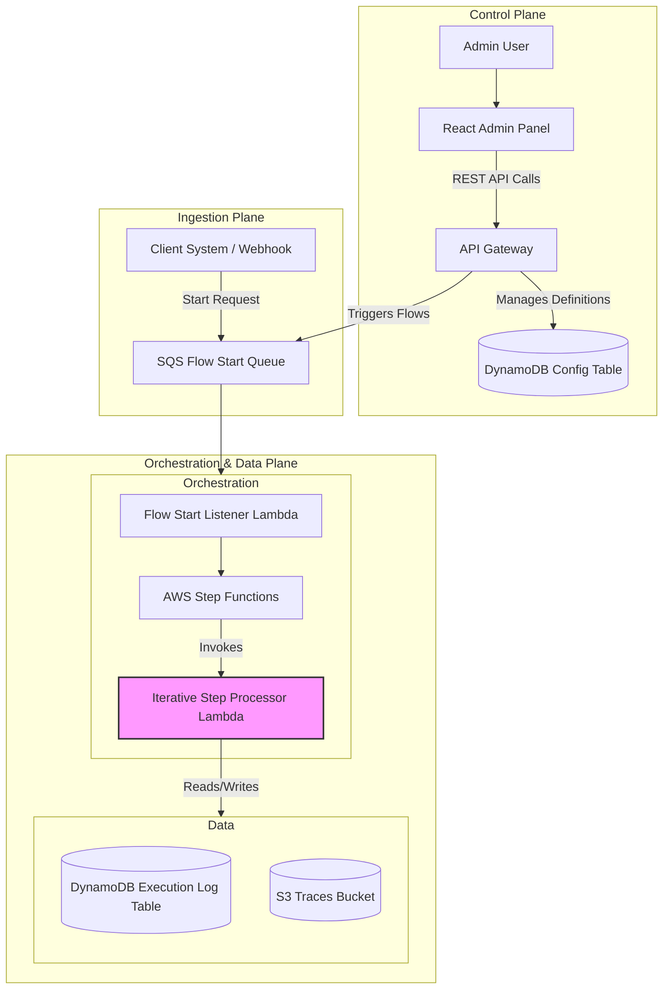
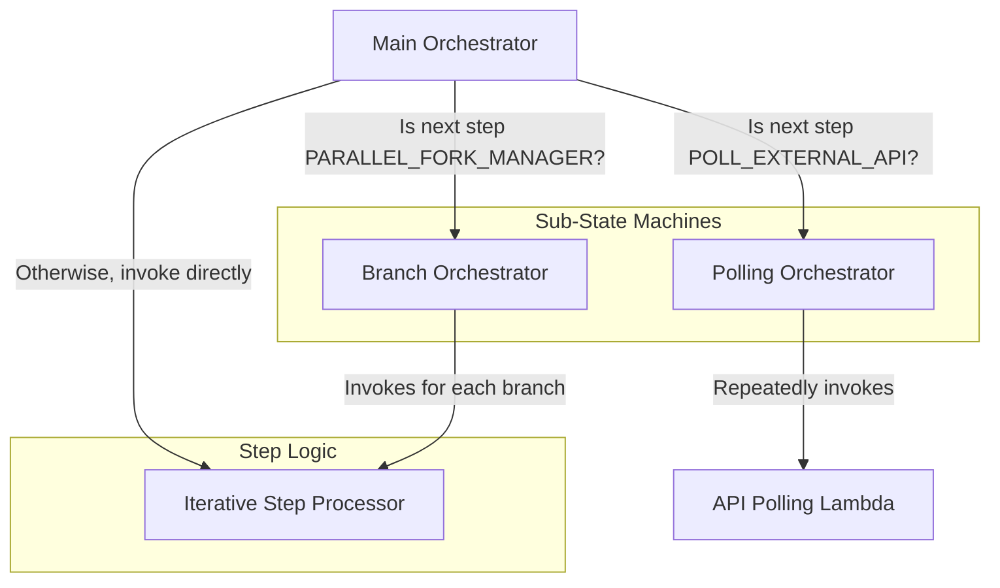

# Architecture Deep Dive

Welcome to the engine room. This document explains how Allma works under the hood. Understanding our serverless, event-driven architecture is key for advanced contributors who want to modify the core platform, add major features, or debug complex issues.

Allma is built entirely on a **serverless-first** AWS stack using the **AWS Cloud Development Kit (CDK)**. This choice is deliberate: it ensures massive scalability, high availability, and minimal operational cost, allowing developers to focus on business logic, not infrastructure management.

## The Big Picture: Planes of Operation

It's helpful to think of Allma's architecture in three distinct planes:

1.  **Control Plane:** The user-facing entry point. This includes the Admin Panel UI and the Admin API (API Gateway & Cognito) where users define and manage Flows.
2.  **Ingestion Plane:** The mechanism for starting a flow execution. This is a durable SQS queue that decouples start requests from the core orchestration engine.
3.  **Orchestration & Data Plane:** The heart of Allma. This is where AWS Step Functions, Lambda functions, and DynamoDB tables work together to execute the defined business logic.



## Lifecycle of a Flow Execution

Let's trace a single execution from start to finish. This journey reveals how the components interact.

1.  **Request:** A message arrives on the **`AllmaFlowStartRequestQueue`**. This message is a JSON object matching the `StartFlowExecutionInput` schema, specifying the `flowDefinitionId` and initial data.
2.  **Initiation:** The **`FlowStartRequestListenerLambda`** polls the queue. Upon receiving a message, it starts a new execution of the main **`AllmaFlowOrchestrator` Step Function**, passing the message body as input.
3.  **Initialization (`InitializeFlowLambda`):** The first state in the Step Function invokes the `initialize-flow.ts` Lambda. This function:
    *   Loads the specified `FlowDefinition` from the `AllmaConfigTable`.
    *   Constructs the initial `FlowRuntimeState` object, which includes the `currentContextData` and sets the `currentStepInstanceId` to the flow's start step.
    *   Initiates logging by writing a "metadata" record to the `AllmaFlowExecutionLogTable`.
4.  **The Loop (The `IterativeStepProcessorLambda`):** This is the core worker of the entire platform. The Step Function now enters a loop, repeatedly invoking `iterative-step-processor/index.ts`. In each invocation, this Lambda:
    *   Loads the configuration for the `currentStepInstanceId` from the `FlowDefinition`.
    *   **Prepares Input:** Applies `inputMappings` to map data from `currentContextData` into a clean input object for the step handler. It transparently resolves any S3 pointers during this process.
    *   **Executes Logic:** Looks up the correct step handler (e.g., `llm-invocation-handler`, `api-call-handler`) and executes it.
    *   **Processes Output:** Takes the output from the step handler, applies `outputMappings`, and merges the result back into `currentContextData`. It offloads large outputs to S3 to avoid Step Function payload limits.
    *   **Determines Next Step:** Evaluates `transitions` and the `defaultNextStepInstanceId` to decide the next `currentStepInstanceId`.
    *   Returns the updated `FlowRuntimeState` to the Step Function.
5.  **Continuation:** The Step Function inspects the returned state. If `currentStepInstanceId` is still present, it loops back and invokes the `IterativeStepProcessorLambda` again.
6.  **Finalization (`FinalizeFlowLambda`):** When the `IterativeStepProcessorLambda` returns a state where `currentStepInstanceId` is `undefined`, the flow path is complete. The Step Function transitions to the final state, invoking `finalize-flow.ts`. This function:
    *   Updates the main execution log record with the final status (`COMPLETED` or `FAILED`).
    *   Executes any `onCompletionActions` defined in the flow (e.g., sending an SNS notification, calling a final webhook).

## Key Design Patterns & Why They Matter

### Single-Table Design in DynamoDB

Allma uses a single DynamoDB table (`AllmaConfigTable`) for all configuration data. This is a deliberate choice for performance and scalability.

-   **Primary Key (PK):** `ENTITY_TYPE#<entityId>` (e.g., `FLOW_DEF#<flowId>`)
-   **Sort Key (SK):** `METADATA` for the master record, or `VERSION#<versionNumber>` for a specific version.

**Why?** This allows us to fetch related data in a single, efficient query. For example, to load a Flow in the Admin UI, we can query for `PK = FLOW_DEF#<flowId>` to get both the metadata (latest version, published version) and a list of all available versions at once. This is implemented in the generic `VersionedEntityManager` service.

```typescript title="packages/allma-core/logic/src/allma-admin/services/versioned-entity.service.ts"
// Simplified example of fetching versions
async listVersions(id: string): Promise<Partial<TVersion>[]> {
    const { pk } = this.getKeys(id);
    const { Items } = await ddbDocClient.send(new QueryCommand({
        TableName: CONFIG_TABLE_NAME,
        KeyConditionExpression: 'PK = :pk AND begins_with(SK, :skPrefix)',
        ExpressionAttributeValues: { ':pk': pk, ':skPrefix': 'VERSION#' },
        // ... projections
    }));
    return (Items || []) as Partial<TVersion>[];
}
```

### Specialized Orchestration with Sub-State Machines

Complex patterns like polling and parallel execution are handled by dedicated sub-state machines, keeping the main orchestrator clean.



-   **`PollingOrchestrator`:** A simple loop that calls the `APIPollingLambda` and waits, checking exit conditions on each iteration. This isolates long-running polling logic from the main flow.
-   **`BranchOrchestrator` & `Distributed Map`:** The `PARALLEL_FORK_MANAGER` step triggers AWS Step Functions' powerful Map state. For smaller arrays, it runs an in-memory map. For massive datasets specified via an S3 manifest, it uses the **Distributed Map** feature to process millions of items in parallel across a fleet of Lambda functions, achieving immense scale.

### The "Smart" Data Mapper & Payload Offloading

A core challenge in stateful orchestration is the 256KB payload limit between states. Allma solves this transparently.

-   **Offloading:** The `@allma/core-sdk` contains an `offloadIfLarge` utility. Before returning data, a step handler passes its output through this function. If the payload is too large, it's automatically saved to the S3 `traces` bucket, and a small pointer object (`{ "_s3_output_pointer": { ... } }`) is returned instead.
-   **Hydration:** The `prepareStepInput` function in `data-mapper.ts` uses a "smart" resolver, `getSmartValueByJsonPath`. When traversing a JSONPath for an input mapping, if it encounters an S3 pointer object, it automatically fetches the real data from S3 before continuing.

This means flow designers rarely need to think about payload size; the system handles it for them.

This architecture provides a powerful foundation for building complex, scalable, and resilient AI-powered workflows. By understanding these core concepts, you're well-equipped to contribute to and extend the Allma platform.