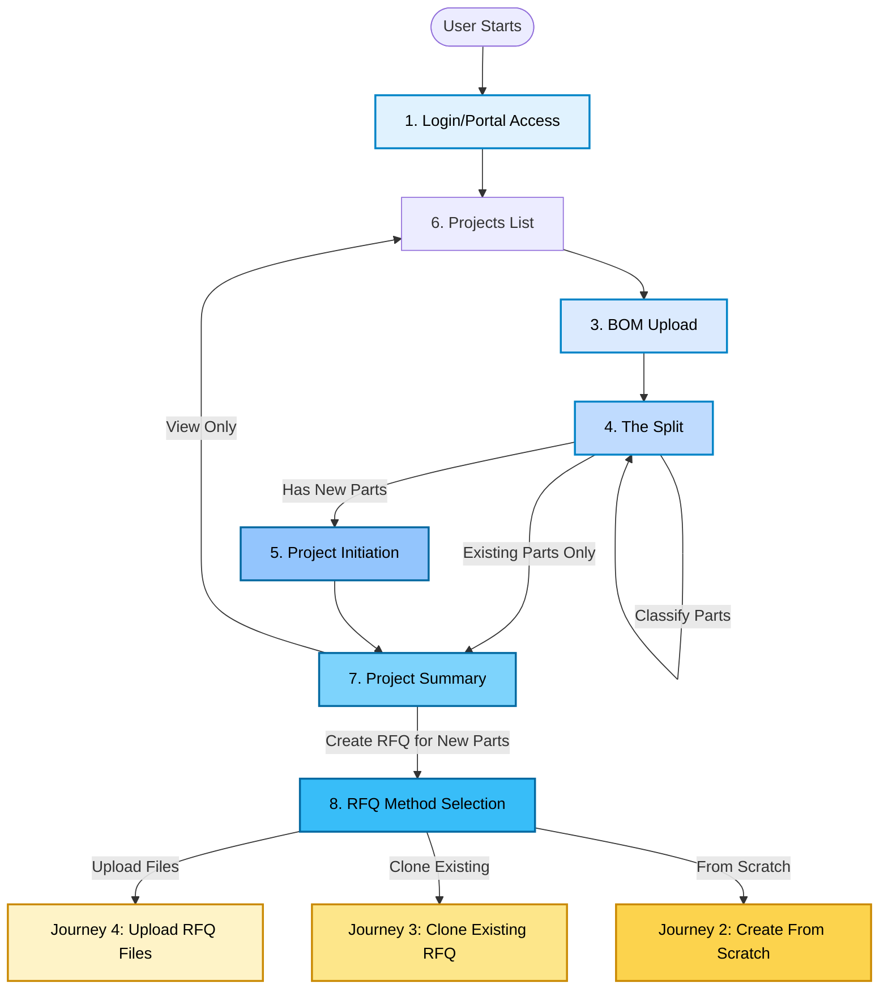
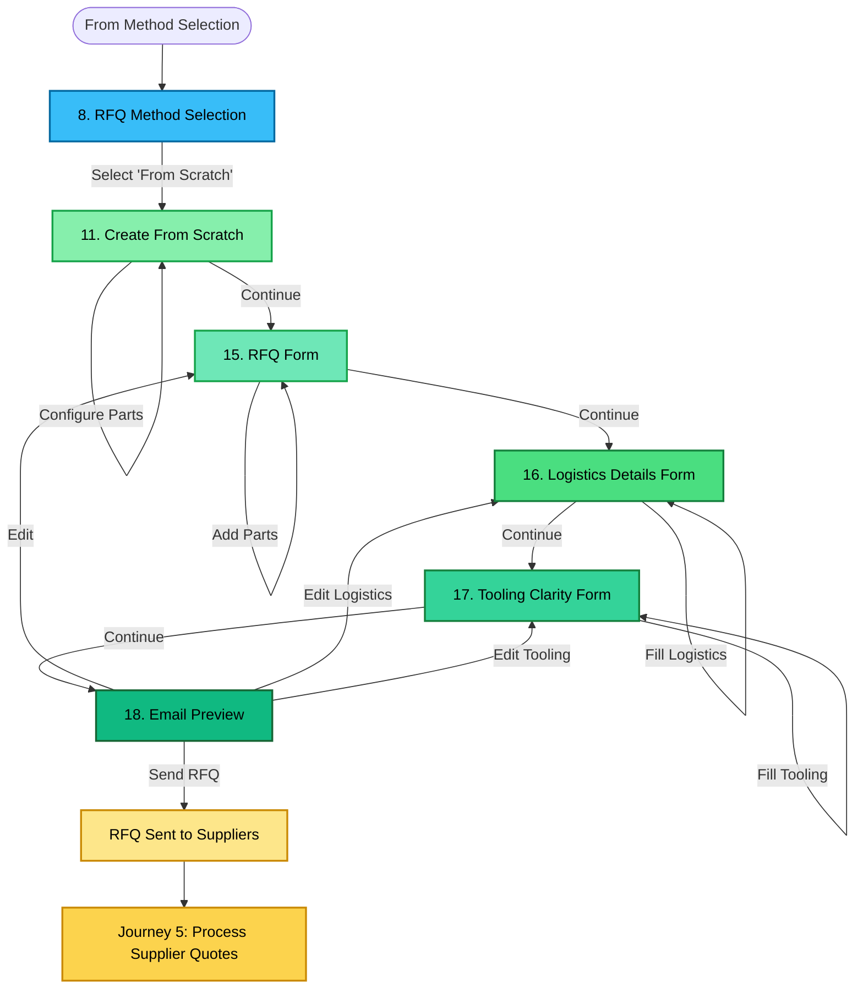
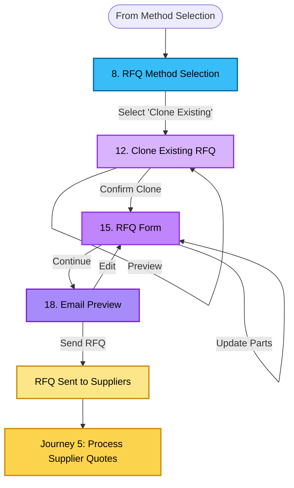
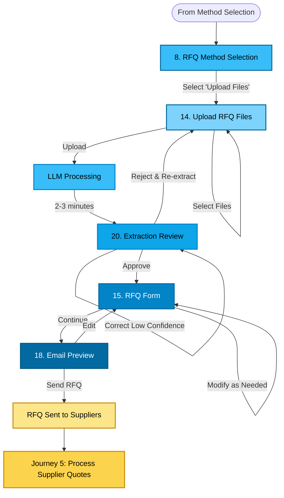
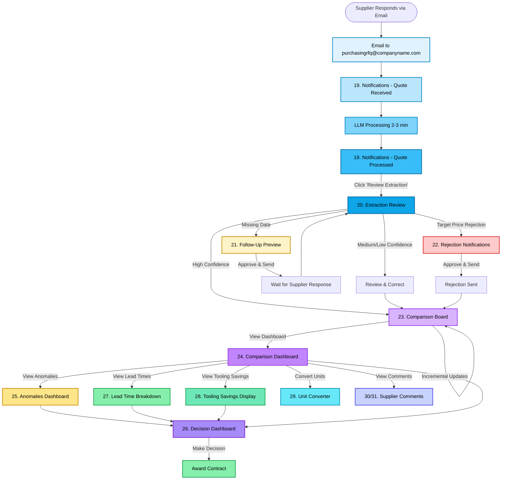
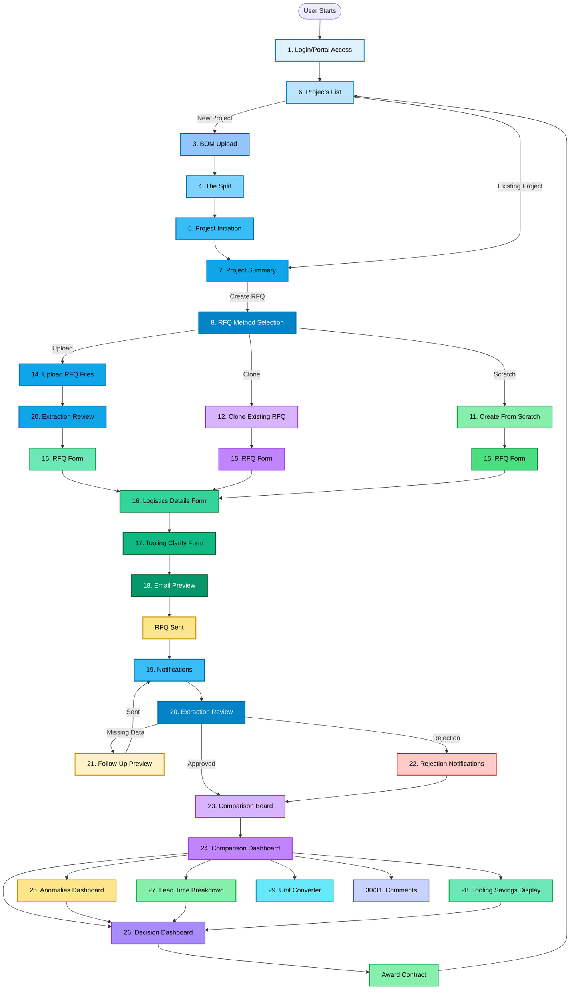

# User Journey Diagrams

**Document Version:** 1.0  
**Date:** January 2, 2026  
**Purpose:** Visual representation of all user journeys through the Optiroq MVP

---

## Overview

This document provides comprehensive Mermaid diagrams for all five primary user journeys in the Optiroq MVP. These diagrams visualize the complete flow from login to decision-making, showing all screens, decision points, and navigation paths.

**Journey Coverage:**
1. Journey 1: BOM to RFQ (Project Initialization)
2. Journey 2: Create RFQ from Scratch
3. Journey 3: Clone Existing RFQ
4. Journey 4: Upload RFQ Files
5. Journey 5: Process Supplier Quotes

---

## Journey 1: BOM to RFQ (Project Initialization)

**Purpose:** Upload BOM, classify parts, initialize project, and start RFQ creation

**Key Screens:** 1 → 6 → 3 → 4 → 5 → 7 → 8 → [9/11/14]

**Description:** This journey represents the complete project initialization workflow, starting from login and ending with RFQ method selection. It includes the critical "The Split" step where parts are classified as existing or new.

**Key Decision Points:**
- **The Split:** Parts classified as existing vs new
- **Project Summary:** View only vs create RFQ
- **Method Selection:** Choose RFQ creation method

**Time Estimate:** 10-15 minutes (including BOM upload and classification)

---

## Journey 2: Create RFQ from Scratch

**Purpose:** Manually create RFQ using step-by-step wizard

**Key Screens:** 8 → 11 → 15 → 16 → 17 → 18 → Send

**Description:** This journey is for creating completely new RFQs with unique requirements. Users manually enter all information through a guided wizard with dynamic field management.

**Key Features:**
- Dynamic field selection from Master List
- Multi-part RFQ support
- Step-by-step wizard
- Preview before sending

**Time Estimate:** ~5 minutes

---

## Journey 3: Clone Existing RFQ

**Purpose:** Duplicate previous RFQ with modifications (60-70% time savings)

**Key Screens:** 8 → 12 → 15 → 18 → Send

**Description:** Most popular method (60-70% usage). Users select a previous RFQ, modify as needed, and send. Pre-filled fields save significant time.

**Key Features:**
- Search and filter previous RFQs
- Pre-filled fields from original RFQ
- Modify suppliers, parts, requirements
- 60-70% time savings vs from scratch

**Time Estimate:** ~3 minutes

---

## Journey 4: Upload RFQ Files

**Purpose:** AI auto-fills RFQ form from existing documents (PPT, Excel, PDF)

**Key Screens:** 8 → 14 → 20 → 15 → 18 → Send

**Description:** Users upload existing RFQ documents, LLM extracts data, buyer reviews and corrects extractions, then sends RFQ.

**Key Features:**
- Multi-format support (PPT, Excel, PDF)
- LLM extraction with confidence scoring
- Side-by-side review (original vs extracted)
- Correction workflow for low confidence

**Time Estimate:** ~4 minutes (including extraction review)

---

## Journey 5: Process Supplier Quotes

**Purpose:** Receive, extract, validate, compare, and decide on supplier quotes

**Key Screens:** 19 → 20 → [21/22] → 23 → 24 → 25 → 26 → Decision

**Description:** Complete quote processing workflow from email notification to decision-making. Includes automatic extraction, quality control, anomaly detection, and comparison.

**Key Features:**
- Two-stage email notifications (received + processed)
- Automatic extraction with confidence scoring
- Immediate quality control (follow-up/rejection)
- Incremental comparison board updates
- Multi-dimensional analysis (anomalies, lead times, tooling)
- Comprehensive decision support

**Time Estimate:** 5-10 minutes per supplier (mostly automated)

---

## Complete System Flow (All Journeys Combined)

**Purpose:** Show how all journeys interconnect in the complete system

---

## Journey Comparison Matrix

| Journey | Entry Point | Key Screens | Decision Points | Time Estimate | Usage % |
|---------|-------------|-------------|-----------------|---------------|---------|
| **1. BOM to RFQ** | Login | 1→6→3→4→5→7→8 | The Split, Method Selection | 10-15 min | 100% (first time) |
| **2. From Scratch** | Method Selection | 8→11→15→16→17→18 | Field Selection, Parts Config | ~5 min | 10-20% |
| **3. Clone Existing** | Method Selection | 8→12→15→18 | RFQ Selection, Modifications | ~3 min | 60-70% |
| **4. Upload Files** | Method Selection | 8→14→20→15→18 | Extraction Review, Corrections | ~4 min | 20-30% |
| **5. Process Quotes** | Email Notification | 19→20→[21/22]→23→24→25→26 | Review, Follow-up/Reject, Decision | 5-10 min/supplier | 100% |

---

## Screen Usage Frequency

Based on user journeys, here's how often each screen is used:

**Every Journey:**
- Screen 1: Login/Portal Access (100%)
- Screen 6: Projects List (100%)
- Screen 18: Email Preview (100% for RFQ creation)
- Screen 19: Notifications (100% for quote processing)

**High Frequency (60%+):**
- Screen 8: RFQ Method Selection (100% for RFQ creation)
- Screen 12: Clone Existing RFQ (60-70%)
- Screen 15: RFQ Form (100% for RFQ creation)
- Screen 20: Extraction Review (100% for quote processing)
- Screen 23: Comparison Board (100% for quote processing)
- Screen 24: Comparison Dashboard (100% for quote processing)
- Screen 26: Decision Dashboard (100% for quote processing)

**Medium Frequency (20-60%):**
- Screen 3: BOM Upload (first-time projects)
- Screen 4: The Split (first-time projects)
- Screen 5: Project Initiation (first-time projects)
- Screen 7: Project Summary (project reviews)
- Screen 14: Upload RFQ Files (20-30%)
- Screen 16: Logistics Details Form (100% for RFQ creation)
- Screen 17: Tooling Clarity Form (100% for RFQ creation)
- Screen 21: Follow-Up Preview (when data missing)
- Screen 22: Rejection Notifications (when target price exceeded)
- Screen 25: Anomalies Dashboard (when anomalies detected)

**Low Frequency (<20%):**
- Screen 2: Buyer Profile (profile updates)
- Screen 11: Create From Scratch (10-20%)
- Screen 13: Clone Project (rare)
- Screen 27: Lead Time Breakdown (detailed analysis)
- Screen 28: Tooling Savings Display (detailed analysis)
- Screen 29: Unit Converter (manual conversions)
- Screen 30/31: Supplier Comments (collaboration)

---

## Navigation Patterns

### Primary Navigation Paths

**Linear Progression:**
- BOM Upload → The Split → Project Initiation → Project Summary
- RFQ Form → Logistics Form → Tooling Form → Email Preview
- Notifications → Extraction Review → Comparison Board → Decision Dashboard

**Branching Points:**
- **Method Selection:** 3 paths (Upload, Clone, Scratch)
- **Extraction Review:** 3 paths (Approve, Follow-up, Reject)
- **Comparison Dashboard:** 5 analysis screens (Anomalies, Lead Time, Tooling, Units, Comments)

**Return Paths:**
- Email Preview → RFQ Form (edit)
- Extraction Review → Upload Files (re-extract)
- Any screen → Projects List (via header logo)

### Navigation Depth

**Shallow (1-3 screens):**
- Login → Projects List → Project Summary

**Medium (4-6 screens):**
- Method Selection → Clone → RFQ Form → Email Preview → Send

**Deep (7+ screens):**
- Login → BOM Upload → The Split → Project Init → Project Summary → Method Selection → Upload → Extraction Review → RFQ Form → Email Preview → Send

---

## Key Insights

### Time Savings

**Manual vs Automated:**
- **Manual RFQ Creation:** ~5 minutes (from scratch)
- **Cloning RFQ:** ~3 minutes (60% time savings)
- **Upload Files:** ~4 minutes (20% time savings)
- **Manual Quote Entry:** ~45 minutes per supplier
- **Automated Extraction:** ~3 minutes per supplier (93% time savings)

**Total Time Savings:**
- Per RFQ: 2-3 minutes (cloning vs scratch)
- Per Quote: ~42 minutes (automated vs manual)
- Per Project (5 suppliers): ~210 minutes (3.5 hours)

### User Preferences

**RFQ Creation Methods:**
- Clone Existing: 60-70% (most popular)
- Upload Files: 20-30%
- From Scratch: 10-20%

**Rationale:**
- Buyers typically work with same suppliers and requirements
- Cloning pre-fills most fields, requires minimal changes
- Upload useful when existing documents available
- From Scratch for completely new projects

### Critical Decision Points

**The Split (Screen 4):**
- Determines which parts need RFQs
- Existing parts skip RFQ creation
- New parts proceed to RFQ workflow

**Method Selection (Screen 8):**
- Determines RFQ creation path
- Impacts time and effort required
- Most users choose Clone (60-70%)

**Extraction Review (Screen 20):**
- Determines quote processing path
- High confidence → Comparison Board
- Low confidence → Review & Correct
- Missing data → Follow-up
- Target price exceeded → Rejection

**Decision Dashboard (Screen 26):**
- Final decision point
- Award contract to supplier
- Completes entire workflow

---

## Document History

| Version | Date | Author | Changes |
|---------|------|--------|---------|
| 1.0 | Jan 2, 2026 | Kiro | Initial user journey diagrams created |

