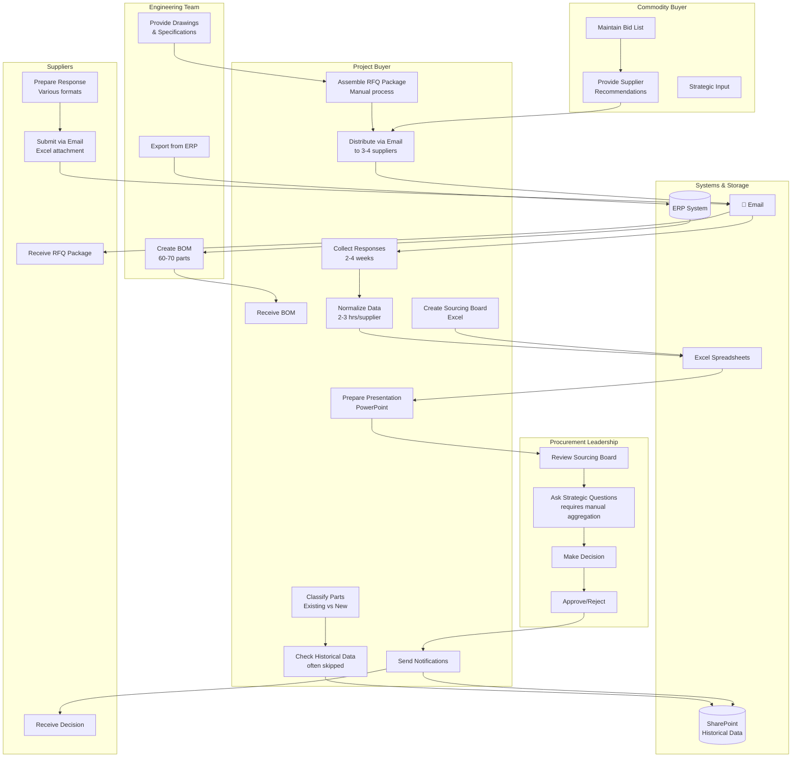
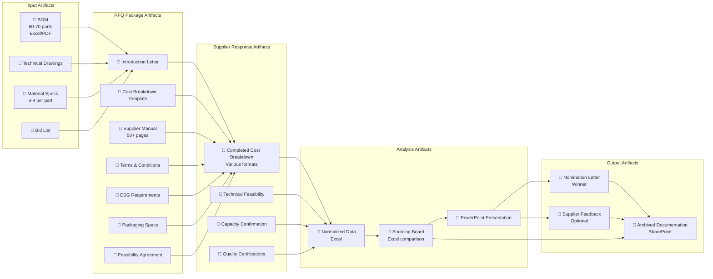
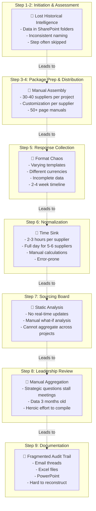
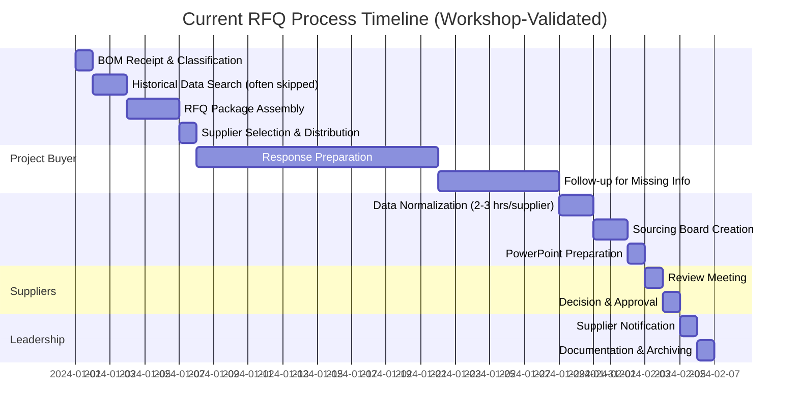
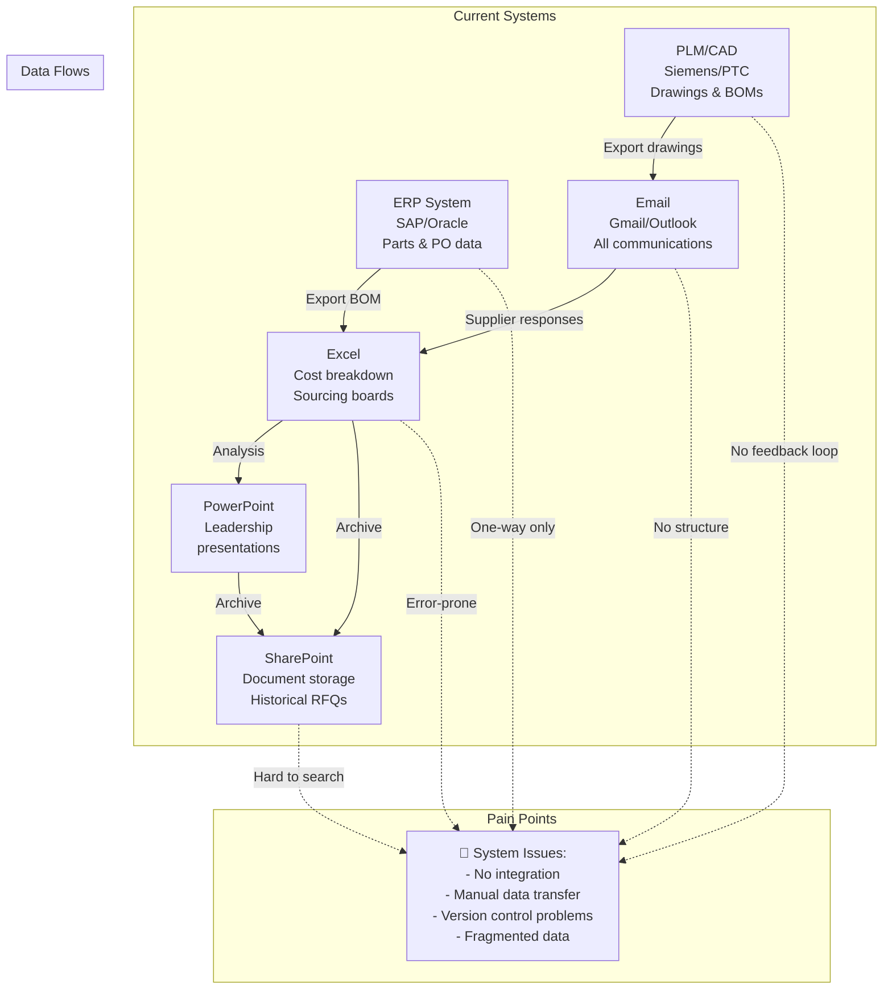

# Product Requirements Document: Optiroq RFQ Platform

**Document Version:** 1.0  
**Date:** December 24, 2024  
**Product Focus:** Request for Quotation (RFQ) Process Automation

---

## Document Purpose

This Product Requirements Document (PRD) focuses exclusively on **product development requirements** for the Optiroq RFQ platform. It contains:
- Current process flows and workflows (workshop-validated)
- User personas and use cases
- Functional and technical requirements
- MVP scope and prioritization
- User experience specifications

**For business strategy, market analysis, and competitive positioning**, see: `Business_Strategy_Document.md`

---

## IMPORTANT NOTICE: Data Sources

All process descriptions, workflows, and pain points in this document are based on workshop discussions with procurement professionals (December 2024). These insights are workshop-validated and represent actual current-state practices in manufacturing procurement organizations.

---

## Table of Contents

1. User Personas & Use Cases
2. Functional Requirements
3. Technical Architecture & AI Integration
4. MVP Scope & Prioritization
5. User Experience & Interface Design

---

## 1. User Personas & Use Cases

### Why This Matters

Effective product design begins with deep understanding of the people who will use the system and the jobs they need to accomplish. The Optiroq platform serves a diverse set of stakeholders, each with distinct goals, workflows, and success criteria. This section defines five primary personas and six core use cases that will drive product requirements and design decisions.

Understanding these personas is critical because procurement is fundamentally a collaborative process. A sourcing decision involves coordination between project buyers, commodity buyers, engineering teams, and leadership—each bringing different expertise and priorities. The platform must serve all these stakeholders while maintaining a coherent, efficient workflow.

### 1.1 Primary Personas

#### Persona 1: Sarah Chen - Project Buyer (New Product Introduction)

**Background:**
Sarah is a 32-year-old project buyer at a Tier 1 automotive supplier, responsible for sourcing components for new vehicle platforms. She has a bachelor's degree in supply chain management and 6 years of procurement experience. Sarah manages 4-6 active projects simultaneously, each with 40-80 parts to source across multiple commodity categories.

**Daily Workflow:**
Sarah's day starts with checking project timelines and upcoming milestones. She receives BOMs from engineering teams, coordinates with commodity buyers on supplier selection, prepares and distributes RFQ packages, follows up with suppliers on missing information, normalizes cost data from responses, and prepares sourcing recommendations for leadership review. She's constantly juggling competing priorities and tight deadlines.

**Goals:**
- Complete RFQs quickly to meet project timelines (target: 3-4 weeks from BOM receipt to sourcing decision)
- Identify cost-saving opportunities, especially on existing parts included in new projects
- Evaluate enough suppliers to ensure competitive pricing (ideally 6-8 per commodity)
- Make defensible sourcing decisions backed by solid data and analysis
- Build strong relationships with strategic suppliers

**Pain Points:**
- Spends 40-50% of time on manual data entry and normalization instead of strategic analysis
- Can only realistically Evaluate 3-4 suppliers per RFQ due to manual workload
- Lacks visibility into historical pricing and supplier performance
- Misses renegotiation opportunities on existing parts because historical data is hard to access
- Struggles to identify cost anomalies without manually checking market indices
- Feels reactive rather than strategic, constantly chasing information

**Technology Comfort:**
High. Sarah is comfortable with Excel, ERP systems, and email. She's frustrated by clunky enterprise software and appreciates consumer-grade user experiences. She's open to AI-powered tools if they demonstrably save time and improve decision quality.

**Success Criteria:**
- Reduce time spent on data normalization by 60-70%
- Evaluate 2x more suppliers per RFQ without increasing workload
- Identify and capture 80%+ of existing part renegotiation opportunities
- Have confidence that sourcing decisions are based on complete, accurate data
- Receive positive feedback from leadership on sourcing recommendations

**Quote from Workshop:**
"I know I should be negotiating harder and Evaluating more suppliers, but I'm so buried in Excel work that I'm just trying to get through each RFQ without making mistakes. Strategic sourcing feels like a luxury I can't afford."

---

#### Persona 2: Marcus Weber - Commodity Buyer (Strategic Sourcing)

**Background:**
Marcus is a 45-year-old commodity buyer responsible for the aluminum category at a global industrial equipment manufacturer. He has 18 years of procurement experience and deep expertise in aluminum sourcing, supplier capabilities, and market dynamics. Marcus manages a bid list of 25 aluminum suppliers across Europe, Asia, and North America.

**Daily Workflow:**
Marcus spends his time developing commodity strategies, conducting supplier audits, negotiating framework agreements, monitoring market trends and pricing indices, and providing guidance to project buyers on supplier selection. He's constantly balancing strategic planning with tactical firefighting when project buyers encounter supplier issues.

**Goals:**
- Develop and maintain an optimal supplier portfolio (right mix of capabilities, geographies, and strategic relationships)
- Leverage total spend across all projects to negotiate volume-based discounts
- Proactively manage supplier relationships and capacity allocation
- Identify and mitigate supply chain risks (concentration, geographic, financial)
- Drive continuous cost reduction through supplier development and market intelligence

**Pain Points:**
- Lacks real-time visibility into which suppliers are being Evaluated in active RFQs
- Learns about sourcing decisions months after they're made, too late to influence strategy
- Cannot easily aggregate total business awarded to each supplier across projects and regions
- Struggles to enforce bid list strategy—project buyers often use familiar suppliers instead of strategic choices
- Spends weeks manually creating portfolio views that should be available instantly
- Misses opportunities to leverage volume because spend data is fragmented

**Technology Comfort:**
Medium-high. Marcus is proficient with Excel and ERP systems but less comfortable with newer technologies. He values tools that provide clear insights without requiring extensive training. He's skeptical of "black box" AI but open to transparent, explainable recommendations.

**Success Criteria:**
- Have real-time visibility into supplier evaluation pipeline across all projects
- Aggregate total business awarded to each supplier (historical, pipeline, awarded-not-yet-active)
- Proactively manage supplier capacity allocation and concentration risk
- Leverage consolidated spend data in negotiations
- Enforce bid list strategy and track complianceate spend data instantly (historical, pipeline, awarded but not active)
- Increase bid list compliance from 60% to 90%+
- Leverage volume to negotiate 3-5% better pricing on framework agreements
- Proactively identify and address supplier concentration risks before they become problems

**Quote from Workshop:**
"I spend months developing a sourcing strategy for aluminum, identifying the right mix of suppliers across regions and technologies. Then I discover that project buyers are still using the same three suppliers they've always used, ignoring my recommendations. We have no systematic way to enforce bid list strategy or even track compliance."

---

#### Persona 3: Dr. Elena Kowalski - Engineering Lead (Product Development)

**Background:**
Elena is a 38-year-old senior mechanical engineer leading the design team for a new product platform at an automotive OEM. She has a PhD in mechanical engineering and 12 years of experience in product development. Elena's team is responsible for creating CAD models, defining specifications, and releasing BOMs to procurement.

**Daily Workflow:**
Elena's team works in CAD and PLM systems, conducting design reviews, running simulations, and iterating on part designs. She coordinates with procurement on sourcing feasibility but often doesn't receive feedback until weeks after releasing a BOM. When RFQ responses reveal cost issues, her team must decide whether to redesign (delaying the project) or accept higher costs.

**Goals:**
- Design products that meet performance requirements within cost targets
- Understand cost implications of design decisions before finalizing specifications
- Ensure that specified manufacturing processes are feasible with available suppliers
- Minimize design iterations due to sourcing issues
- Collaborate effectively with procurement on design-to-cost optimization

**Pain Points:**
- Releases BOMs without visibility into cost impact until RFQ responses arrive weeks later
- Often over-specifies (tighter tolerances, premium materials) because cost trade-offs aren't visible
- Discovers sourcing issues too late in the design process to make easy changes
- Lacks feedback on which suppliers can execute specified manufacturing processes
- Frustrated by slow iteration cycles when design changes are needed

**Technology Comfort:**
High in engineering tools (CAD, PLM, simulation), medium in business systems. Elena appreciates data-driven insights but needs them presented in engineering-friendly formats. She's interested in AI tools that can predict cost impacts of design decisions.

**Success Criteria:**
- Receive cost feedback on designs within days, not weeks
- Reduce design iterations due to sourcing issues by 50%
- Hit cost targets on 90%+ of new designs (vs. current 70%)
- Understand supplier capabilities before finalizing manufacturing process specifications
- Collaborate seamlessly with procurement without leaving engineering tools

**Quote from Workshop:**
"We might specify a machining operation that requires seven steps, when a stamping process could achieve the same result with three steps at half the cost. But we don't find out until the RFQ responses come back, and by then we're locked into the design due to project timelines."

---

#### Persona 4: James Mitchell - Procurement Director (Strategic Leadership)

**Background:**
James is a 52-year-old Procurement Director at a mid-sized industrial manufacturer with $500M annual procurement spend. He has 25 years of procurement experience and is responsible for a team of 15 buyers across multiple commodity categories. James reports to the CFO and is accountable for cost reduction targets, supplier risk management, and procurement operational excellence.

**Daily Workflow:**
James reviews sourcing board presentations, approves major sourcing decisions, meets with key suppliers on strategic partnerships, monitors procurement KPIs and cost savings, and develops organizational strategy for supplier portfolio management. He needs to make quick, informed decisions but often waits for his team to manually aggregate data.

**Goals:**
- Achieve annual cost reduction targets (typically 3-5% of total spend)
- Manage supplier portfolio to balance cost, quality, risk, and innovation
- Ensure procurement operations are efficient and compliant with corporate policies
- Develop strategic supplier partnerships that create competitive advantage
- Provide leadership with visibility into procurement performance and risks

**Pain Points:**
- Lacks real-time portfolio view of supplier commitments across projects, regions, and time horizons
- Sourcing board reviews are delayed while teams manually prepare data
- Cannot quickly assess supplier concentration risk or geographic exposure
- Struggles to benchmark buyer performance or identify best practices to scale
- Makes strategic decisions based on data that's weeks or months old
- Spends time in meetings waiting for answers that should be instantly available

**Technology Comfort:**
Medium. James is comfortable with executive dashboards and reporting tools but doesn't use Excel or ERP systems daily. He values simple, visual presentations of complex data. He's interested in AI-powered insights but needs them to be explainable and trustworthy.

**Success Criteria:**
- Have instant access to portfolio views (supplier spend, concentration, pipeline)
- Reduce sourcing decision cycle time by 40-50%
- Increase visibility into cost savings opportunities and track realization
- Proactively identify and mitigate supply chain risks
- Make data-driven strategic decisions with confidence
- Demonstrate procurement value to executive leadership with clear metrics

**Quote from Workshop:**
"I'm making multi-million dollar strategic decisions based on data that's three months old and required heroic effort to compile. In 2024, this is unacceptable."

---

#### Persona 5: Raj Patel - Supplier (Manufacturing Partner)

**Background:**
Raj is a 41-year-old Sales Manager at a Tier 2 automotive supplier specializing in aluminum stamping and machining. His company has 300 employees and serves 15 major OEMs and Tier 1 suppliers. Raj manages relationships with 8-10 key customers and responds to 30-40 RFQs per month.

**Daily Workflow:**
Raj receives RFQ packages via email, coordinates with his engineering and operations teams to prepare quotations, fills out cost breakdown templates, and submits responses. He follows up with customers on clarifications, negotiates terms, and manages the transition from RFQ to production for awarded business.

**Goals:**
- Win profitable business that utilizes his company's capabilities
- Respond to RFQs quickly and accurately to maximize win rate
- Build strong relationships with key customers
- Understand customer requirements clearly to avoid costly misunderstandings
- Receive timely feedback on RFQ outcomes (win or lose, and why)

**Pain Points:**
- Receives RFQ packages in inconsistent formats from different customers
- Must learn and use multiple customer portals, each with different interfaces
- Often unclear on customer priorities (lowest price vs. capacity vs. quality vs. strategic relationship)
- Rarely receives feedback when losing RFQs, making it hard to improve
- Spends significant time on RFQs that don't result in business
- Frustrated by long decision cycles and lack of communication from customers

**Technology Comfort:**
Medium. Raj is comfortable with email, Excel, and CRM systems. He's willing to use customer portals if they're intuitive and add value. He appreciates tools that make it easier to submit accurate quotations quickly.

**Success Criteria:**
- Receive clear, complete RFQ packages that minimize back-and-forth clarifications
- Submit quotations quickly using familiar tools (email, Excel)
- Understand customer decision criteria and priorities
- Receive timely feedback on RFQ outcomes with specific reasons
- Build stronger relationships through professional, efficient interactions

**Quote from Workshop:**
"We respond to dozens of RFQs every month, but we only win 20-30% of them. When we lose, we rarely know why. Was it price? Capacity? Something else? Without feedback, we're just guessing at how to improve."

---

### 1.2 Core Use Cases

The following six use cases represent the primary workflows that the Optiroq platform must support. Each use case is described with actors, preconditions, main flow, alternative flows, and success criteria.

---

#### UC-01: New Project RFQ Execution (New Parts)

**Description:**
A project buyer receives a BOM for a new product platform and must execute RFQs for parts that don't currently exist in the company's portfolio. This is the most common and comprehensive RFQ workflow.

**Primary Actor:** Sarah Chen (Project Buyer)  
**Supporting Actors:** Marcus Weber (Commodity Buyer), Engineering Team, Suppliers  
**Frequency:** 5-10 times per month per project buyer  
**Business Value:** Core revenue-generating activity; determines product cost structure for years

**Preconditions:**
- Engineering has released a BOM with part specifications, volumes, and timeline
- Project has been approved at CQA (Customer Quote Approval) level
- Target manufacturing location has been identified
- Project buyer has been assigned to the project

**Main Flow:**

1. **Project Intake**
   - Sarah receives BOM from engineering (via email or ERP export)
   - She uploads the BOM to Optiroq, which automatically classifies parts as new (X-numbers) vs. existing
   - System extracts key data: part numbers, specifications, annual volumes, lifetime volumes, SOP date
   - Sarah reviews and confirms the extracted data, making manual corrections if needed

2. **Commodity Buyer Alignment**
   - System identifies commodities represented in the BOM (plastics, steel, aluminum, electronics)
   - Sarah initiates a virtual "kickoff" with relevant commodity buyers
   - Marcus (aluminum commodity buyer) reviews the aluminum parts and recommends suppliers from his bid list
   - System captures commodity buyer recommendations and strategic guidance

3. **Supplier Selection**
   - Sarah reviews the bid list for each commodity, filtered by Marcus's recommendations
   - System displays supplier capabilities, past performance, current capacity utilization, and strategic classification
   - Sarah selects 6-8 suppliers per commodity (vs. 3-4 in manual process)
   - System flags any suppliers with recent quality issues or capacity constraints

4. **RFQ Package Generation**
   - System auto-generates introduction letters customized for each supplier
   - Includes project details, customer (if allowed), volumes, SOP date, and delivery location
   - Attaches technical drawings, specifications, cost breakdown template, supplier manual, T&Cs, ESG requirements
   - Sarah reviews and approves the packages

5. **RFQ Distribution**
   - System sends RFQ packages via email to all selected suppliers
   - Includes secure links to download large files (drawings, specifications)
   - Sets response deadline (typically 2-3 weeks)
   - Sends automated reminders as deadline approaches

6. **Response Collection & Validation**
   - Suppliers submit responses via email (Excel attachments) or upload portal
   - AI ingestion agent extracts data from responses, handling multiple formats
   - System validates mandatory fields and flags missing data
   - Sends automated requests to suppliers for missing information

7. **Cost Normalization & Analysis**
   - Normalization agent standardizes all responses to common format
   - Converts currencies using exchange rates from quotation date
   - Adjusts for different IncoTerms and payment terms
   - Verifies material costs against market indices (MEPS for steel, LME for aluminum)
   - Calculates Total Cost of Ownership (TCO) including cash flow impact

8. **Anomaly Detection**
   - Analysis agent flags potential issues:
     - Material costs >15% above market index
     - Gross/net weight ratios suggesting excessive scrap
     - Cycle times inconsistent with quoted capacity
     - Missing capacity confirmations for high-volume parts
   - Sarah reviews flagged items and requests clarifications from suppliers

9. **Supplier Comparison**
   - System generates interactive sourcing board comparing all suppliers
   - Side-by-side cost breakdown, TCO, capacity confirmation, quality certifications
   - Visual indicators for red flags and strategic fit
   - Sarah uses conversational AI to explore: "Why is Supplier A's material cost higher than Supplier B?"

10. **Sourcing Decision**
    - Sarah selects winning supplier(s) based on analysis and strategic considerations
    - Documents decision rationale (price, capacity, quality, strategic fit)
    - System generates nomination letter for winner
    - System generates rejection letters for non-selected suppliers with specific feedback

11. **Leadership Approval**
    - Sarah submits sourcing recommendation to James (Procurement Director)
    - James reviews sourcing board, asks clarifying questions via conversational interface
    - System provides instant answers: "How much total business have we awarded to this supplier this year?"
    - James approves decision; system creates complete audit trail

**Alternative Flows:**

- **A1: Supplier Requests Clarification**
  - Supplier emails questions about specifications or requirements
  - Sarah responds via email; system captures correspondence in project record
  - If clarification affects all suppliers, system sends update to entire group

- **A2: Design Change During RFQ**
  - Engineering releases updated design (new revision)
  - Sarah notifies all suppliers of change
  - System tracks which suppliers have acknowledged the update
  - Response deadline is extended automatically

- **A3: No Acceptable Responses**
  - All supplier responses exceed target cost or fail to meet requirements
  - Sarah consults with Marcus to identify additional suppliers
  - System expands RFQ to new suppliers while maintaining history of previous round

**Success Criteria:**
- RFQ cycle time reduced from 4-6 weeks to 2-3 weeks
- 6-8 suppliers Evaluated per commodity (vs. 3-4 previously)
- 100% of responses normalized and validated automatically
- 90%+ of cost anomalies flagged automatically
- Complete audit trail created without manual documentation
- Leadership approval obtained in days, not weeks

---

#### UC-02: Existing Part Re-Evaluation (Volume Changes)

**Description:**
A new project includes existing parts that the company already purchases. The project buyer must determine whether increased volumes warrant price renegotiation and capacity confirmation.

**Primary Actor:** Sarah Chen (Project Buyer)  
**Supporting Actors:** Existing Suppliers  
**Frequency:** Occurs in 70-80% of new projects  
**Business Value:** High-value, low-effort cost savings opportunity currently missed 60-70% of the time

**Preconditions:**
- BOM includes parts with existing part numbers (not X-numbers)
- Historical pricing and supplier data exists in the system
- New project volumes have been defined

**Main Flow:**

1. **Existing Part Identification**
   - System automatically identifies existing parts in the BOM
   - Retrieves current supplier, pricing, volumes, and contract terms
   - Calculates incremental volume from new project

2. **Renegotiation Opportunity Assessment**
   - System compares new total volume to historical volume
   - Flags parts where volume increase >20% (renegotiation threshold)
   - Checks material cost trends since original quotation
   - Assesses whether current price aligns with current market indices

3. **Automated Supplier Outreach**
   - System generates customized letters to existing suppliers
   - "You currently supply Part X at $1.00 for 1M units/year. New project adds 500K units. Please confirm capacity and provide updated pricing."
   - Includes capacity confirmation template

4. **Response Analysis**
   - Supplier confirms capacity and provides updated pricing
   - System flags responses as:
     - **Green**: Price decreased (supplier sharing economies of scale)
     - **Yellow**: Price unchanged (requires justification)
     - **Red**: Price increased (requires investigation)

5. **Negotiation Support**
   - For yellow/red flags, system provides negotiation talking points:
     - "Material costs have decreased 12% since original quote"
     - "Volume increase of 50% should yield 3-5% price reduction"
     - "Supplier B offers similar part at 15% lower cost"

6. **Alternative Sourcing (if needed)**
   - If existing supplier won't negotiate, system recommends alternative suppliers from bid list
   - Sarah can initiate competitive RFQ for the existing part
   - System tracks decision to re-source vs. stay with existing supplier

**Alternative Flows:**

- **A1: Capacity Constraint**
  - Existing supplier cannot accommodate additional volume
  - System recommends dual-sourcing strategy
  - Sarah initiates RFQ for incremental volume with alternative suppliers

- **A2: Price Increase Justified**
  - Supplier provides valid justification (material costs increased, new investment required)
  - System validates justification against market data
  - Sarah accepts price increase or initiates alternative sourcing

**Success Criteria:**
- 100% of existing parts automatically identified and Evaluated
- 80%+ of renegotiation opportunities captured (vs. 30-40% currently)
- Average 2-4% cost reduction on existing parts with volume increases
- Capacity risks identified before they become supply chain issues
- Process completed in 1-2 weeks vs. being skipped entirely

---

#### UC-03: Supplier Response Normalization & Validation

**Description:**
Suppliers submit RFQ responses in various formats. The system must extract data, normalize it to a common structure, validate completeness and accuracy, and flag anomalies for buyer review.

**Primary Actor:** AI Ingestion & Normalization Agents  
**Supporting Actors:** Sarah Chen (Project Buyer), Suppliers  
**Frequency:** Continuous as responses arrive  
**Business Value:** Eliminates 40-50% of buyer manual work; enables Evaluation of more suppliers

**Preconditions:**
- RFQ has been distributed to suppliers
- Suppliers have submitted responses via email or upload portal
- Market index data is available for material cost validation

**Main Flow:**

1. **Response Ingestion**
   - System monitors email inbox and upload portal for supplier responses
   - AI agent identifies RFQ responses based on subject line, sender, and attachments
   - Extracts Excel files, PDFs, and embedded data from email body
   - Associates response with correct RFQ and supplier

2. **Data Extraction**
   - AI agent parses cost breakdown data from supplier files
   - Handles multiple formats: provided template, supplier custom format, PDF tables
   - Extracts key fields: material costs, process costs, tooling, payment terms, IncoTerms, capacity confirmation
   - Confidence scoring: flags low-confidence extractions for human review

3. **Mandatory Field Validation**
   - System checks for required fields based on commodity and part type
   - Flags missing data: "Supplier A did not provide cycle time for Part X"
   - Generates automated follow-up requests to suppliers for missing information
   - Tracks supplier response completeness as KPI

4. **Currency & Unit Normalization**
   - Converts all costs to common currency (e.g., EUR) using exchange rates from quotation date
   - Standardizes units of measure (kg, liters, pieces)
   - Adjusts for different volume bases (per piece, per 1000 pieces, per year)

5. **Terms Normalization**
   - Standardizes IncoTerms to common basis (e.g., DDP to delivery location)
   - Calculates cash flow impact of different payment terms
   - Converts payment terms to equivalent cost impact (90 days vs. 30 days = ~1% cost difference)

6. **Material Cost Validation**
   - Retrieves market index prices for quoted materials (steel, aluminum, copper, plastics)
   - Compares supplier material costs to index prices for quotation month
   - Flags deviations >15% as potential anomalies
   - Accounts for regional variations and material grades

7. **Process Cost Analysis**
   - Validates cycle times against quoted capacity
   - Checks gross weight to net weight ratios for reasonableness
   - Compares number of operations to part complexity
   - Flags labor rates outside regional norms

8. **Capacity Validation**
   - Checks that tooling capacity (shots) aligns with lifetime volume
   - Validates that quoted capacity matches cycle time and equipment count
   - Flags capacity confirmations that lack detail or seem unrealistic

9. **Anomaly Flagging**
   - System generates red/yellow/green indicators for each supplier response
   - **Red flags**: Material cost >20% above index, missing critical data, capacity mismatch
   - **Yellow flags**: Material cost 10-20% above index, incomplete capacity confirmation
   - **Green**: All validations passed, no anomalies detected

10. **Buyer Notification**
    - System notifies Sarah of completed normalization
    - Highlights responses requiring attention (red/yellow flags)
    - Provides summary: "5 of 7 responses normalized successfully; 2 require clarification"

**Alternative Flows:**

- **A1: Unstructured Response**
  - Supplier sends response in email body or non-standard format
  - AI extraction confidence is low
  - System flags for manual data entry with pre-populated fields where possible

- **A2: Partial Response**
  - Supplier provides pricing but not capacity confirmation
  - System accepts partial response and flags missing elements
  - Automated follow-up sent for missing information

- **A3: Revised Response**
  - Supplier submits updated quotation after initial response
  - System tracks revision history
  - Normalization runs on latest version; previous versions archived

**Success Criteria:**
- 80%+ automatic extraction accuracy from supplier responses
- 100% of responses normalized to common format
- 90%+ of cost anomalies automatically flagged
- Normalization completed within 1 hour of response receipt (vs. 2-3 hours manual work per response)
- Buyer time spent on normalization reduced by 70%+

---

#### UC-04: Multi-criteria Sourcing Decision

**Description:**
The project buyer must select a supplier based on multiple criteria: cost, capacity, quality, strategic fit, and risk. The system provides decision support through comparative analysis and AI-powered recommendations.

**Primary Actor:** Sarah Chen (Project Buyer)  
**Supporting Actors:** James Mitchell (Procurement Director), Marcus Weber (Commodity Buyer)  
**Frequency:** At conclusion of every RFQ  
**Business Value:** Improves decision quality; reduces risk of poor supplier selection

**Preconditions:**
- All supplier responses have been normalized and validated
- Anomalies have been investigated and resolved
- Commodity buyer has provided strategic guidance

**Main Flow:**

1. **Sourcing Board Generation**
   - System creates interactive sourcing board with all suppliers
   - Displays key metrics: piece price, tooling cost, TCO, payment terms, capacity confirmation
   - Visual indicators for quality certifications, strategic classification, bid list status

2. **Cost Comparison**
   - Side-by-side cost breakdown for all suppliers
   - Highlights cost drivers: material, process, tooling, logistics
   - Shows variance from target cost and from lowest bidder

3. **TCO Calculation**
   - Calculates Total Cost of Ownership including:
     - Piece price × lifetime volume
     - Tooling investment
     - Cash flow impact of payment terms
     - Logistics costs based on IncoTerms
     - Quality risk premium (if applicable)

4. **Strategic Fit Assessment**
   - Displays supplier classification (A/B/C, strategic/preferred/approved)
   - Shows current business with supplier (historical + pipeline)
   - Flags concentration risk if selecting this supplier
   - Indicates commodity buyer recommendation

5. **Conversational Analysis**
   - Sarah asks: "Why is Supplier A's material cost higher than Supplier B?"
   - AI agent responds: "Supplier A quoted steel at €2,200/ton vs. Supplier B at €1,900/ton. MEPS index for November shows €1,850/ton. Supplier A's quote is 19% above index; Supplier B is 3% above."
   - Sarah asks: "How much total business have we awarded to Supplier A this year?"
   - System responds: "€8.5M across 12 projects. This RFQ would add €2.1M, bringing total to €10.6M."

6. **Scenario Modeling**
   - Sarah explores "what-if" scenarios
   - "What if we dual-source between Supplier A and Supplier B?"
   - System calculates cost impact, capacity allocation, risk mitigation

7. **AI Recommendation**
   - System provides recommendation based on multi-criteria scoring
   - "Recommended: Supplier B. Rationale: Lowest TCO (€1.2M vs. €1.4M), strong capacity confirmation, strategic supplier for aluminum category, no concentration risk."
   - Transparency: shows scoring methodology and weights

8. **Decision Documentation**
   - Sarah selects winning supplier (may accept or override AI recommendation)
   - Documents decision rationale in free text
   - System captures: selected supplier, runner-up, key decision factors, any overrides of AI recommendation

9. **Nomination & Rejection Letters**
   - System generates nomination letter for winner
   - Includes: part numbers, volumes, pricing, terms, next steps
   - Generates rejection letters for non-selected suppliers
   - Includes specific feedback: "Your quotation was 18% above target cost. Material costs were 22% above market index. We encourage you to review your cost structure for future opportunities."

10. **Leadership Approval**
    - Sarah submits recommendation to James for approval
    - James reviews sourcing board, asks questions via conversational interface
    - System provides instant portfolio context
    - James approves; system creates audit trail

**Alternative Flows:**

- **A1: Split Award**
  - Sarah decides to dual-source for risk mitigation
  - System calculates volume split and cost impact
  - Generates nomination letters for both suppliers with allocated volumes

- **A2: Override AI Recommendation**
  - Sarah selects different supplier than AI recommendation
  - System requires justification for override
  - Captures rationale: "Selected Supplier A despite higher cost due to strategic partnership and superior quality track record"

- **A3: No Acceptable Supplier**
  - All suppliers exceed target cost or fail requirements
  - Sarah escalates to James and Marcus
  - Options: expand RFQ to new suppliers, negotiate with engineering on design changes, accept higher cost

**Success Criteria:**
- Sourcing decisions made in 2-3 days (vs. 1-2 weeks currently)
- 100% of decisions backed by comprehensive data analysis
- 90%+ of decisions include portfolio context (total supplier business)
- Complete audit trail created automatically
- Leadership approval cycle reduced by 50%

---

#### UC-05: Historical Data Analytics & Portfolio View

**Description:**
Procurement leadership and commodity buyers need comprehensive visibility into supplier relationships, business allocation, and cost trends across all projects and time horizons.

**Primary Actor:** James Mitchell (Procurement Director), Marcus Weber (Commodity Buyer)  
**Supporting Actors:** Executive Leadership  
**Frequency:** Daily for operational decisions; weekly/monthly for strategic planning  
**Business Value:** Enables data-driven strategy; identifies risks and opportunities proactively

**Preconditions:**
- System has captured data from multiple completed and active RFQs
- Supplier master data is maintained
- Historical pricing and volume data is available

**Main Flow:**

1. **Portfolio Dashboard Access**
   - James logs into Optiroq and navigates to Portfolio View
   - Selects scope: global, regional, or commodity-specific
   - Chooses time horizon: historical (12 months), pipeline (active RFQs), awarded (not yet SOP), or all

2. **Supplier Business Summary**
   - System displays total business by supplier across three dimensions:
     - **Historical**: Business awarded and active in past 12 months
     - **Pipeline**: Open RFQs where supplier is being Evaluated (potential business)
     - **Awarded but Not Active**: Business awarded but not yet reached SOP
   - Visual representation: stacked bar charts, trend lines

3. **Concentration Risk Analysis**
   - System calculates supplier concentration by commodity, region, and globally
   - Flags high-risk concentrations: "78% of aluminum spend concentrated with 3 suppliers"
   - Recommends diversification strategies

4. **Cost Trend Analysis**
   - James selects a commodity (e.g., steel stamping)
   - System shows cost trends over time: piece price, material cost, process cost
   - Compares actual costs to market indices
   - Identifies opportunities: "Steel costs decreased 8% in Q3, but supplier prices only decreased 3%"

5. **Supplier Performance Benchmarking**
   - Compares suppliers across key metrics:
     - Win rate (% of RFQs won)
     - Average cost competitiveness (% above/below median)
     - Response completeness (% of mandatory fields provided)
     - Capacity reliability (confirmed vs. actual)
   - Identifies top performers and underperformers

6. **Conversational Exploration**
   - James asks: "Which suppliers have we awarded the most business to in the past 6 months?"
   - System responds with ranked list and breakdown by commodity
   - James asks: "Show me all open RFQs for aluminum suppliers in Europe"
   - System displays active RFQs with status, expected decision date, and potential value

7. **Strategic Planning Support**
   - Marcus (commodity buyer) uses portfolio view for strategy development
   - Identifies suppliers receiving too much/too little business
   - Plans supplier development initiatives for underutilized strategic suppliers
   - Prepares for volume-based negotiations with data on total spend

8. **Executive Reporting**
   - James generates executive summary for CFO
   - Key metrics: total spend, cost savings achieved, supplier concentration, pipeline value
   - System creates presentation-ready visualizations
   - Exports data for board presentations

**Alternative Flows:**

- **A1: Deep Dive on Specific Supplier**
  - James clicks on a supplier to see detailed history
  - System shows: all RFQs (won and lost), pricing trends, capacity utilization, quality issues
  - Provides recommendation: "Consider increasing business with this supplier; they have capacity and competitive pricing"

- **A2: Geographic Risk Assessment**
  - James filters portfolio by geography
  - System highlights geopolitical risks: "32% of electronics spend in region with trade tensions"
  - Recommends geographic diversification

- **A3: Commodity Strategy Review**
  - Marcus reviews aluminum portfolio quarterly
  - System compares current allocation to target strategy
  - Flags deviations: "Bid list compliance at 65%; target is 85%"

**Success Criteria:**
- Portfolio views generated instantly (vs. weeks of manual aggregation)
- 100% visibility into historical, pipeline, and awarded business
- Concentration risks identified proactively
- Strategic decisions backed by comprehensive data
- Executive reporting completed in hours, not days

---

#### UC-06: Commodity Strategy Alignment

**Description:**
Commodity buyers develop sourcing strategies and bid lists. Project buyers must align with these strategies when executing RFQs. The system facilitates this collaboration and tracks compliance.

**Primary Actor:** Marcus Weber (Commodity Buyer), Sarah Chen (Project Buyer)  
**Supporting Actors:** Suppliers  
**Frequency:** Ongoing; formal alignment at project kickoff  
**Business Value:** Ensures strategic sourcing decisions; leverages commodity expertise; improves bid list compliance

**Preconditions:**
- Marcus has developed commodity strategy and maintained bid list
- Sarah has received BOM for new project
- Bid list includes supplier capabilities, strategic classification, and recommendations

**Main Flow:**

1. **Project Kickoff Notification**
   - Sarah initiates new RFQ in system
   - System identifies commodities in BOM (aluminum, plastics, steel)
   - Automatically notifies relevant commodity buyers (Marcus for aluminum)

2. **Bid List Review**
   - Marcus receives notification: "New project includes 8 aluminum parts; estimated annual value €2.5M"
   - Reviews parts and volumes
   - Accesses bid list with supplier recommendations

3. **Strategic Guidance**
   - Marcus provides guidance in system:
     - "Prioritize Supplier A (strategic partner, has capacity)"
     - "Include Supplier B (new relationship, need to test capabilities)"
     - "Avoid Supplier C (quality issues on recent project)"
   - Sets priority levels: must-include, recommended, optional

4. **Supplier Selection**
   - Sarah reviews Marcus's guidance when selecting suppliers
   - System highlights recommended suppliers
   - If Sarah wants to deviate, system prompts for justification
   - Marcus receives notification of final supplier selection

5. **Compliance Tracking**
   - System tracks bid list compliance across all RFQs
   - Calculates: "Aluminum bid list compliance: 78% (target: 85%)"
   - Identifies patterns: "Project buyers frequently skip Supplier D despite strategic classification"

6. **Strategy Refinement**
   - Marcus reviews compliance data quarterly
   - Investigates low-compliance suppliers: "Why aren't project buyers using Supplier D?"
   - Discovers: "Supplier D has slow response times; buyers avoid them to meet deadlines"
   - Updates strategy: works with Supplier D on responsiveness or adjusts classification

7. **Volume Leverage**
   - Marcus sees total aluminum business in pipeline: €15M across 6 projects
   - Identifies opportunity for framework agreement
   - Contacts Supplier A: "We're Evaluating you for €15M in business over next 12 months. Can you offer volume-based pricing?"
   - Negotiates 3% discount; applies to all active RFQs

8. **Supplier Development**
   - Marcus identifies underutilized strategic supplier (Supplier E)
   - Reviews why they're not winning RFQs: "Pricing 8% above average"
   - Initiates supplier development: works with Supplier E on cost reduction
   - Tracks improvement over time

**Alternative Flows:**

- **A1: Emergency Sourcing**
  - Sarah needs to source urgently; can't wait for commodity buyer input
  - System allows override with justification
  - Marcus receives notification after the fact
  - Reviews decision and provides feedback for future

- **A2: New Supplier Addition**
  - Sarah discovers new supplier not in bid list
  - Requests Marcus to Evaluate for bid list inclusion
  - Marcus conducts assessment; adds to bid list if qualified
  - Supplier becomes available for future RFQs

- **A3: Supplier Escalation**
  - Sarah encounters issue with recommended supplier (e.g., won't negotiate)
  - Escalates to Marcus
  - Marcus leverages relationship and total business to negotiate
  - Resolution captured in system for future reference

**Success Criteria:**
- Bid list compliance increases from 60% to 85%+
- 100% of RFQs include commodity buyer input (vs. 40% currently)
- Volume leverage opportunities identified and captured
- Supplier development initiatives tracked and measured
- Strategic supplier relationships strengthened through coordinated approach

---

### 1.3 User Journey Maps

To complement the use cases, the following user journey maps illustrate the emotional experience and pain points at each stage of key workflows.

#### Journey Map: Sarah's RFQ Execution (Current State vs. Future State)

**Current State Journey:**

| Stage | Actions | Thoughts | Emotions | Pain Points |
|-------|---------|----------|----------|-------------|
| **BOM Receipt** | Receive Excel file via email; manually review | "Is this the latest version?" | Uncertain | No version control; unclear if data is complete |
| **Part Classification** | Manually check each part in ERP | "This will take hours" | Frustrated | Tedious manual lookup; easy to miss existing parts |
| **Supplier Selection** | Email commodity buyer; wait for response | "Hope he responds quickly" | Anxious | Delays waiting for input; often proceeds without guidance |
| **Package Prep** | Manually assemble documents; customize letters | "Copy-paste nightmare" | Exhausted | Repetitive work; high error risk |
| **Distribution** | Send individual emails to each supplier | "Did I attach everything?" | Stressed | Manual process; tracking who received what |
| **Response Collection** | Monitor inbox; download attachments | "Where did I save that file?" | Overwhelmed | Disorganized; responses in different formats |
| **Normalization** | Manually copy data to comparison spreadsheet | "This is soul-crushing" | Demoralized | Hours of data entry; no value-add |
| **Analysis** | Create charts; look up indices manually | "Am I missing something?" | Uncertain | Limited time for deep analysis |
| **Decision** | Select supplier; prepare PowerPoint | "Hope leadership agrees" | Anxious | Weak data to support recommendation |
| **Approval** | Present to director; wait for questions | "I don't have that data" | Embarrassed | Can't answer strategic questions |

**Future State Journey (with Optiroq):**

| Stage | Actions | Thoughts | Emotions | Pain Points Resolved |
|-------|---------|----------|----------|---------------------|
| **BOM Receipt** | Upload BOM; system auto-classifies parts | "That was easy" | Confident | Instant classification; existing parts flagged |
| **Part Classification** | Review system classification; confirm | "It caught the existing parts!" | Pleased | Automatic detection; renegotiation opportunities surfaced |
| **Supplier Selection** | Review commodity buyer recommendations in-system | "Clear guidance" | Empowered | Real-time collaboration; strategic context provided |
| **Package Prep** | Review auto-generated packages | "This would have taken me 2 hours" | Relieved | Automated assembly; consistent quality |
| **Distribution** | Click "Send to All"; system handles delivery | "Done in 30 seconds" | Satisfied | One-click distribution; automatic tracking |
| **Response Collection** | System notifies when responses arrive | "I can focus on other work" | Calm | Automated monitoring; organized storage |
| **Normalization** | System normalizes automatically; review results | "This is amazing" | Impressed | 70% time savings; focus on analysis not data entry |
| **Analysis** | Explore interactive sourcing board; ask AI questions | "Now I can dig deep" | Engaged | Rich insights; conversational exploration |
| **Decision** | Select supplier with AI recommendation support | "I'm confident in this choice" | Assured | Data-driven decision; clear rationale |
| **Approval** | Share sourcing board; director asks questions | "I have all the answers" | Proud | Instant portfolio context; comprehensive audit trail |

---

This completes Section 3. The personas and use cases provide a comprehensive foundation for understanding user needs and designing workflows that deliver value to each stakeholder group.

---

## 2. Functional Requirements

### Why This Matters

This section translates user needs and use cases into specific, measurable functional requirements. Each requirement is assigned a unique identifier (REQ-RFQ-XX), includes detailed acceptance criteria, priority level (P0/P1/P2), and dependencies. These requirements will guide product development, testing, and validation.

Requirements are organized into four major workflow areas that align with the core value propositions of the Optiroq platform:
1. **RFQ Core Workflow** - Project intake through supplier response management
2. **Cost Breakdown Normalization & Analysis** - Data standardization and anomaly detection
3. **Sourcing Decision Support** - AI-powered recommendations and portfolio analytics
4. **Supplier Risk & Compliance** - Validation and performance tracking

Priority levels are defined as:
- **P0 (Must Have)**: Critical for MVP; system cannot function without this
- **P1 (Should Have)**: Important for competitive differentiation; include in MVP if possible
- **P2 (Nice to Have)**: Valuable but can be deferred to post-MVP releases

---

### 2.1 RFQ Core Workflow

#### REQ-RFQ-01: Project Intake & BOM Analysis

**Description:**
The system shall enable project buyers to initiate new RFQ projects by uploading Bill of Materials (BOM) data and automatically extract, classify, and validate part information.

**Acceptance Criteria:**

1. **BOM Upload**
   - System accepts BOM files in multiple formats: Excel (.xlsx, .xls), CSV, PDF
   - System accepts BOM data via manual entry or API integration (future)
   - Upload interface provides clear instructions and format requirements
   - System validates file format and provides immediate feedback on upload success/failure

2. **Automatic Part Classification**
   - System distinguishes between existing parts (standard part numbers) and new parts (X-numbers, E-numbers, prototype numbers)
   - Classification accuracy ≥95% for standard formats
   - System flags ambiguous cases for manual review
   - Classification results displayed in clear visual format (color-coded, filterable)

3. **Data Extraction**
   - System extracts: part numbers, descriptions, specifications, annual volumes, lifetime volumes, SOP date, delivery location
   - Extraction accuracy ≥90% for structured data
   - System identifies and flags missing critical fields
   - User can review and correct extracted data before proceeding

4. **Existing Part Intelligence**
   - For existing parts, system automatically retrieves: current supplier, current price, historical volumes, contract terms, last RFQ date
   - System calculates incremental volume from new project
   - System flags existing parts where volume change >20% (renegotiation threshold)
   - System displays historical pricing trends and material cost index changes

5. **Project Metadata**
   - System captures: project name, customer, platform, target SOP date, target manufacturing location, project buyer assignment
   - System generates unique project ID for tracking
   - Project metadata is editable by authorized users

**Priority:** P0 (Must Have)

**Dependencies:**
- Integration with ERP system for existing part data (P1 - can start with manual data entry)
- Material index data feeds (P0 for cost analysis)

**Acceptance Testing:**
- Upload 10 sample BOMs with varying formats; verify ≥90% extraction accuracy
- Test with BOMs containing 50% existing parts, 50% new parts; verify correct classification
- Verify existing part data retrieval for 20 sample parts
- Confirm renegotiation flags appear for parts with >20% volume increase

---

#### REQ-RFQ-02: Existing Parts Intelligence & Re-Evaluation

**Description:**
The system shall automatically identify existing parts in new projects, assess renegotiation opportunities based on volume changes and market conditions, and facilitate supplier outreach for capacity confirmation and pricing updates.

**Acceptance Criteria:**

1. **Automatic Identification**
   - System identifies 100% of existing parts in uploaded BOMs
   - System retrieves complete historical data: supplier, pricing, volumes, terms, capacity commitments
   - System displays existing parts in dedicated view with historical context

2. **Renegotiation Opportunity Assessment**
   - System calculates total volume (existing + new project) for each existing part
   - System flags parts where volume increase exceeds configurable threshold (default: 20%)
   - System compares current pricing to material index trends since original quotation
   - System calculates potential savings based on volume leverage and market trends
   - System prioritizes opportunities by potential savings value

3. **Automated Supplier Outreach**
   - System generates customized letters to existing suppliers for flagged parts
   - Letter includes: current part number, current volume, incremental volume, request for capacity confirmation and updated pricing
   - System sends letters via email with response deadline
   - System tracks which suppliers have responded

4. **Response Analysis**
   - System categorizes supplier responses:
     - **Green**: Price decreased (sharing economies of scale)
     - **Yellow**: Price unchanged (requires justification)
     - **Red**: Price increased (requires investigation)
   - System validates justifications against market data
   - System provides negotiation talking points for yellow/red responses

5. **Alternative Sourcing Trigger**
   - For red-flagged responses, system recommends alternative suppliers from bid list
   - System enables one-click initiation of competitive RFQ for existing part
   - System tracks decision to re-source vs. stay with existing supplier

**Priority:** P0 (Must Have) - This is a key differentiator and high-value feature

**Dependencies:**
- REQ-RFQ-01 (Project Intake)
- REQ-RFQ-07 (Market Index Integration)
- REQ-RFQ-03 (Supplier Selection)

**Acceptance Testing:**
- Test with BOM containing 30 existing parts; verify 100% identification
- Verify renegotiation flags for parts with 25%, 50%, 100% volume increases
- Confirm automated letters generated with correct data
- Test response categorization with sample supplier responses (price up, down, unchanged)

---

#### REQ-RFQ-03: Supplier Selection & Bid List Management

**Description:**
The system shall enable project buyers to select suppliers from commodity-managed bid lists, facilitate collaboration with commodity buyers, and support strategic supplier selection aligned with commodity strategies.

**Acceptance Criteria:**

1. **Bid List Access**
   - System maintains bid list for each commodity category
   - Bid list includes: supplier name, location, capabilities, strategic classification (A/B/C, strategic/preferred/approved), bid list status (active/non-active/rejected)
   - System filters bid list by commodity, geography, capability, and strategic classification
   - Bid list is searchable and sortable

2. **Commodity Buyer Collaboration**
   - System automatically notifies relevant commodity buyers when new RFQ is initiated
   - Notification includes: project details, commodities involved, estimated value
   - Commodity buyers can provide recommendations directly in system: must-include, recommended, optional, avoid
   - System captures commodity buyer guidance with timestamp and rationale

3. **Supplier Selection Interface**
   - System displays suppliers with commodity buyer recommendations highlighted
   - System shows supplier details: capabilities, past performance, current capacity utilization, total business (historical + pipeline)
   - Project buyer can select multiple suppliers per commodity
   - System recommends 6-8 suppliers per commodity (vs. typical 3-4)

4. **Strategic Alerts**
   - System flags suppliers with recent quality issues or capacity constraints
   - System warns if selecting supplier would create concentration risk
   - System highlights underutilized strategic suppliers
   - System shows total business that would be awarded to supplier if selected

5. **Compliance Tracking**
   - System tracks bid list compliance: % of RFQs where commodity buyer recommendations were followed
   - System identifies patterns: suppliers frequently skipped despite recommendations
   - Compliance metrics available to commodity buyers and leadership

**Priority:** P0 (Must Have)

**Dependencies:**
- Supplier master data management
- REQ-RFQ-11 (Supplier Portfolio Analytics) for business allocation data

**Acceptance Testing:**
- Create bid list with 20 suppliers across 3 commodities; verify filtering and search
- Test commodity buyer notification and recommendation workflow
- Verify strategic alerts appear for suppliers with quality issues
- Confirm compliance tracking calculates correctly

---

#### REQ-RFQ-04: RFQ Package Generation & Distribution

**Description:**
The system shall automatically generate comprehensive RFQ packages customized for each supplier and distribute them via email with tracking and reminder capabilities.

**Acceptance Criteria:**

1. **Introduction Letter Generation**
   - System auto-generates introduction letters customized for each supplier
   - Letter includes: project name, customer (if disclosure allowed), platform, volumes (annual + lifetime), SOP date, delivery location, response deadline
   - Letter template is configurable by organization
   - System personalizes letter with supplier name and contact person

2. **Document Assembly**
   - System assembles complete RFQ package including:
     - Introduction letter
     - Technical drawings (from engineering)
     - Material specifications (multiple specs per part if applicable)
     - Cost breakdown template (standardized or custom)
     - Supplier manual
     - Terms & conditions
     - ESG requirements
     - Packaging specifications
     - Feasibility agreement
   - System organizes documents in logical folder structure
   - System generates secure download links for large files

3. **Cost Breakdown Template**
   - System provides standardized cost breakdown template
   - Template includes all required fields: material costs (with index reference), process costs (operations, cycle time, labor), tooling/capital, packaging, transportation, payment terms, IncoTerms
   - Template is pre-populated with part data (part number, volumes, specifications)
   - System supports custom templates if customer requires specific format

4. **Email Distribution**
   - System sends RFQ packages to all selected suppliers simultaneously
   - Email includes: introduction letter (inline or attachment), secure links to download documents, clear response deadline, contact information
   - System tracks email delivery status (sent, delivered, opened, bounced)
   - System handles email failures gracefully with retry logic

5. **Response Tracking**
   - System monitors for supplier responses via email
   - System sends automated reminders at configurable intervals (e.g., 1 week before deadline, 2 days before deadline)
   - System displays response status dashboard: responded, pending, overdue
   - System allows manual marking of responses received via other channels

6. **Supplier Communication**
   - System captures all email correspondence with suppliers in project record
   - Suppliers can ask clarification questions via email; system associates with project
   - Project buyer can send updates/clarifications to all suppliers or subset
   - System maintains complete communication audit trail

**Priority:** P0 (Must Have)

**Dependencies:**
- REQ-RFQ-03 (Supplier Selection)
- Document storage and secure link generation
- Email service integration

**Acceptance Testing:**
- Generate RFQ packages for 10 suppliers; verify all documents included
- Test email distribution to 10 suppliers; verify delivery tracking
- Confirm automated reminders sent at correct intervals
- Verify response status dashboard updates correctly

---

#### REQ-RFQ-05: Supplier Response Management

**Description:**
The system shall collect supplier responses via multiple channels, validate completeness, track revisions, and organize responses for analysis.

**Acceptance Criteria:**

1. **Multi-Channel Response Collection**
   - System accepts responses via email (Excel/PDF attachments)
   - System provides upload portal for suppliers who prefer web interface
   - System automatically associates responses with correct RFQ and supplier
   - System handles multiple file formats: Excel (.xlsx, .xls), PDF, CSV

2. **Response Validation**
   - System checks for mandatory fields based on commodity and part type
   - System generates completeness score for each response (% of required fields provided)
   - System flags missing critical data with specific field names
   - System categorizes responses: complete, incomplete, requires clarification

3. **Automated Follow-up**
   - For incomplete responses, system generates automated follow-up emails
   - Follow-up specifies exactly which fields are missing
   - System tracks follow-up status and supplier re-submission
   - System limits automated follow-ups to avoid spam (max 2 automated requests)

4. **Revision Control**
   - System tracks multiple submissions from same supplier
   - System maintains version history with timestamps
   - System clearly indicates which version is "current" for analysis
   - Previous versions are archived but accessible for audit

5. **Response Organization**
   - System organizes responses by supplier, commodity, and part
   - System provides filterable view: all responses, complete only, pending, overdue
   - System highlights responses requiring buyer attention (incomplete, anomalies detected)
   - System enables bulk actions: approve all, request clarification from multiple suppliers

6. **Manual Data Entry Support**
   - For responses that cannot be automatically parsed, system provides guided data entry interface
   - Interface pre-populates known fields and highlights required fields
   - System validates data entry in real-time (e.g., currency format, numeric ranges)

**Priority:** P0 (Must Have)

**Dependencies:**
- REQ-RFQ-04 (RFQ Distribution)
- REQ-RFQ-06 (Cost Structure Decomposition) for field definitions

**Acceptance Testing:**
- Submit 20 responses via email and upload portal; verify correct association
- Test with 5 incomplete responses; verify automated follow-ups sent
- Submit revised response; verify version tracking
- Test manual data entry interface with complex response

---

### 2.2 Cost Breakdown Normalization & Analysis

#### REQ-RFQ-06: Cost Structure Decomposition & Normalization

**Description:**
The system shall extract cost data from supplier responses, normalize to common format, and decompose into standard cost categories for comparison.

**Acceptance Criteria:**

1. **AI-Powered Data Extraction**
   - System uses AI/ML to extract cost data from supplier responses
   - Handles multiple formats: provided template, supplier custom format, PDF tables, email body
   - Extraction confidence scoring: high (>90%), medium (70-90%), low (<70%)
   - Low-confidence extractions flagged for human review

2. **Cost Category Standardization**
   - System decomposes costs into standard categories:
     - **Material Costs**: Raw material type, weight (gross vs. net), cost per unit, index used, scrap recovery value
     - **Process Costs**: Operations (stamping, machining, painting, etc.), cycle time, labor cost, overhead allocation
     - **Tooling/Capital**: Tooling investment, amortization period, shots/lifetime, maintenance costs
     - **Packaging**: Packaging materials, returnable vs. expendable, cost per unit
     - **Transportation**: Logistics costs, IncoTerms, freight allocation
     - **Other**: Engineering support, quality costs, administrative overhead

3. **Currency Normalization**
   - System converts all costs to common currency (configurable: EUR, USD, etc.)
   - Uses exchange rates from quotation date (not current date)
   - System retrieves historical exchange rates from reliable source (e.g., ECB, Federal Reserve)
   - Displays original currency and converted currency for transparency

4. **Unit Normalization**
   - System standardizes units of measure: kg, liters, pieces, meters
   - Converts between units where necessary (e.g., tons to kg, pounds to kg)
   - Normalizes volume bases: per piece, per 1000 pieces, per year
   - Flags unit inconsistencies for review

5. **Terms Normalization**
   - **IncoTerms**: Adjusts costs to common basis (e.g., all to DDP at delivery location)
   - **Payment Terms**: Calculates cash flow impact of different payment terms (30/60/90 days)
   - Converts payment terms to equivalent cost impact (e.g., 90 days vs. 30 days ≈ 1% cost difference)
   - **Volume Tiers**: Normalizes pricing for different volume scenarios

6. **Data Quality Indicators**
   - System assigns quality score to each normalized response
   - Factors: extraction confidence, completeness, consistency, anomaly flags
   - Quality score displayed prominently in comparison views
   - Low-quality responses highlighted for buyer review

**Priority:** P0 (Must Have) - Core value proposition

**Dependencies:**
- REQ-RFQ-05 (Response Management)
- AI/ML extraction models (requires training data)
- Exchange rate data feed
- IncoTerms reference database

**Acceptance Testing:**
- Test extraction with 50 responses in various formats; measure accuracy
- Verify currency conversion using historical rates for 10 sample dates
- Test IncoTerms adjustment calculations for common scenarios
- Confirm quality scoring algorithm with diverse response set

---

#### REQ-RFQ-07: Market Index Integration & Validation

**Description:**
The system shall integrate with commodity market indices to validate supplier material costs, identify pricing anomalies, and provide market-based benchmarks.

**Acceptance Criteria:**

1. **Index Data Integration**
   - System integrates with major commodity indices:
     - **Steel**: MEPS (Metal Expert Price Service) or equivalent
     - **Aluminum**: LME (London Metal Exchange) or equivalent
     - **Copper**: LME or equivalent
     - **Plastics**: Resin pricing indices (e.g., ICIS, Platts)
     - **Oil/Energy**: Brent crude or regional equivalents
   - System retrieves historical index data (minimum 24 months)
   - Data refresh frequency: daily for active indices
   - System handles index subscription management (customer-configurable)

2. **Material Cost Validation**
   - System matches supplier material specifications to appropriate index
   - Compares supplier quoted material cost to index price for quotation month
   - Accounts for regional variations and material grades
   - Calculates variance: % above/below index price

3. **Anomaly Thresholds**
   - System flags material costs based on variance from index:
     - **Green**: Within ±10% of index (acceptable range)
     - **Yellow**: 10-20% above index (requires review)
     - **Red**: >20% above index (significant anomaly)
   - Thresholds are configurable by organization and commodity
   - System provides context: "Steel cost is 22% above MEPS index for November 2024"

4. **Trend Analysis**
   - System displays material cost trends over time (6-24 months)
   - Compares supplier pricing trends to index trends
   - Identifies divergence: "Index decreased 8% in Q3, but supplier prices only decreased 3%"
   - Provides forecasting to SOP date based on index trends

5. **Negotiation Support**
   - System generates talking points for negotiations:
     - "Your steel cost of €2,200/ton is 19% above MEPS index of €1,850/ton"
     - "Steel prices have decreased 12% since your last quotation; we expect updated pricing"
   - System suggests target material cost based on index + reasonable margin
   - Provides historical context: "This supplier typically quotes 5-8% above index"

6. **Index Subscription Management**
   - System allows customers to configure which indices to subscribe to
   - Displays subscription costs and ROI (savings enabled vs. subscription cost)
   - Gracefully handles missing index data (e.g., customer hasn't subscribed)
   - Provides recommendations: "Subscribe to MEPS to validate €15M annual steel spend"

**Priority:** P0 (Must Have) - Critical differentiator

**Dependencies:**
- Commodity index data provider partnerships/subscriptions
- REQ-RFQ-06 (Cost Decomposition) for material cost extraction

**Acceptance Testing:**
- Integrate with 3 major indices; verify data retrieval and accuracy
- Test material cost validation with 30 sample quotations
- Verify anomaly flagging with known good/bad examples
- Confirm trend analysis displays correctly for 12-month period

---

#### REQ-RFQ-08: Anomaly Detection & Red Flags

**Description:**
The system shall automatically detect anomalies and inconsistencies in supplier quotations across multiple dimensions: material costs, process costs, capacity, and terms.

**Acceptance Criteria:**

1. **Material Cost Anomalies**
   - Detects material costs significantly above market index (per REQ-RFQ-07)
   - Identifies unusual gross weight to net weight ratios (excessive scrap)
   - Flags material type mismatches vs. specifications
   - Detects inconsistent material pricing across similar parts from same supplier

2. **Process Cost Anomalies**
   - Identifies cycle times inconsistent with quoted capacity
   - Flags number of operations that don't match part complexity
   - Detects labor rates outside regional norms (configurable by geography)
   - Identifies process cost reductions without corresponding operation reductions

3. **Capacity Anomalies**
   - Flags capacity confirmations lacking detail or specificity
   - Detects tooling capacity (shots) misaligned with lifetime volume
   - Identifies volume increases without corresponding capacity investment
   - Flags suppliers quoting same price for significantly different volumes

4. **Terms & Compliance Anomalies**
   - Detects payment terms significantly different from request
   - Flags IncoTerms that don't match request
   - Identifies missing or incomplete feasibility agreements
   - Detects missing quality certifications for parts requiring them

5. **Anomaly Prioritization**
   - System assigns severity to each anomaly: critical, high, medium, low
   - Critical anomalies block sourcing decision until resolved
   - System calculates potential cost impact of each anomaly
   - Prioritizes anomalies by financial impact for buyer review

6. **Anomaly Explanation**
   - System provides clear explanation for each flagged anomaly
   - Includes specific data points: "Cycle time of 45 seconds with capacity of 2M units/year requires 4.2 machines, but supplier quotes 2 machines"
   - Suggests follow-up questions for supplier
   - Tracks anomaly resolution: explained, corrected, accepted with justification

**Priority:** P0 (Must Have) - Core value proposition

**Dependencies:**
- REQ-RFQ-06 (Cost Decomposition)
- REQ-RFQ-07 (Market Index Integration)
- Regional labor rate database
- Industry benchmarks for process costs

**Acceptance Testing:**
- Test with 20 quotations containing known anomalies; verify detection rate >90%
- Verify severity assignment aligns with financial impact
- Confirm explanations are clear and actionable
- Test anomaly resolution tracking workflow

---

#### REQ-RFQ-09: Multi-Supplier Comparison Dashboard

**Description:**
The system shall provide interactive dashboards for comparing supplier quotations across multiple dimensions with drill-down capabilities and visual analytics.

**Acceptance Criteria:**

1. **Sourcing Board View**
   - System generates comprehensive sourcing board with all suppliers
   - Displays key metrics in tabular format:
     - Supplier name, location, bid list status
     - Piece price, tooling cost, Total Cost of Ownership (TCO)
     - Payment terms, IncoTerms, capacity confirmation status
     - Quality certifications, strategic classification
     - Anomaly flags (red/yellow/green indicators)
   - Table is sortable by any column
   - Supports filtering: by commodity, by anomaly status, by strategic classification

2. **Cost Breakdown Comparison**
   - Side-by-side cost breakdown for selected suppliers
   - Visual comparison: stacked bar charts showing material, process, tooling, logistics
   - Highlights cost drivers: "Supplier A's material cost is 15% higher than average"
   - Drill-down capability: click on cost category to see detailed breakdown

3. **TCO Calculation**
   - System calculates Total Cost of Ownership including:
     - Piece price × lifetime volume
     - Tooling investment (amortized or upfront)
     - Cash flow impact of payment terms (NPV calculation)
     - Logistics costs based on IncoTerms
     - Quality risk premium (configurable, based on scorecard)
   - TCO displayed prominently with breakdown
   - Variance from target cost and from lowest bidder

4. **Visual Analytics**
   - Interactive charts: bar charts, pie charts, scatter plots, trend lines
   - Cost waterfall: shows how each supplier's cost builds up from material to final price
   - Variance analysis: visual representation of cost differences
   - Heatmap: highlights best/worst performers across multiple criteria

5. **Scenario Modeling**
   - System supports "what-if" scenarios:
     - "What if we dual-source 60/40 between Supplier A and B?"
     - "What if material costs increase 10%?"
     - "What if we negotiate 5% price reduction with Supplier A?"
   - Scenario results displayed alongside base case
   - Scenarios can be saved and shared

6. **Export & Sharing**
   - System exports sourcing board to Excel, PDF, PowerPoint
   - Generates presentation-ready slides for leadership review
   - Supports sharing via secure link (view-only access)
   - Maintains formatting and visual quality in exports

**Priority:** P0 (Must Have)

**Dependencies:**
- REQ-RFQ-06 (Cost Decomposition)
- REQ-RFQ-08 (Anomaly Detection)
- Charting/visualization library

**Acceptance Testing:**
- Generate sourcing board with 8 suppliers; verify all metrics displayed correctly
- Test drill-down functionality for cost breakdowns
- Verify TCO calculation with sample data
- Test scenario modeling with 3 different scenarios
- Confirm export quality for Excel, PDF, PowerPoint

---

### 2.3 Sourcing Decision Support

#### REQ-RFQ-10: AI-Powered Recommendations

**Description:**
The system shall provide AI-powered sourcing recommendations based on multi-criteria analysis, with transparent scoring methodology and conversational interface for exploration.

**Acceptance Criteria:**

1. **Multi-Criteria Scoring**
   - System scores each supplier across multiple dimensions:
     - **Cost**: TCO vs. target, competitiveness vs. peers
     - **Capacity**: Confirmation quality, investment requirements, utilization
     - **Quality**: Certifications, scorecard history, audit results
     - **Strategic Fit**: Bid list classification, commodity buyer recommendation, portfolio balance
     - **Risk**: Concentration, geographic, financial health
   - Scoring weights are configurable by organization
   - Default weights based on industry best practices

2. **Recommendation Generation**
   - System identifies top-ranked supplier based on weighted scoring
   - Provides clear rationale: "Recommended: Supplier B. Rationale: Lowest TCO (€1.2M vs. €1.4M), strong capacity confirmation, strategic supplier for aluminum, no concentration risk."
   - Identifies runner-up and explains gap
   - Flags situations where recommendation is uncertain (close scores)

3. **Transparency & Explainability**
   - System shows complete scoring breakdown for each supplier
   - Displays how each criterion contributed to final score
   - Allows user to adjust weights and see impact on recommendation
   - Provides confidence level for recommendation (high/medium/low)

4. **Conversational Interface**
   - User can ask questions in natural language:
     - "Why is Supplier A ranked higher than Supplier B?"
     - "What if we prioritize capacity over cost?"
     - "Show me material cost comparison"
     - "How much business have we given to Supplier C this year?"
   - System provides contextual, data-driven answers
   - Conversation history is maintained within project

5. **Alternative Scenarios**
   - System suggests alternative scenarios:
     - "Consider dual-sourcing to mitigate capacity risk"
     - "Supplier D is 8% more expensive but offers superior quality track record"
     - "Negotiating 5% reduction with Supplier A would make them competitive"
   - User can explore scenarios interactively
   - System recalculates recommendations for each scenario

6. **Override Capability**
   - User can select different supplier than AI recommendation
   - System requires justification for override
   - Override rationale captured in audit trail
   - System learns from overrides to improve future recommendations (P2)

**Priority:** P0 (Must Have) - Key differentiator

**Dependencies:**
- REQ-RFQ-09 (Comparison Dashboard)
- REQ-RFQ-11 (Portfolio Analytics) for strategic context
- Natural language processing for conversational interface
- Machine learning models for scoring (can start with rule-based, evolve to ML)

**Acceptance Testing:**
- Test recommendation generation with 10 RFQs; verify rationale clarity
- Test conversational interface with 20 common questions
- Verify scoring transparency and weight adjustment functionality
- Test override workflow and justification capture

---

#### REQ-RFQ-11: Supplier Portfolio Analytics

**Description:**
The system shall provide comprehensive visibility into supplier relationships, business allocation, and commitments across three time horizons: historical, pipeline, and awarded but not active.

**Acceptance Criteria:**

1. **Three-Horizon View**
   - **Historical**: Business awarded and active in past 12-24 months (configurable)
   - **Pipeline**: Open RFQs where supplier is being Evaluated (potential business)
   - **Awarded but Not Active**: Business awarded but not yet reached SOP
   - System displays total business by supplier across all three horizons
   - Visual representation: stacked bar charts, trend lines, pie charts

2. **Supplier Business Summary**
   - For each supplier, system shows:
     - Total annual spend (historical)
     - Number of active part numbers
     - Number of projects
     - Pipeline value (potential)
     - Awarded value (committed but not active)
     - Total relationship value (sum of all three)
   - Breakdown by: commodity, region, project, part type
   - Trend analysis: growth/decline over time

3. **Concentration Risk Analysis**
   - System calculates supplier concentration by:
     - Commodity (% of aluminum spend with top 3 suppliers)
     - Geography (% of spend in specific region/country)
     - Global (% of total spend with single supplier)
   - Flags high-risk concentrations based on configurable thresholds
   - Recommends diversification strategies
   - Tracks concentration trends over time

4. **Portfolio Dashboards**
   - **Procurement Director View**: Global portfolio with drill-down by region, commodity, supplier
   - **Commodity Buyer View**: Commodity-specific portfolio with supplier comparison
   - **Project Buyer View**: Project-specific supplier allocation
   - Dashboards are interactive with filtering, sorting, drill-down
   - Real-time updates as RFQs progress and decisions are made

5. **Supplier Performance Benchmarking**
   - Compares suppliers across key metrics:
     - Win rate (% of RFQs won when Evaluated)
     - Cost competitiveness (average % above/below median)
     - Response quality (completeness, accuracy)
     - Capacity reliability (confirmed vs. actual delivery)
   - Identifies top performers and underperformers
   - Supports supplier development initiatives

6. **Strategic Planning Support**
   - System identifies suppliers receiving disproportionate business
   - Highlights underutilized strategic suppliers
   - Recommends volume consolidation opportunities
   - Provides data for framework agreement negotiations
   - Supports "what-if" planning: "What if we shift 20% of aluminum from Supplier A to Supplier B?"

**Priority:** P0 (Must Have) - Critical for strategic decision-making

**Dependencies:**
- Historical RFQ data (requires data migration or accumulation)
- REQ-RFQ-01 through REQ-RFQ-09 for pipeline data
- Supplier master data

**Acceptance Testing:**
- Populate system with 100 historical RFQs; verify portfolio calculations
- Test concentration risk analysis with various scenarios
- Verify dashboard interactivity and drill-down functionality
- Test supplier benchmarking with 20 suppliers

---

#### REQ-RFQ-12: Decision Documentation & Communication

**Description:**
The system shall automatically generate decision documentation including nomination letters, rejection letters with feedback, and complete audit trails for compliance and learning.

**Acceptance Criteria:**

1. **Nomination Letter Generation**
   - System auto-generates nomination letter for selected supplier(s)
   - Letter includes:
     - Part numbers and descriptions
     - Awarded volumes (annual + lifetime)
     - Agreed pricing (piece price + tooling)
     - Terms (payment, IncoTerms, delivery location)
     - Next steps (contract execution, tooling kickoff, capacity planning)
     - Key contacts and timeline
   - Letter template is configurable by organization
   - Supports multi-supplier awards (dual-sourcing)

2. **Rejection Letter Generation**
   - System auto-generates rejection letters for non-selected suppliers
   - Letter includes:
     - Appreciation for participation
     - Specific feedback on why not selected:
       - "Your quotation was 18% above target cost"
       - "Material costs were 22% above market index"
       - "Capacity confirmation was insufficient"
       - "Selected supplier offered superior strategic fit"
     - Encouragement for future opportunities
     - Contact for questions
   - Feedback is specific but professional
   - Configurable level of detail (high/medium/low)

3. **Audit Trail Creation**
   - System automatically captures complete decision history:
     - All supplier responses (with versions)
     - Normalization and analysis results
     - Anomaly flags and resolutions
     - Commodity buyer recommendations
     - Conversational AI interactions
     - Sourcing board views and exports
     - Decision rationale and justification
     - Approval chain with timestamps
   - Audit trail is immutable (append-only)
   - Searchable and filterable for compliance reviews

4. **Exit Node Capture**
   - For rejected suppliers, system captures structured exit reasons:
     - Price (% above target)
     - Capacity (insufficient/unconfirmed)
     - Quality (certification/scorecard issues)
     - Strategic fit (not aligned with commodity strategy)
     - Terms (payment/IncoTerms unacceptable)
   - Exit reasons are categorized and quantified
   - Enables analysis: "Supplier X has lost 5 RFQs in past year, all due to pricing"

5. **Communication Workflow**
   - System sends nomination and rejection letters via email
   - Tracks delivery and acknowledgment
   - Supports follow-up questions from suppliers
   - Maintains all correspondence in project record
   - Enables bulk communication for multi-part RFQs

6. **Learning & Improvement**
   - System aggregates exit reasons across RFQs
   - Identifies patterns: "Supplier Y consistently loses on material costs"
   - Provides insights to commodity buyers for supplier development
   - Tracks supplier improvement over time
   - Informs future bid list decisions

**Priority:** P0 (Must Have)

**Dependencies:**
- REQ-RFQ-10 (AI Recommendations) for decision rationale
- Email service integration
- Document generation templates

**Acceptance Testing:**
- Generate nomination letters for 5 different scenarios; verify accuracy
- Generate rejection letters with various feedback types; verify tone and specificity
- Verify audit trail completeness for sample RFQ
- Test exit node capture and pattern analysis

---

### 2.4 Supplier Risk & Compliance

#### REQ-RFQ-13: Supplier Validation & Compliance Tracking

**Description:**
The system shall validate supplier compliance with terms & conditions, supplier manual requirements, ESG criteria, and feasibility agreements, tracking acceptance and flagging non-compliance.

**Acceptance Criteria:**

1. **Terms & Conditions Management**
   - System maintains library of T&C documents by organization
   - T&C documents are versioned with effective dates
   - System includes T&C in RFQ package distribution
   - Tracks supplier acceptance: accepted, rejected, accepted with exceptions
   - Flags suppliers who reject or modify T&C for legal review

2. **Supplier Manual Compliance**
   - System includes supplier manual in RFQ package
   - Manual covers: quality requirements, logistics requirements, communication protocols, ESG requirements, packaging specifications
   - System validates supplier responses against manual requirements
   - Flags non-compliance: "Supplier did not provide ISO 9001 certification as required by manual"
   - Tracks compliance rate by supplier

3. **ESG Criteria Validation**
   - System captures ESG requirements: environmental certifications, social compliance (no child labor, fair wages), governance standards
   - Validates supplier ESG certifications against requirements
   - Flags missing or expired certifications
   - Supports ESG scoring based on certifications and self-assessments
   - Tracks ESG compliance trends

4. **Feasibility Agreement Management**
   - System includes feasibility agreement in RFQ package
   - Agreement confirms supplier can meet: technical specifications, volume requirements, timeline commitments, quality standards
   - Tracks feasibility agreement signature status
   - Blocks sourcing decision for suppliers without signed feasibility agreement (configurable)
   - Maintains feasibility agreements for audit and liability purposes

5. **Compliance Dashboard**
   - System provides compliance overview by supplier:
     - T&C acceptance status
     - Supplier manual compliance rate
     - ESG certification status
     - Feasibility agreement status
   - Flags suppliers with compliance issues
   - Tracks compliance trends over time
   - Supports filtering: show only compliant suppliers, show suppliers with issues

6. **Non-Compliance Workflow**
   - For suppliers with compliance issues, system triggers workflow:
     - Automated notification to supplier requesting missing items
     - Escalation to procurement leadership if not resolved
     - Option to proceed with waiver (requires justification and approval)
     - Documentation of waiver in audit trail
   - Tracks time-to-resolution for compliance issues

**Priority:** P1 (Should Have) - Important for risk management and compliance

**Dependencies:**
- Document management system for T&C, manuals, agreements
- REQ-RFQ-04 (RFQ Package Generation)
- REQ-RFQ-05 (Response Management)

**Acceptance Testing:**
- Test T&C tracking with 10 suppliers (various acceptance statuses)
- Verify ESG validation with sample certifications
- Test feasibility agreement workflow
- Confirm compliance dashboard displays correctly

---

#### REQ-RFQ-14: Quality & Performance Integration

**Description:**
The system shall integrate with supplier quality scorecards and performance tracking systems, incorporating quality and delivery metrics into sourcing decisions.

**Acceptance Criteria:**

1. **Scorecard Integration**
   - System integrates with existing supplier scorecard systems (if available)
   - Retrieves scorecard data: quality rating, delivery rating, service rating, overall score
   - Displays scorecard data in sourcing board and supplier profiles
   - Supports manual scorecard entry if automated integration not available
   - Tracks scorecard trends over time

2. **Quality Certification Verification**
   - System maintains database of required quality certifications by commodity/part type:
     - ISO 9001 (Quality Management)
     - IATF 16949 (Automotive Quality)
     - ISO 14001 (Environmental Management)
     - ISO 45001 (Occupational Health & Safety)
     - Industry-specific certifications (VDA, TS, etc.)
   - Validates supplier certifications against requirements
   - Tracks certification expiration dates
   - Sends alerts for expiring certifications

3. **Performance History**
   - System captures historical performance data:
     - On-time delivery rate
     - Quality defect rate (PPM - parts per million)
     - Responsiveness (RFQ response time, issue resolution time)
     - Capacity reliability (delivered vs. committed volumes)
   - Displays performance history in supplier profiles
   - Incorporates performance into sourcing recommendations

4. **Risk Scoring**
   - System calculates supplier risk score based on:
     - Quality scorecard (if available)
     - Certification status
     - Historical performance
     - Financial health (if available via D&B or similar)
     - Geographic/geopolitical risk
   - Risk score displayed prominently in sourcing decisions
   - High-risk suppliers flagged for additional scrutiny

5. **Performance-Based Recommendations**
   - AI recommendations factor in quality and performance:
     - "Supplier A is 5% cheaper but has 2x higher defect rate than Supplier B"
     - "Supplier C has excellent quality track record; worth 3% price premium"
   - System supports quality risk premium in TCO calculation
   - Configurable: organization can set quality vs. cost trade-off preferences

6. **Continuous Improvement Tracking**
   - System tracks supplier performance trends over time
   - Identifies improving and declining suppliers
   - Supports supplier development initiatives with data
   - Provides feedback loop: sourcing decisions → performance → future decisions

**Priority:** P1 (Should Have) - Important for quality and risk management

**Dependencies:**
- Integration with quality scorecard systems (optional)
- Certification database (can start with manual entry)
- Historical performance data (accumulates over time)

**Acceptance Testing:**
- Test scorecard integration with sample data
- Verify certification validation logic
- Test risk scoring algorithm with various supplier profiles
- Confirm performance data displays correctly in sourcing board

---

### 2.5 Requirements Summary

The following table summarizes all functional requirements with priorities and dependencies:

| Requirement ID | Requirement Name | Priority | Dependencies |
|----------------|------------------|----------|--------------|
| REQ-RFQ-01 | Project Intake & BOM Analysis | P0 | ERP integration (P1) |
| REQ-RFQ-02 | Existing Parts Intelligence | P0 | REQ-RFQ-01, REQ-RFQ-07 |
| REQ-RFQ-03 | Supplier Selection & Bid List | P0 | REQ-RFQ-11 |
| REQ-RFQ-04 | RFQ Package Generation | P0 | REQ-RFQ-03 |
| REQ-RFQ-05 | Supplier Response Management | P0 | REQ-RFQ-04 |
| REQ-RFQ-06 | Cost Decomposition & Normalization | P0 | REQ-RFQ-05 |
| REQ-RFQ-07 | Market Index Integration | P0 | REQ-RFQ-06 |
| REQ-RFQ-08 | Anomaly Detection | P0 | REQ-RFQ-06, REQ-RFQ-07 |
| REQ-RFQ-09 | Multi-Supplier Comparison | P0 | REQ-RFQ-06, REQ-RFQ-08 |
| REQ-RFQ-10 | AI-Powered Recommendations | P0 | REQ-RFQ-09, REQ-RFQ-11 |
| REQ-RFQ-11 | Supplier Portfolio Analytics | P0 | Historical data |
| REQ-RFQ-12 | Decision Documentation | P0 | REQ-RFQ-10 |
| REQ-RFQ-13 | Supplier Validation & Compliance | P1 | REQ-RFQ-04, REQ-RFQ-05 |
| REQ-RFQ-14 | Quality & Performance Integration | P1 | Scorecard systems (optional) |

**MVP Scope:** All P0 requirements must be included in MVP. P1 requirements should be included if time permits, or delivered in immediate post-MVP release.

**Success Criteria for Requirements:**
- All P0 requirements implemented and tested
- Acceptance criteria met for each requirement (≥90% pass rate)
- Integration testing completed across requirement dependencies
- User acceptance testing with pilot customers shows positive feedback
- Performance benchmarks met (response times, throughput, accuracy)

---

This completes Section 4 - Functional Requirements. The requirements provide specific, measurable, and testable specifications for all core platform capabilities, organized by workflow area and prioritized for MVP development.

---

## 3. Technical Architecture & AI Integration

### Why This Matters

The technical architecture defines how the Optiroq platform will be built, deployed, and scaled. This section outlines the AI agent orchestration strategy, data model, integration approach, and external data sources. The architecture is designed to support the email-first MVP approach while enabling future expansion to enterprise system integrations.

Key architectural principles:
- **Email-Native First**: Minimize adoption barriers by working within existing workflows
- **AI-Powered Automation**: Leverage AI agents for data extraction, normalization, and analysis
- **Modular & Extensible**: Support phased integration with enterprise systems
- **Cloud-Native**: Scalable, secure, multi-tenant SaaS architecture
- **API-First**: Enable future integrations and ecosystem partnerships

---

### 3.1 AI Agent Orchestration

The Optiroq platform employs a multi-agent architecture where specialized AI agents handle distinct aspects of the RFQ workflow. This approach provides modularity, maintainability, and the ability to optimize each agent independently.

#### Agent Architecture Overview

```
┌─────────────────────────────────────────────────────────────────┐
│                     Orchestration Layer                          │
│  (Workflow Engine, Agent Coordination, State Management)        │
└─────────────────────────────────────────────────────────────────┘
                              │
        ┌─────────────────────┼─────────────────────┐
        │                     │                     │
        ▼                     ▼                     ▼
┌──────────────┐      ┌──────────────┐     ┌──────────────┐
│  Ingestion   │      │Normalization │     │   Analysis   │
│    Agent     │──────▶    Agent     │─────▶    Agent     │
└──────────────┘      └──────────────┘     └──────────────┘
        │                     │                     │
        │                     │                     ▼
        │                     │             ┌──────────────┐
        │                     │             │Communication │
        │                     │             │    Agent     │
        │                     │             └──────────────┘
        │                     │                     │
        ▼                     ▼                     ▼
┌─────────────────────────────────────────────────────────────────┐
│                        Data Layer                                │
│  (Projects, Parts, Suppliers, Quotations, Indices, Audit Trail) │
└─────────────────────────────────────────────────────────────────┘
```

#### Ingestion Agent

**Purpose:** Extract structured data from unstructured sources (emails, Excel files, PDFs)

**Capabilities:**
- **Email Monitoring**: Monitors designated email inbox for RFQ responses
- **Document Classification**: Identifies document types (cost breakdown, technical specs, capacity confirmation)
- **Data Extraction**: Uses AI/ML models to extract structured data from various formats
  - Excel: Handles both template-based and custom formats
  - PDF: OCR + table extraction for scanned documents
  - Email Body: Extracts inline data and key information
- **Confidence Scoring**: Assigns confidence scores to extracted data
- **Human-in-Loop**: Flags low-confidence extractions for manual review

**Technology Stack:**
- Document AI / OCR: Google Document AI, Azure Form Recognizer, or AWS Textract
- NLP Models: Fine-tuned transformers for procurement domain (BERT, GPT-based)
- Email Integration: IMAP/SMTP for email monitoring, Microsoft Graph API for Outlook
- File Processing: Apache POI (Excel), PyPDF2/pdfplumber (PDF)

**Training Data Requirements:**
- 500+ sample cost breakdown templates from various suppliers
- 1000+ sample RFQ responses for model training
- Continuous learning from user corrections

#### Normalization Agent

**Purpose:** Standardize extracted data into common format for comparison

**Capabilities:**
- **Currency Conversion**: Converts all costs to common currency using historical exchange rates
- **Unit Standardization**: Normalizes units of measure (kg, liters, pieces)
- **Cost Category Mapping**: Maps supplier cost structures to standard categories
- **Terms Adjustment**: Adjusts for IncoTerms, payment terms, volume bases
- **Data Quality Scoring**: Assigns quality scores based on completeness and consistency
- **Gap Identification**: Identifies missing mandatory fields

**Technology Stack:**
- Exchange Rate API: ECB, Federal Reserve, or commercial provider (XE, OANDA)
- Business Rules Engine: For complex normalization logic
- Data Validation: Schema validation, range checks, consistency checks

**Normalization Rules:**
- Material costs: Raw material + scrap recovery - index validation
- Process costs: Operations + cycle time + labor + overhead
- Tooling: Investment + amortization period + maintenance
- Logistics: IncoTerms adjustment + freight + packaging
- Terms: Payment terms NPV adjustment + volume tier normalization

#### Analysis Agent

**Purpose:** Detect anomalies, validate against benchmarks, generate insights

**Capabilities:**
- **Index Validation**: Compares material costs to market indices
- **Anomaly Detection**: Identifies outliers and inconsistencies
  - Statistical methods: Z-score, IQR for outlier detection
  - Rule-based: Domain-specific validation rules
  - ML-based: Trained models for pattern recognition
- **Capacity Validation**: Checks cycle time vs. capacity claims
- **Benchmarking**: Compares supplier costs to historical data and peer suppliers
- **Risk Scoring**: Calculates supplier risk based on multiple factors

**Technology Stack:**
- Statistical Analysis: Python (NumPy, Pandas, SciPy)
- ML Models: Scikit-learn, XGBoost for anomaly detection
- Rules Engine: For domain-specific validation logic
- Index Data Integration: APIs for MEPS, LME, commodity indices

**Anomaly Detection Algorithms:**
- Material cost: `|supplier_cost - index_price| / index_price > threshold`
- Scrap ratio: `(gross_weight - net_weight) / gross_weight > industry_norm`
- Capacity: `required_machines = (volume × cycle_time) / (working_hours × efficiency)`
- Labor rates: Compare to regional benchmarks with ±20% tolerance

#### Communication Agent

**Purpose:** Generate communications, provide conversational interface, automate follow-ups

**Capabilities:**
- **Document Generation**: Creates nomination letters, rejection letters, RFQ packages
- **Conversational AI**: Answers natural language questions about RFQ data
  - "Why is Supplier A more expensive than Supplier B?"
  - "Show me material cost comparison"
  - "How much business have we awarded to Supplier X?"
- **Automated Follow-ups**: Sends reminders for missing information
- **Email Composition**: Generates contextual emails based on workflow state
- **Multilingual Support**: Supports multiple languages for global operations (P2)

**Technology Stack:**
- NLP/LLM: GPT-4, Claude, or similar for conversational interface
- Template Engine: For document generation (Jinja2, Handlebars)
- Email Service: SendGrid, AWS SES, or Microsoft Graph API
- Knowledge Base: Vector database for RAG (Retrieval-Augmented Generation)

**Conversational Interface Architecture:**
```
User Query → Intent Classification → Entity Extraction → 
Data Retrieval → Response Generation → Natural Language Response
```

#### Orchestration Layer

**Purpose:** Coordinate agents, manage workflow state, ensure data consistency

**Capabilities:**
- **Workflow Management**: Defines and executes RFQ workflow stages
- **Agent Coordination**: Routes tasks to appropriate agents
- **State Management**: Maintains workflow state across agent interactions
- **Error Handling**: Manages failures, retries, and fallback strategies
- **Audit Logging**: Records all agent actions for compliance and debugging

**Technology Stack:**
- Workflow Engine: Temporal, Apache Airflow, or AWS Step Functions
- Message Queue: RabbitMQ, Apache Kafka, or AWS SQS for agent communication
- State Store: Redis or similar for workflow state management
- Monitoring: Prometheus, Grafana for agent performance monitoring

---

### 3.2 Data Model

The data model is designed to support the complete RFQ lifecycle while enabling rich analytics and portfolio management.

#### Core Entities

**Projects**
```
Project {
  id: UUID
  name: String
  customer: String
  platform: String
  target_sop_date: Date
  manufacturing_location: String
  project_buyer_id: UUID
  status: Enum [draft, active, completed, cancelled]
  created_at: Timestamp
  updated_at: Timestamp
}
```

**Parts**
```
Part {
  id: UUID
  part_number: String
  revision: String
  description: String
  commodity: String
  specifications: JSON
  is_existing: Boolean
  existing_part_id: UUID (nullable, references Part)
  annual_volume: Integer
  lifetime_volume: Integer
  gross_weight: Decimal
  net_weight: Decimal
  material_type: String
  created_at: Timestamp
}
```

**Suppliers**
```
Supplier {
  id: UUID
  name: String
  locations: JSON [country, city, plant_code]
  capabilities: Array<String>
  commodities: Array<String>
  bid_list_status: Enum [active, non_active, rejected]
  strategic_classification: Enum [A, B, C, strategic, preferred, approved]
  contact_info: JSON
  certifications: JSON
  scorecard_data: JSON (nullable)
  created_at: Timestamp
  updated_at: Timestamp
}
```

**RFQs**
```
RFQ {
  id: UUID
  project_id: UUID
  commodity: String
  parts: Array<UUID>
  selected_suppliers: Array<UUID>
  distribution_date: Date
  response_deadline: Date
  status: Enum [draft, distributed, responses_pending, analysis, decided]
  commodity_buyer_recommendations: JSON
  created_at: Timestamp
  updated_at: Timestamp
}
```

**Quotations**
```
Quotation {
  id: UUID
  rfq_id: UUID
  supplier_id: UUID
  part_id: UUID
  version: Integer
  submission_date: Date
  
  // Pricing
  piece_price: Decimal
  currency: String
  tooling_cost: Decimal
  payment_terms: Integer (days)
  incoterms: String
  
  // Cost Breakdown
  material_costs: JSON {
    raw_material_type: String
    cost_per_unit: Decimal
    index_used: String
    index_date: Date
    gross_weight: Decimal
    net_weight: Decimal
    scrap_value: Decimal
  }
  
  process_costs: JSON {
    operations: Array<{name, cycle_time, labor_cost, overhead}>
    total_process_cost: Decimal
  }
  
  tooling_details: JSON {
    investment: Decimal
    amortization_period: Integer
    shots_lifetime: Integer
    maintenance_cost: Decimal
  }
  
  logistics_costs: JSON {
    packaging: Decimal
    transportation: Decimal
    incoterms_basis: String
  }
  
  // Capacity & Compliance
  capacity_confirmation: JSON
  certifications: Array<String>
  feasibility_signed: Boolean
  terms_accepted: Boolean
  
  // Analysis Results
  normalized_data: JSON
  anomaly_flags: Array<{type, severity, description}>
  quality_score: Decimal
  
  created_at: Timestamp
  updated_at: Timestamp
}
```

**Indices**
```
MarketIndex {
  id: UUID
  commodity: String (steel, aluminum, copper, etc.)
  index_provider: String (MEPS, LME, etc.)
  date: Date
  price: Decimal
  unit: String
  region: String
  grade: String (optional)
  created_at: Timestamp
}
```

**Sourcing Decisions**
```
SourcingDecision {
  id: UUID
  rfq_id: UUID
  selected_supplier_id: UUID
  selected_quotation_id: UUID
  runner_up_supplier_id: UUID (nullable)
  
  decision_rationale: Text
  ai_recommendation: JSON {
    recommended_supplier_id: UUID
    confidence: Decimal
    reasoning: Text
  }
  override: Boolean
  override_justification: Text (nullable)
  
  total_cost_of_ownership: Decimal
  approved_by: UUID
  approval_date: Date
  
  created_at: Timestamp
}
```

**Audit Trail**
```
AuditLog {
  id: UUID
  entity_type: String (project, rfq, quotation, decision)
  entity_id: UUID
  action: String (created, updated, deleted, viewed)
  actor_id: UUID
  actor_type: Enum [user, agent]
  changes: JSON (before/after for updates)
  context: JSON (additional metadata)
  timestamp: Timestamp
}
```

#### Relationships

```
Project 1──────▶ N RFQ
RFQ 1──────▶ N Quotation
RFQ N──────▶ N Supplier (many-to-many)
Quotation N──────▶ 1 Supplier
Quotation N──────▶ 1 Part
RFQ 1──────▶ 1 SourcingDecision
Part N──────▶ 1 Part (self-reference for existing parts)
```

---

### 3.3 Integration Strategy

The integration strategy follows a phased approach, starting with email-native MVP and progressively adding enterprise system integrations based on customer demand and ROI.

#### Phase 1: Email-First MVP (Months 1-6)

**Approach:** Minimize integration complexity by working within existing email workflows

**Integrations:**
- **Email**: IMAP/SMTP or Microsoft Graph API for email monitoring and sending
- **File Storage**: Cloud storage (AWS S3, Azure Blob) for documents and attachments
- **Market Indices**: API integrations with MEPS, LME, or data providers
- **Exchange Rates**: ECB or commercial API for historical rates
- **Authentication**: OAuth 2.0 / SAML for enterprise SSO

**Benefits:**
- Fastest time to market (3-4 months to MVP)
- Zero training required for suppliers (continue using email)
- Minimal IT involvement from customer organizations
- Immediate value delivery without enterprise system dependencies

**Limitations:**
- Manual BOM upload (no automatic ERP sync)
- Limited existing part data (requires initial data load)
- No real-time capacity management
- Supplier master data maintained in Optiroq

**Success Criteria:**
- 80%+ AI extraction accuracy from email responses
- 50% reduction in RFQ cycle time vs. manual process
- 10+ pilot customers successfully using email-based workflow

---

#### Phase 2: ERP Connectors (Months 7-12)

**Approach:** Add connectors to major ERP systems for automatic BOM and part data sync

**Integrations:**
- **SAP**: SAP OData APIs or RFC for BOM, part master, supplier master
- **Oracle**: Oracle REST APIs for similar data
- **Microsoft Dynamics**: Dynamics 365 APIs
- **Generic**: CSV/Excel import for smaller ERPs

**Data Flows:**
- **Inbound**: BOM data, part specifications, existing part pricing, supplier master data
- **Outbound**: Sourcing decisions, awarded pricing, supplier selections

**Benefits:**
- Eliminates manual BOM upload
- Automatic existing part identification with complete history
- Real-time part specification updates
- Supplier master data synchronization

**Implementation Approach:**
- Start with read-only integrations (inbound data only)
- Offer as premium add-on ($10-20K implementation + $2-5K/month)
- Provide integration toolkit for customer IT teams
- Support both real-time (API) and batch (file-based) modes

**Success Criteria:**
- 5+ customers with ERP integrations live
- 95%+ data sync accuracy
- <5 minute sync latency for real-time mode

---

#### Phase 3: B2B Portal Integrations (Months 13-18)

**Approach:** Integrate with existing supplier portals (Titan, Evalia, SAP Ariba)

**Integrations:**
- **Titan**: API integration for RFQ distribution and response collection
- **Evalia**: Similar API integration
- **SAP Ariba**: Ariba Network integration
- **Custom Portals**: REST API framework for proprietary portals

**Data Flows:**
- **Outbound**: RFQ packages distributed to portal
- **Inbound**: Supplier responses retrieved from portal
- **Bidirectional**: Status updates, clarifications, revisions

**Benefits:**
- Leverage existing supplier portal investments
- Maintain portal-based workflows where established
- Unified view across email and portal responses
- Reduced supplier friction (use familiar portal)

**Implementation Approach:**
- Offer as premium add-on per portal type
- Prioritize based on customer demand
- Maintain email fallback for suppliers not on portal
- Support hybrid: some suppliers via email, others via portal

**Success Criteria:**
- 3+ portal integrations available
- Seamless experience across email and portal responses
- 90%+ supplier adoption where portals exist

---

#### Phase 4: PLM/CAD Integration (Months 19-24)

**Approach:** Close the loop with engineering systems for design-to-cost feedback

**Integrations:**
- **Siemens Teamcenter**: PLM integration for BOM, drawings, specifications
- **PTC Windchill**: Similar PLM integration
- **Dassault ENOVIA**: ENOVIA integration
- **CAD Systems**: CATIA, SolidWorks, NX for drawing retrieval

**Data Flows:**
- **Inbound**: BOM with full technical context, CAD drawings, change notifications
- **Outbound**: Cost feedback to engineering, supplier capabilities, sourcing status

**Benefits:**
- Automatic drawing retrieval for RFQ packages
- Real-time cost feedback during design phase
- Design change impact analysis
- Closed-loop design-to-cost optimization

**Implementation Approach:**
- Requires deep customer engagement and IT partnership
- Offer as strategic engagement for large customers
- Pilot with 1-2 design-intensive customers
- Demonstrate ROI through design optimization case studies

**Success Criteria:**
- 2+ PLM integrations live
- Measurable design-to-cost improvements (5-10% cost reduction)
- Engineering team adoption and satisfaction

---

### 3.4 External Data Sources

The platform relies on several external data sources to provide market intelligence and validation capabilities.

#### Commodity Market Indices

**Steel Indices:**
- **MEPS (Metal Expert Price Service)**: Primary source for steel pricing
  - Coverage: Global steel prices by region and grade
  - Update Frequency: Monthly
  - Subscription Cost: ~$5-10K/year
  - API Availability: Yes (REST API)
- **Platts Steel**: Alternative/supplementary source
- **CRU**: Comprehensive metals intelligence

**Aluminum Indices:**
- **LME (London Metal Exchange)**: Primary aluminum pricing
  - Coverage: Global aluminum spot and futures
  - Update Frequency: Real-time (daily close for historical)
  - Subscription Cost: Market data fees apply
  - API Availability: Yes
- **Platts Aluminum**: Regional pricing and premiums

**Copper Indices:**
- **LME Copper**: Primary copper pricing
- **COMEX**: North American copper futures

**Plastics/Resin Indices:**
- **ICIS**: Comprehensive petrochemical pricing
- **Platts Polymers**: Resin pricing by type and region

**Implementation Strategy:**
- Start with MEPS (steel) and LME (aluminum) for MVP
- Add additional indices based on customer commodity mix
- Offer index subscriptions as customer add-ons
- Provide ROI calculator: savings enabled vs. subscription cost
- Support manual index entry for customers without subscriptions

---

#### Exchange Rate Data

**Sources:**
- **European Central Bank (ECB)**: Free, reliable, daily rates
- **Federal Reserve**: USD-based rates
- **Commercial Providers**: XE, OANDA for broader coverage and historical data

**Requirements:**
- Historical rates for past 24 months minimum
- Daily granularity
- Support for 50+ currencies
- API access with reasonable rate limits

**Implementation:**
- Primary: ECB API (free, reliable)
- Fallback: Federal Reserve API
- Cache rates locally to minimize API calls
- Update daily via scheduled job

---

#### Supplier Intelligence (Optional/Future)

**Financial Health:**
- **Dun & Bradstreet (D&B)**: Credit ratings, financial health scores
  - Use Case: Supplier risk assessment
  - Cost: Per-query pricing (~$5-50 per report)
  - Integration: REST API

**Certifications:**
- **ISO Database**: Verify ISO 9001, 14001, 45001 certifications
- **IATF Database**: Automotive quality certifications
- **Industry-Specific**: VDA, TS, etc.

**Geopolitical Risk:**
- **Risk Intelligence Platforms**: Geopolitical risk scoring by region
- **Trade Policy Databases**: Tariff and trade restriction data

**Implementation Strategy:**
- Phase 2-3 features (not MVP)
- Offer as premium add-ons
- Focus on high-value use cases (large suppliers, strategic decisions)

---

### 3.5 Technology Stack Recommendations

#### Backend Services

**Application Framework:**
- **Node.js + TypeScript** or **Python + FastAPI**
- Rationale: Strong AI/ML ecosystem, async processing, scalability

**Database:**
- **Primary (Transactional)**: PostgreSQL
  - Rationale: ACID compliance, JSON support, mature ecosystem
- **Cache**: Redis
  - Rationale: Session management, workflow state, performance
- **Search**: Elasticsearch (optional, for advanced search)

**AI/ML:**
- **LLM**: OpenAI GPT-4, Anthropic Claude, or Azure OpenAI
- **Document AI**: Google Document AI or Azure Form Recognizer
- **ML Framework**: Python (scikit-learn, XGBoost) for custom models

**Message Queue:**
- **RabbitMQ** or **AWS SQS**
- Rationale: Agent coordination, async processing, reliability

**File Storage:**
- **AWS S3**, **Azure Blob Storage**, or **Google Cloud Storage**
- Rationale: Scalability, durability, cost-effectiveness

---

#### Frontend

**Framework:**
- **React** or **Vue.js** with **TypeScript**
- Rationale: Rich ecosystem, component reusability, developer availability

**UI Components:**
- **Material-UI**, **Ant Design**, or **Tailwind CSS**
- Rationale: Professional appearance, accessibility, rapid development

**Data Visualization:**
- **Recharts**, **Chart.js**, or **D3.js**
- Rationale: Interactive charts for sourcing boards and analytics

**State Management:**
- **Redux** or **Zustand**
- Rationale: Complex state management for multi-step workflows

---

#### Infrastructure

**Cloud Provider:**
- **AWS**, **Azure**, or **Google Cloud**
- Rationale: Multi-tenant SaaS, global availability, managed services

**Deployment:**
- **Kubernetes** or **AWS ECS/Fargate**
- Rationale: Container orchestration, scalability, resilience

**CI/CD:**
- **GitHub Actions**, **GitLab CI**, or **Jenkins**
- Rationale: Automated testing, deployment pipelines

**Monitoring:**
- **Datadog**, **New Relic**, or **Prometheus + Grafana**
- Rationale: Application performance, agent monitoring, alerting

**Security:**
- **OAuth 2.0 / SAML** for authentication
- **Role-Based Access Control (RBAC)** for authorization
- **Encryption**: TLS in transit, AES-256 at rest
- **Compliance**: SOC 2, GDPR, ISO 27001 (roadmap)

---

### 3.6 Scalability & Performance

**Performance Targets:**
- **Response Time**: <2 seconds for dashboard loads, <5 seconds for complex queries
- **AI Extraction**: <30 seconds per supplier response
- **Normalization**: <10 seconds per response
- **Concurrent Users**: Support 100+ concurrent users per customer
- **Data Volume**: Handle 10,000+ RFQs per customer per year

**Scalability Strategy:**
- **Horizontal Scaling**: Stateless application servers, scale out as needed
- **Database Optimization**: Indexing, query optimization, read replicas
- **Caching**: Redis for frequently accessed data, CDN for static assets
- **Async Processing**: Background jobs for AI extraction, normalization, analysis
- **Multi-Tenancy**: Shared infrastructure with data isolation per customer

---

This completes Section 5 - Technical Architecture & AI Integration. The architecture provides a solid foundation for the email-first MVP while enabling future expansion to enterprise integrations.

---

## 4. MVP Scope & Prioritization

### Why This Matters

Defining the Minimum Viable Product (MVP) scope is critical for balancing speed to market with delivering meaningful value. This section clearly delineates what will be included in the initial release versus what will be deferred to future phases. The MVP must deliver enough value to justify adoption while remaining achievable within a 4-6 month development timeline.

The MVP scope is driven by three principles:
1. **Immediate Value**: Deliver tangible time savings and cost improvements from day one
2. **Email-Native**: Minimize adoption barriers by working within existing workflows
3. **Differentiated**: Include features that competitors don't offer (existing part intelligence, anomaly detection)

---

### 4.1 MVP Phase 1: Core RFQ Automation

**Target Timeline:** 4-6 months from development start  
**Target Customers:** 5-10 pilot customers in automotive/manufacturing sectors  
**Success Criteria:** 50% cycle time reduction, 80% AI accuracy, 3-5% cost savings

#### IN SCOPE: 12 Core Capabilities

**1. Manual BOM Upload with Part Classification**

**What's Included:**
- Web interface for uploading BOM files (Excel, CSV)
- AI-powered classification of existing vs. new parts (X-numbers)
- Automatic extraction of part numbers, volumes, specifications
- Manual review and correction interface
- Project metadata capture (customer, platform, SOP date, location)

**What's Excluded:**
- Real-time ERP integration (Phase 2)
- Automatic BOM sync from engineering systems
- CAD drawing auto-retrieval

**Value Delivered:**
- Eliminates manual part classification (saves 1-2 hours per project)
- Identifies existing parts automatically (enables renegotiation)
- 95% classification accuracy target

---

**2. Existing Part Intelligence**

**What's Included:**
- Automatic identification of existing parts in new projects
- Retrieval of historical pricing, supplier, volumes
- Volume change calculation (existing + new project)
- Renegotiation opportunity flagging (>20% volume increase)
- Material cost trend analysis since original quotation
- Automated supplier outreach letters for capacity/pricing updates
- Response categorization (green/yellow/red)

**What's Excluded:**
- Predictive pricing models
- Automatic renegotiation triggers based on market conditions
- Integration with contract management systems

**Value Delivered:**
- Captures 80%+ of existing part renegotiation opportunities (vs. 30% currently)
- Average 2-4% cost reduction on existing parts
- Identifies capacity risks before they become supply chain issues

**Why This is Critical:**
This is a key differentiator. Competitors focus on new parts; we capture value from existing parts that buyers currently miss. High ROI with relatively low complexity.

---

**3. Bid List-Based Supplier Selection**

**What's Included:**
- Supplier master data management (name, location, capabilities, bid list status)
- Bid list maintenance by commodity
- Strategic classification (A/B/C, strategic/preferred/approved)
- Commodity buyer recommendation workflow
- Supplier selection interface with filtering and search
- Strategic alerts (quality issues, concentration risk)
- Compliance tracking (bid list adherence)

**What's Excluded:**
- Automated supplier discovery/recommendation
- Real-time capacity management
- Supplier financial health integration (D&B)

**Value Delivered:**
- Enforces commodity strategy (85% compliance vs. 60% currently)
- Enables Evaluation of 6-8 suppliers vs. 3-4 (2x increase)
- Provides strategic context for supplier selection

---

**4. Email-Based RFQ Distribution**

**What's Included:**
- Automated RFQ package generation (introduction letter, documents)
- Customization per supplier (name, contact, specific parts)
- Email distribution to all selected suppliers simultaneously
- Secure file download links for large documents (drawings, specs)
- Delivery tracking (sent, delivered, opened)
- Automated reminders (1 week before, 2 days before deadline)
- Response status dashboard (responded, pending, overdue)

**What's Excluded:**
- B2B portal integration (Titan, Evalia) - Phase 3
- SMS/mobile notifications
- Supplier portal for response submission

**Value Delivered:**
- Reduces package preparation time from 4-6 hours to 30 minutes
- Ensures consistent, professional communication
- Eliminates tracking spreadsheets

---

**5. Standardized Cost Breakdown Template**

**What's Included:**
- Comprehensive cost breakdown template (Excel)
- Pre-populated with part data (numbers, volumes, specs)
- All required fields: material costs (with index), process costs, tooling, packaging, transportation, terms
- Clear instructions and examples
- Template versioning and management

**What's Excluded:**
- Dynamic template customization per customer (Phase 2)
- Supplier-specific template support (Phase 2)
- Interactive web-based template (Phase 3)

**Value Delivered:**
- Standardizes supplier responses (easier comparison)
- Ensures mandatory fields are provided
- Reduces back-and-forth clarifications

---

**6. AI Email/Excel Response Parsing**

**What's Included:**
- Email monitoring for supplier responses
- AI extraction from Excel files (template-based and custom formats)
- PDF parsing with OCR for scanned documents
- Confidence scoring for extracted data
- Low-confidence flagging for human review
- Manual data entry interface for unparseable responses
- Version tracking for revised responses

**What's Excluded:**
- Real-time portal response ingestion (Phase 3)
- Advanced NLP for unstructured email body extraction (Phase 2)
- Automatic supplier follow-up for clarifications (Phase 2)

**Value Delivered:**
- 80% extraction accuracy target (vs. 0% automation currently)
- Eliminates 10-15 hours of manual data entry per RFQ
- Enables Evaluation of more suppliers without increasing workload

**Why This is Critical:**
This is the core automation that enables everything else. Without accurate extraction, normalization and analysis are impossible.

---

**7. Cost Normalization (Indices, Terms, IncoTerms)**

**What's Included:**
- Currency conversion using historical exchange rates
- Unit standardization (kg, liters, pieces)
- IncoTerms adjustment to common basis (DDP)
- Payment terms cash flow impact calculation
- Material cost validation against market indices (MEPS for steel, LME for aluminum)
- Cost category standardization (material, process, tooling, logistics)
- Data quality scoring

**What's Excluded:**
- Comprehensive index coverage (start with steel, aluminum)
- Real-time index updates (daily batch is sufficient)
- Advanced cost modeling (Phase 2)

**Value Delivered:**
- Apples-to-apples comparison across suppliers
- Identifies material cost anomalies (15-20% of responses)
- Quantifies impact of different terms

**Index Subscription Strategy:**
- Include MEPS (steel) and LME (aluminum) in platform cost
- Additional indices as customer add-ons
- Provide ROI calculator to justify subscriptions

---

**8. Anomaly Detection**

**What's Included:**
- Material cost validation against indices (>15% variance flagged)
- Gross/net weight ratio analysis (excessive scrap detection)
- Cycle time vs. capacity consistency checks
- Labor rate regional benchmarking
- Missing mandatory field detection
- Severity scoring (critical, high, medium, low)
- Anomaly explanation and suggested follow-up questions

**What's Excluded:**
- ML-based anomaly detection (start with rule-based)
- Predictive anomaly detection
- Automatic supplier clarification requests

**Value Delivered:**
- Flags 90%+ of cost anomalies automatically
- Prevents poor sourcing decisions (capacity mismatches, inflated costs)
- Provides negotiation leverage (data-backed talking points)

**Anomaly Detection Rules (MVP):**
- Material cost: `|supplier_cost - index| / index > 15%`
- Scrap ratio: `(gross - net) / gross > 25%`
- Capacity: `required_machines != quoted_machines ± 1`
- Labor: `labor_rate outside regional_range ± 20%`

---

**9. Multi-Supplier Comparison Dashboard**

**What's Included:**
- Interactive sourcing board with all suppliers
- Side-by-side cost breakdown comparison
- TCO calculation (piece price + tooling + terms impact)
- Visual analytics (bar charts, cost waterfall, variance analysis)
- Sortable, filterable table view
- Drill-down capability for cost details
- Red/yellow/green anomaly indicators
- Export to Excel, PDF, PowerPoint

**What's Excluded:**
- Advanced scenario modeling (Phase 2)
- Real-time collaboration features
- Mobile-optimized interface

**Value Delivered:**
- Comprehensive view of all suppliers in one place
- Visual identification of cost drivers
- Presentation-ready outputs for leadership

---

**10. AI Recommendation Engine**

**What's Included:**
- Multi-criteria scoring (cost, capacity, quality, strategic fit, risk)
- Configurable scoring weights
- Clear recommendation with rationale
- Transparency: show scoring breakdown
- Conversational interface for questions:
  - "Why is Supplier A ranked higher?"
  - "Show me material cost comparison"
  - "How much business with Supplier X this year?"
- Override capability with justification capture

**What's Excluded:**
- Machine learning-based recommendations (start with rule-based)
- Predictive recommendations
- Automated negotiation suggestions

**Value Delivered:**
- Data-driven decision support
- Faster decision-making (days vs. weeks)
- Consistent, defensible decisions

**Conversational AI Scope (MVP):**
- 20-30 pre-defined question patterns
- Data retrieval from structured database
- Natural language response generation
- Context awareness within single RFQ

---

**11. Historical Data Storage**

**What's Included:**
- Complete RFQ history storage (projects, parts, suppliers, quotations)
- Audit trail for all actions (user and AI agent)
- Search and filter across historical RFQs
- Supplier performance history
- Cost trend analysis over time
- Portfolio view (historical + pipeline + awarded)

**What's Excluded:**
- Advanced analytics and reporting (Phase 2)
- Predictive analytics
- Data warehouse for cross-customer benchmarking

**Value Delivered:**
- Institutional knowledge capture (no more lost data)
- Enables existing part intelligence
- Supports portfolio management

---

**12. Decision Documentation**

**What's Included:**
- Automated nomination letter generation
- Automated rejection letter generation with specific feedback
- Complete audit trail creation
- Exit node capture (why suppliers lost)
- Email distribution of letters
- Document storage and retrieval

**What's Excluded:**
- Contract generation (Phase 2)
- Integration with contract management systems
- E-signature workflow

**Value Delivered:**
- Professional, consistent communication
- Complete compliance documentation
- Supplier feedback for continuous improvement

---

### 4.2 OUT OF SCOPE: Deferred to Future Phases

The following capabilities are valuable but not essential for MVP. They will be prioritized for post-MVP releases based on customer feedback and demand.

#### Real-Time ERP/PLM Integration (Phase 2)

**Why Deferred:**
- Significant integration complexity (3-6 months per ERP)
- Requires deep customer IT engagement
- Manual BOM upload is acceptable for MVP
- Can validate product-market fit without this

**Customer Impact:**
- Buyers must manually upload BOMs (adds 10-15 minutes per project)
- Existing part data requires initial load
- No automatic sync of specification changes

**Post-MVP Priority:** High - Offer as premium add-on once 10+ customers on platform

---

#### RFI/Advanced Sourcing Workflows (Separate Product)

**Why Deferred:**
- Different user persona (advanced sourcing team vs. project buyers)
- More complex workflow (partner discovery, co-development, IP management)
- Smaller market (10-20% of procurement organizations have dedicated advanced sourcing)
- Requires different feature set (NDA management, sample tracking, IP agreements)

**Customer Impact:**
- Platform focuses on build-to-print RFQ only
- Customers with advanced sourcing needs must use separate tools

**Post-MVP Priority:** Medium - Develop as separate product offering after RFQ platform is established

---

#### B2B Supplier Portal Integrations (Phase 3)

**Why Deferred:**
- Email-first approach minimizes supplier friction
- Portal integrations are customer-specific (Titan, Evalia, custom)
- Can validate core value proposition without portals
- Requires partnerships with portal vendors

**Customer Impact:**
- Suppliers must respond via email (not a burden for most)
- Customers with heavy portal investments may hesitate to adopt

**Post-MVP Priority:** High - Prioritize based on customer demand (likely Titan first)

---

#### Real-Time Capacity Management (Phase 2-3)

**Why Deferred:**
- Requires integration with supplier MES/ERP systems
- Complex data model (machines, shifts, utilization, commitments)
- Capacity confirmation in RFQ responses is sufficient for MVP
- Limited supplier willingness to share real-time capacity data

**Customer Impact:**
- Capacity validation is manual/declarative (supplier confirms in response)
- No real-time visibility into supplier capacity utilization

**Post-MVP Priority:** Medium - Valuable for strategic suppliers, but complex to implement

---

#### Design Change Proposal Tracking (Phase 3)

**Why Deferred:**
- Requires PLM integration for design change management
- Complex workflow (engineering review, cost impact, approval)
- Relatively infrequent use case (10-20% of RFQs)
- Can be handled manually in MVP

**Customer Impact:**
- Design change proposals managed outside platform
- No automated cost impact analysis for design changes

**Post-MVP Priority:** Low-Medium - Valuable for design-intensive industries

---

#### Packaging Specification Automation (Phase 3)

**Why Deferred:**
- Requires integration with packaging databases and logistics systems
- Complex validation rules (pallet types, container optimization)
- Packaging specs can be included as static documents in MVP
- Lower priority than core cost analysis features

**Customer Impact:**
- Packaging specifications included as PDF documents
- No automated validation of packaging proposals

**Post-MVP Priority:** Low - Nice-to-have, not critical

---

#### Advanced Analytics & Reporting (Phase 2)

**Why Deferred:**
- Basic portfolio view and historical data sufficient for MVP
- Advanced analytics require significant data accumulation
- Can add incrementally based on customer requests
- Reporting needs vary significantly by organization

**Customer Impact:**
- Limited to standard dashboards and exports
- No custom report builder
- No predictive analytics

**Post-MVP Priority:** High - Add incrementally based on customer feedback

---

### 4.3 MVP Success Metrics

The MVP will be considered successful if it achieves the following metrics with pilot customers:

#### Efficiency Metrics

**RFQ Cycle Time Reduction:**
- **Baseline**: 4-6 weeks from BOM receipt to sourcing decision
- **Target**: 2-3 weeks (50% reduction)
- **Measurement**: Track time from project creation to decision approval

**Buyer Time Savings:**
- **Baseline**: 25-35 hours per RFQ (manual process)
- **Target**: 10-15 hours per RFQ (60% reduction)
- **Measurement**: Time tracking survey with pilot users

**Supplier Evaluation Capacity:**
- **Baseline**: 3-4 suppliers per commodity
- **Target**: 6-8 suppliers per commodity (2x increase)
- **Measurement**: Count suppliers Evaluated per RFQ

---

#### Quality Metrics

**AI Extraction Accuracy:**
- **Target**: 80% automatic extraction accuracy from supplier responses
- **Measurement**: Manual validation of 100 sample responses per month
- **Threshold**: Must achieve 80% by Month 3 of pilot

**Cost Savings:**
- **Target**: 3-5% cost reduction vs. target costs
- **Measurement**: Compare awarded costs to target costs across all RFQs
- **Attribution**: Track savings from existing part renegotiation, anomaly detection, increased competition

**Anomaly Detection Rate:**
- **Target**: Flag 90%+ of material cost anomalies (>15% above index)
- **Measurement**: Manual review of flagged vs. missed anomalies
- **False Positive Rate**: <20% (acceptable for MVP)

**Decision Audit Compliance:**
- **Target**: 100% of sourcing decisions have complete audit trail
- **Measurement**: Audit trail completeness check for all decisions
- **Requirement**: No exceptions - this is critical for compliance

---

#### Adoption Metrics

**User Adoption:**
- **Target**: 80% of project buyers at pilot customers actively using platform
- **Measurement**: Monthly active users (MAU) / total project buyers
- **Threshold**: Achieve 80% by Month 2 of pilot

**Supplier Response Rate:**
- **Target**: 85% supplier response rate (comparable to manual process)
- **Measurement**: Responses received / RFQs sent
- **Concern**: Email-based approach should not reduce response rates

**Customer Satisfaction:**
- **Target**: Net Promoter Score (NPS) ≥ 40
- **Measurement**: Quarterly NPS survey with pilot users
- **Qualitative**: Collect detailed feedback on pain points and feature requests

---

### 4.4 MVP Development Roadmap

**Month 1-2: Foundation**
- Core data model and database setup
- User authentication and authorization
- Basic project and supplier management
- Email integration (send/receive)

**Month 2-3: AI Agents**
- Ingestion agent (email parsing, Excel extraction)
- Normalization agent (currency, units, terms)
- Initial training data collection and model training
- Confidence scoring and human-in-loop workflow

**Month 3-4: Analysis & Comparison**
- Market index integration (MEPS, LME)
- Anomaly detection rules engine
- Sourcing board and comparison dashboard
- TCO calculation
- Visual analytics (charts, graphs)

**Month 4-5: Decision Support**
- AI recommendation engine (rule-based)
- Conversational interface (basic Q&A)
- Decision documentation (nomination/rejection letters)
- Audit trail and compliance features
- Portfolio view and historical analytics

**Month 5-6: Polish & Pilot**
- User interface refinement
- Performance optimization
- Security hardening
- Pilot customer onboarding
- Training materials and documentation
- Bug fixes and stability improvements

---

### 4.5 Pilot Customer Strategy

**Target Pilot Customers:**
- 5-10 customers in automotive/manufacturing sectors
- Mid-sized organizations ($200M-$2B annual procurement spend)
- 5-15 project buyers per organization
- Willingness to provide feedback and iterate
- Champions within procurement leadership

**Pilot Engagement Model:**
- Free or heavily discounted during pilot (3-6 months)
- Weekly check-ins and feedback sessions
- Dedicated customer success support
- Co-development of features based on feedback
- Case study and reference customer agreement

**Pilot Success Criteria:**
- 3+ customers achieve 50% cycle time reduction
- 5+ customers willing to convert to paid subscriptions
- 2+ customers willing to provide public testimonials
- NPS ≥ 40 across pilot cohort
- <5 critical bugs per month by end of pilot

**Pilot Learnings to Capture:**
- Feature prioritization for Phase 2
- Pricing and packaging validation
- Integration requirements (ERP, portals)
- Industry-specific customization needs
- Sales and onboarding process refinement

---

### 4.6 MVP vs. Full Vision

The MVP represents approximately 40-50% of the full product vision. The following table illustrates the progression:

| Capability | MVP (Phase 1) | Phase 2 | Phase 3 | Full Vision |
|------------|---------------|---------|---------|-------------|
| **BOM Management** | Manual upload | ERP integration | PLM integration | Real-time sync + design feedback |
| **Supplier Selection** | Bid list-based | + Supplier discovery | + Capacity mgmt | + Predictive recommendations |
| **RFQ Distribution** | Email-based | + Portal integration | + Multi-channel | + Supplier self-service portal |
| **Response Collection** | Email parsing | + Portal ingestion | + API integrations | + Real-time collaboration |
| **Cost Analysis** | Rule-based anomaly detection | + ML-based detection | + Predictive modeling | + Prescriptive recommendations |
| **Decision Support** | Basic AI recommendations | + Advanced scenarios | + Negotiation support | + Autonomous sourcing |
| **Integrations** | Email + indices | + ERP connectors | + Portal integrations | + Full ecosystem integration |
| **Analytics** | Basic dashboards | + Custom reports | + Predictive analytics | + Cross-customer benchmarking |

**MVP Delivers:**
- Core workflow automation (project intake → decision documentation)
- Immediate time savings (50% cycle time reduction)
- Key differentiators (existing part intelligence, anomaly detection)
- Foundation for future expansion

**Post-MVP Adds:**
- Enterprise system integrations (ERP, PLM, portals)
- Advanced AI capabilities (ML-based, predictive)
- Expanded analytics and reporting
- Industry-specific customizations
- Ecosystem partnerships

---

### 4.7 MVP Investment & ROI

**Development Investment:**
- **Team**: 6-8 engineers (full-stack, AI/ML, DevOps) for 6 months
- **Estimated Cost**: $400-600K (fully loaded)
- **Infrastructure**: $5-10K/month (cloud, AI APIs, index subscriptions)
- **Total MVP Investment**: $450-650K

**Customer ROI (Per Customer):**
- **Buyer Time Savings**: 15 hours/RFQ × 50 RFQs/year × $75/hour = $56K/year
- **Cost Savings**: 3% × $50M annual sourcing = $1.5M/year
- **Total Value**: $1.5M+/year per mid-sized customer
- **Payback Period**: <1 month at $50K annual subscription

**Platform ROI (10 Pilot Customers):**
- **Annual Recurring Revenue (ARR)**: 10 customers × $50K = $500K
- **Customer Lifetime Value (LTV)**: $500K × 5 years × 70% retention = $1.75M
- **ROI**: $1.75M / $650K = 2.7x (before considering expansion revenue)

**Expansion Opportunity:**
- ERP integration add-ons: $10-20K implementation + $2-5K/month
- Additional index subscriptions: $1-3K/month per index
- Advanced analytics: $5-10K/month for enterprise customers
- Potential to 2-3x revenue per customer over time

## 5. User Experience & Interface

### Why This Matters

User experience is critical for adoption success in enterprise software. Procurement professionals are accustomed to Excel and email workflows that, while inefficient, are familiar and flexible. The Optiroq platform must deliver a user experience that feels intuitive, powerful, and significantly better than current tools while minimizing the learning curve.

Key UX principles for Optiroq:
- **Familiar Yet Better**: Leverage familiar concepts (spreadsheets, email) but make them intelligent
- **Progressive Disclosure**: Show simple views by default, allow drill-down for complexity
- **Conversational Interface**: Enable natural language interaction for complex queries
- **Mobile-Friendly**: Support tablet/mobile access for executives and on-the-go buyers
- **Zero Training**: Interface should be intuitive enough to use without formal training

---

### 5.1 Buyer Interface (Primary User Experience)

#### 5.1.1 Dashboard Overview

The buyer dashboard serves as the command center for all RFQ activities. It provides at-a-glance status of active projects, pending tasks, and key metrics.

**Layout:**
```
┌─────────────────────────────────────────────────────────────────┐
│  Optiroq Logo    [Search Bar]           [Profile] [Settings]    │
├─────────────────────────────────────────────────────────────────┤
│  My Active Projects (6)                    [+ New Project]      │
│  ┌─────────────┐ ┌─────────────┐ ┌─────────────┐              │
│  │Project Alpha│ │Project Beta │ │Project Gamma│              │
│  │Status: RFQ  │ │Status: Eval │ │Status: Decid│              │
│  │Due: 5 days  │ │Due: 2 days  │ │Due: Today   │              │
│  └─────────────┘ └─────────────┘ └─────────────┘              │
├─────────────────────────────────────────────────────────────────┤
│  Pending Actions (3)                                            │
│  • Review anomalies in Project Beta (2 red flags)              │
│  • Approve sourcing decision for Project Gamma                  │
│  • Follow up with Supplier X on missing capacity data          │
├─────────────────────────────────────────────────────────────────┤
│  Recent Activity                          This Month's Stats    │
│  • Supplier A submitted response          • 8 RFQs completed   │
│  • Anomaly detected in Project Delta     • 15% avg cost saving │
│  • Decision approved for Project Echo    • 2.3 weeks avg cycle │
└─────────────────────────────────────────────────────────────────┘
```

**Key Features:**
- **Project Cards**: Visual status indicators (color-coded by urgency)
- **Action Items**: Prioritized list of tasks requiring attention
- **Quick Stats**: Performance metrics to track improvement
- **Search**: Global search across projects, suppliers, parts
- **Notifications**: Real-time updates on supplier responses, anomalies, approvals

---

#### 7.1.2 Project Workspace Layout

Each project has a dedicated workspace that guides the buyer through the RFQ lifecycle.

**Navigation Tabs:**
```
[Project Setup] [Parts & Suppliers] [RFQ Distribution] [Responses] [Analysis] [Decision]
```

**Project Setup Tab:**
- Project metadata form (customer, platform, SOP date, location)
- BOM upload interface with drag-and-drop
- Part classification results with existing part flags
- Commodity identification and buyer assignment

**Parts & Suppliers Tab:**
- Part list with existing/new classification
- Existing part intelligence panel (historical pricing, renegotiation opportunities)
- Supplier selection interface with bid list filtering
- Commodity buyer recommendations display

**RFQ Distribution Tab:**
- RFQ package preview (letters, documents)
- Supplier list with contact verification
- Distribution status tracking
- Response deadline management

**Responses Tab:**
- Response status dashboard (grid view)
- Individual response details with extraction confidence
- Anomaly flags and validation results
- Follow-up action items

**Analysis Tab:**
- Interactive sourcing board (main comparison view)
- Cost breakdown drill-down
- Anomaly investigation tools
- Scenario modeling interface

**Decision Tab:**
- AI recommendation display
- Decision rationale capture
- Nomination/rejection letter preview
- Approval workflow status

---

#### 7.1.3 Conversational AI Interface

The conversational interface allows buyers to ask natural language questions and get instant, data-driven answers.

**Interface Design:**
```
┌─────────────────────────────────────────────────────────────────┐
│  💬 Ask Optiroq anything about this RFQ...                     │
│  ┌─────────────────────────────────────────────────────────────┐ │
│  │ Why is Supplier A's material cost higher than Supplier B?  │ │
│  └─────────────────────────────────────────────────────────────┘ │
│                                                                 │
│  🤖 Optiroq: Supplier A quoted steel at €2,200/ton while      │
│     Supplier B quoted €1,900/ton. The MEPS index for November  │
│     shows €1,850/ton. Supplier A is 19% above index while      │
│     Supplier B is only 3% above. This suggests Supplier A may  │
│     be using outdated pricing or has higher material costs.     │
│                                                                 │
│  👤 You: Show me the material cost comparison chart            │
│                                                                 │
│  🤖 Optiroq: [Displays interactive chart comparing material     │
│     costs across all suppliers with index baseline]            │
│                                                                 │
│  Suggested follow-up questions:                                 │
│  • How much total business have we given Supplier A this year? │
│  • What's the capacity utilization for this part?              │
│  • Show me similar parts we've sourced recently                │
└─────────────────────────────────────────────────────────────────┘
```

**Conversation Capabilities (MVP):**
- Cost comparison questions
- Supplier business history queries
- Anomaly explanations
- Portfolio context requests
- Historical pricing trends
- Capacity and timeline questions

**Response Types:**
- Text explanations with data citations
- Interactive charts and graphs
- Data tables with filtering
- Document links and references
- Suggested follow-up questions

---

#### 7.1.4 Auto-Generated Sourcing Board

The sourcing board is the centerpiece of the analysis phase, providing comprehensive supplier comparison.

**Main View:**
```
┌─────────────────────────────────────────────────────────────────┐
│  Project Alpha - Aluminum Bracket Sourcing Board               │
│  ┌─────────────────────────────────────────────────────────────┐ │
│  │ 🔍 Filter: [All Suppliers ▼] [All Anomalies ▼] [Sort: TCO ▼]│ │
│  └─────────────────────────────────────────────────────────────┘ │
│                                                                 │
│  Supplier    | Piece Price | Tooling | TCO     | Anomalies     │
│  ────────────┼─────────────┼─────────┼─────────┼───────────────│
│  🟢 Supplier A│ €12.50     │ €45K    │ €1.2M   │ None          │
│  🟡 Supplier B│ €11.80     │ €52K    │ €1.3M   │ Material +15% │
│  🔴 Supplier C│ €13.20     │ €38K    │ €1.4M   │ Capacity Risk │
│  🟢 Supplier D│ €12.10     │ €48K    │ €1.25M  │ None          │
│                                                                 │
│  💡 AI Recommendation: Supplier A                              │
│     Rationale: Lowest TCO, no anomalies, strategic supplier    │
│                                                                 │
│  [View Details] [Export to Excel] [Generate Presentation]      │
└─────────────────────────────────────────────────────────────────┘
```

**Drill-Down Views:**
- **Cost Breakdown**: Side-by-side comparison of material, process, tooling costs
- **Anomaly Details**: Specific explanations and suggested actions
- **Supplier Profile**: Historical performance, certifications, business relationship
- **Terms Comparison**: Payment terms, IncoTerms, delivery requirements

**Interactive Features:**
- Click any cell to see detailed breakdown
- Hover for quick tooltips and explanations
- Drag columns to reorder
- Save custom views and filters
- Real-time updates as new responses arrive

---

### 5.2 Supplier Interface (Email-Native)

#### 5.2.1 RFQ Receipt Experience

Suppliers receive RFQ packages via professional, well-formatted emails that provide all necessary information and clear next steps.

**Email Template:**
```
Subject: RFQ Invitation - Project Alpha Aluminum Brackets - Response Due Dec 15

Dear [Supplier Contact],

We invite you to quote on aluminum brackets for our Project Alpha platform. 
This represents significant volume opportunity with our strategic customer.

Project Details:
• Customer: [Customer Name] (if disclosure allowed)
• Platform: Alpha Series
• Annual Volume: 500,000 pieces
• Lifetime Volume: 2,500,000 pieces
• Start of Production: June 2025
• Delivery Location: Detroit, MI

RFQ Package Contents:
📎 Introduction Letter (attached)
📎 Technical Drawings → [Secure Download Link]
📎 Material Specifications → [Secure Download Link]
📎 Cost Breakdown Template → [Download Excel Template]
📎 Supplier Manual → [Secure Download Link]
📎 Terms & Conditions → [Secure Download Link]

Response Requirements:
✅ Complete cost breakdown using provided template
✅ Capacity confirmation for quoted volumes
✅ Signed feasibility agreement
✅ Current quality certifications

Response Deadline: December 15, 2024 (14 days)

Please reply to this email with your completed quotation. If you have 
questions, contact [Buyer Name] at [phone] or reply to this email.

Thank you for your partnership.

Best regards,
[Buyer Name]
[Company] Procurement Team
```

**Key Design Elements:**
- Clear subject line with project name and deadline
- Professional but personal tone
- Structured information (bullets, emojis for visual hierarchy)
- Secure download links for large files
- Clear response instructions
- Direct contact information

---

#### 7.2.2 Template Download Experience

Suppliers access a simple, secure download page for RFQ documents.

**Download Page:**
```
┌─────────────────────────────────────────────────────────────────┐
│  🔒 Secure RFQ Documents - Project Alpha                       │
│                                                                 │
│  Supplier: ABC Manufacturing                                    │
│  RFQ ID: RFQ-2024-1205-ALPHA                                  │
│  Expires: December 15, 2024                                    │
│                                                                 │
│  📁 Available Documents:                                        │
│  ┌─────────────────────────────────────────────────────────────┐ │
│  │ 📄 Technical Drawings (PDF, 15MB)        [Download]        │ │
│  │ 📄 Material Specifications (PDF, 2MB)    [Download]        │ │
│  │ 📊 Cost Breakdown Template (Excel, 1MB)  [Download]        │ │
│  │ 📄 Supplier Manual (PDF, 8MB)            [Download]        │ │
│  │ 📄 Terms & Conditions (PDF, 500KB)       [Download]        │ │
│  └─────────────────────────────────────────────────────────────┘ │
│                                                                 │
│  💡 Need Help?                                                 │
│  Contact [Buyer Name] at [email] or [phone]                   │
│                                                                 │
│  🔐 This link expires on December 15, 2024                    │
└─────────────────────────────────────────────────────────────────┘
```

**Security Features:**
- Time-limited access (expires with RFQ deadline)
- Supplier-specific links (no shared URLs)
- Download tracking (buyer can see what was accessed)
- No login required (frictionless access)

---

#### 7.2.3 Response Submission (Email Attachments)

Suppliers submit responses by replying to the RFQ email with Excel attachments. The system provides clear guidance on submission format.

**Response Instructions (included in template):**
```
📧 How to Submit Your Response:

1. Complete the Cost Breakdown Template (Excel file)
2. Save additional documents (certifications, capacity confirmation)
3. Reply to the original RFQ email
4. Attach all completed documents
5. Include any questions or clarifications in email body

✅ Required Attachments:
• Completed Cost Breakdown Template
• Signed Feasibility Agreement
• Current Quality Certifications (ISO 9001, IATF 16949, etc.)
• Capacity Confirmation Letter

📝 Email Subject: Keep original subject line for proper tracking

⏰ Deadline: December 15, 2024 by 5:00 PM EST

❓ Questions? Reply to this email or call [Buyer Name] at [phone]
```

---

#### 7.2.4 Automated Feedback (Nomination/Rejection)

Suppliers receive professional, informative feedback on RFQ outcomes.

**Nomination Letter:**
```
Subject: Congratulations - Selected for Project Alpha Aluminum Brackets

Dear [Supplier Contact],

Congratulations! We are pleased to inform you that ABC Manufacturing 
has been selected as the supplier for Project Alpha aluminum brackets.

Awarded Business:
• Part Numbers: ALU-001, ALU-002, ALU-003
• Annual Volume: 500,000 pieces
• Lifetime Volume: 2,500,000 pieces
• Agreed Pricing: €12.50 per piece
• Tooling Investment: €45,000
• Payment Terms: Net 60 days, DDP Detroit

Next Steps:
1. Contract execution (target: January 15, 2025)
2. Tooling kickoff meeting (target: January 30, 2025)
3. First article inspection (target: April 15, 2025)
4. Start of Production: June 1, 2025

Your Key Contacts:
• Procurement: [Buyer Name] - [email] - [phone]
• Engineering: [Engineer Name] - [email] - [phone]
• Quality: [Quality Contact] - [email] - [phone]

Thank you for your competitive proposal and partnership.

Best regards,
[Buyer Name]
```

**Rejection Letter:**
```
Subject: Project Alpha RFQ Results - Thank You for Your Participation

Dear [Supplier Contact],

Thank you for your quotation on Project Alpha aluminum brackets. 
After careful Evaluation, we have selected another supplier for this 
opportunity.

Feedback on Your Proposal:
• Your technical approach was excellent
• Material costs were 18% above our target
• Specifically, steel pricing was 22% above current market index
• We encourage you to review your material cost structure

We value our partnership and encourage you to participate in future 
opportunities. Your capabilities in [specific strength] make you an 
important supplier for our [commodity] category.

Upcoming Opportunities:
• Project Beta (Q2 2025) - Steel stampings
• Project Gamma (Q3 2025) - Aluminum extrusions

Thank you again for your time and effort.

Best regards,
[Buyer Name]
```

**Feedback Principles:**
- Specific, actionable feedback
- Professional and respectful tone
- Highlight supplier strengths
- Mention future opportunities
- Provide improvement suggestions

---

### 5.3 Leadership Interface (Executive Dashboard)

#### 5.3.1 Portfolio View

Procurement leadership needs high-level visibility into supplier relationships, business allocation, and performance trends.

**Executive Dashboard:**
```
┌─────────────────────────────────────────────────────────────────┐
│  Procurement Portfolio Dashboard - Q4 2024                     │
│                                                                 │
│  📊 Key Metrics                    📈 Trends (vs. Q3)          │
│  ┌─────────────────────────────────┐ ┌─────────────────────────┐ │
│  │ Total Spend: $125M             │ │ Cycle Time: -35% ↓     │ │
│  │ Active Suppliers: 245          │ │ Cost Savings: +12% ↑   │ │
│  │ Open RFQs: 23                 │ │ Supplier Diversity: +8% │ │
│  │ Avg Cycle Time: 18 days       │ │ Anomaly Detection: 94%  │ │
│  └─────────────────────────────────┘ └─────────────────────────┘ │
│                                                                 │
│  🏭 Top Suppliers by Business      ⚠️  Risk Alerts             │
│  ┌─────────────────────────────────┐ ┌─────────────────────────┐ │
│  │ 1. Supplier A    $15M (12%)    │ │ • High concentration    │ │
│  │ 2. Supplier B    $12M (10%)    │ │   in steel (3 suppliers │ │
│  │ 3. Supplier C    $10M (8%)     │ │   = 78% of spend)       │ │
│  │ 4. Supplier D    $8M  (6%)     │ │ • Supplier X capacity   │ │
│  │ 5. Supplier E    $7M  (6%)     │ │   constraint flagged    │ │
│  └─────────────────────────────────┘ └─────────────────────────┘ │
│                                                                 │
│  [View Details] [Generate Report] [Schedule Review]            │
└─────────────────────────────────────────────────────────────────┘
```

---

#### 7.3.2 Risk Dashboards

Leadership needs proactive visibility into supply chain risks.

**Risk Dashboard:**
```
┌─────────────────────────────────────────────────────────────────┐
│  Supply Chain Risk Dashboard                                    │
│                                                                 │
│  🔴 Critical Risks (2)                                         │
│  • Steel concentration: 78% with 3 suppliers (target: <60%)    │
│  • Supplier X: $8M business, financial health declining        │
│                                                                 │
│  🟡 Medium Risks (5)                                           │
│  • China exposure: 32% of electronics spend (trade tensions)   │
│  • Supplier Y: Capacity utilization >95% (limited flexibility) │
│  • Aluminum pricing: 15% above 6-month average                 │
│                                                                 │
│  🟢 Low Risks (12)                                             │
│  • Geographic diversification: Within target ranges             │
│  • Quality performance: 99.2% on-time delivery                 │
│                                                                 │
│  📈 Risk Trends                    🎯 Mitigation Actions       │
│  • Concentration improving (-5%)   • Qualify 2 new steel       │
│  • Geographic risk stable          suppliers by Q1 2025        │
│  • Financial risk increasing (+2)  • Diversify electronics     │
│                                    sourcing to Vietnam/Mexico  │
└─────────────────────────────────────────────────────────────────┘
```

---

#### 7.3.3 Savings Tracker

Leadership needs visibility into cost reduction achievements and opportunities.

**Savings Dashboard:**
```
┌─────────────────────────────────────────────────────────────────┐
│  Cost Savings Tracker - 2024                                   │
│                                                                 │
│  🎯 Annual Target: $5.0M (4% of spend)                        │
│  ✅ Achieved: $4.2M (84% of target)                           │
│  📈 Projected: $5.3M (106% of target)                         │
│                                                                 │
│  💰 Savings by Source                                          │
│  ┌─────────────────────────────────────────────────────────────┐ │
│  │ Existing Part Renegotiation    $1.8M (43%)                │ │
│  │ Increased Competition          $1.2M (29%)                 │ │
│  │ Anomaly Detection/Correction   $0.8M (19%)                 │ │
│  │ Market Index Leverage          $0.4M (9%)                  │ │
│  └─────────────────────────────────────────────────────────────┘ │
│                                                                 │
│  📊 Monthly Trend                  🔍 Top Opportunities        │
│  [Interactive chart showing        • Project Delta: $200K      │
│   monthly savings achievement]     potential (steel pricing)   │
│                                   • Supplier Z renegotiation: │
│                                     $150K (volume increase)   │
│                                                                 │
│  [Detailed Report] [Export Data] [Share with CFO]             │
└─────────────────────────────────────────────────────────────────┘
```

---

#### 7.3.4 KPI Summary

Executive summary of key performance indicators.

**KPI Dashboard:**
```
┌─────────────────────────────────────────────────────────────────┐
│  Procurement KPI Summary - December 2024                       │
│                                                                 │
│  ⚡ Efficiency Metrics                                          │
│  • RFQ Cycle Time: 18 days (target: 21 days) ✅              │
│  • Buyer Productivity: 8.2 RFQs/month (target: 6) ✅          │
│  • Supplier Response Rate: 87% (target: 85%) ✅               │
│                                                                 │
│  💰 Financial Metrics                                          │
│  • Cost Savings: 4.2% (target: 4.0%) ✅                      │
│  • Budget Variance: -2.1% under budget ✅                     │
│  • Contract Compliance: 98.5% (target: 95%) ✅                │
│                                                                 │
│  🎯 Quality Metrics                                            │
│  • Supplier Quality: 99.2% (target: 99.0%) ✅                │
│  • On-Time Delivery: 96.8% (target: 95%) ✅                  │
│  • Audit Compliance: 100% (target: 100%) ✅                  │
│                                                                 │
│  🤖 AI Performance                                             │
│  • Extraction Accuracy: 89% (target: 80%) ✅                 │
│  • Anomaly Detection: 94% (target: 90%) ✅                   │
│  • Recommendation Acceptance: 76% (target: 70%) ✅            │
│                                                                 │
│  [Monthly Report] [Quarterly Review] [Board Presentation]      │
└─────────────────────────────────────────────────────────────────┘
```

---

### 5.4 Mobile & Responsive Design

#### 5.4.1 Mobile-First Considerations

While the primary interface is desktop-focused, key functions must work on tablets and smartphones for executives and traveling buyers.

**Mobile Priorities:**
1. **Dashboard View**: Status overview, notifications, urgent actions
2. **Approval Workflow**: Review and approve sourcing decisions
3. **Supplier Communication**: Read and respond to supplier questions
4. **Portfolio View**: High-level metrics and risk alerts
5. **Conversational AI**: Ask questions and get quick answers

**Mobile Interface Adaptations:**
- Simplified navigation (hamburger menu)
- Touch-friendly buttons and controls
- Swipe gestures for table navigation
- Condensed data views with drill-down
- Voice input for conversational AI

---

#### 7.4.2 Tablet Experience

Tablets provide a middle ground between desktop functionality and mobile convenience.

**Tablet-Optimized Views:**
- **Sourcing Board**: Horizontal scrolling with pinch-to-zoom
- **Cost Comparison**: Side-by-side supplier cards
- **Document Review**: PDF viewing with annotation
- **Presentation Mode**: Full-screen charts for meetings

---

### 5.5 Accessibility & Internationalization

#### 5.5.1 Accessibility Standards

The platform must be accessible to users with disabilities, following WCAG 2.1 AA guidelines.

**Accessibility Features:**
- **Keyboard Navigation**: Full functionality without mouse
- **Screen Reader Support**: Proper ARIA labels and semantic HTML
- **Color Contrast**: Minimum 4.5:1 ratio for text
- **Font Scaling**: Support for 200% zoom without horizontal scrolling
- **Alternative Text**: Descriptive alt text for all images and charts

---

#### 7.5.2 Internationalization (Phase 2)

Global procurement organizations need multi-language support.

**Supported Languages (Roadmap):**
- English (primary)
- German (automotive industry)
- Spanish (manufacturing)
- French (aerospace)
- Mandarin Chinese (supply base)

**Localization Considerations:**
- Right-to-left text support (Arabic, Hebrew)
- Date/time format preferences
- Number format preferences (decimal separators)
- Currency display preferences
- Cultural color associations

---

### 5.6 Performance & Usability Standards

#### 5.6.1 Performance Targets

**Page Load Times:**
- Dashboard: <2 seconds
- Sourcing Board: <3 seconds
- Complex queries: <5 seconds
- File uploads: Progress indicators for >10 seconds

**Responsiveness:**
- UI interactions: <100ms feedback
- Search results: <500ms
- Conversational AI: <3 seconds for simple queries

---

#### 7.6.2 Usability Metrics

**Target Metrics:**
- **Task Completion Rate**: >95% for core workflows
- **Error Rate**: <2% for data entry tasks
- **Time to Competency**: <2 hours for new users
- **User Satisfaction**: NPS >40, SUS score >70

**Usability Testing:**
- Moderated user testing with 5-8 users per persona
- A/B testing for key interface decisions
- Continuous feedback collection via in-app surveys
- Heat mapping and user behavior analytics

## Appendices 

### Appendix.1 Current RFQ Process Flow

This workflow represents the typical RFQ process for new product introduction in manufacturing organizations (workshop-validated, December 2024).

#### Step 1: Project Initiation & BOM Receipt

**Current Practice:**
- Project buyer receives notification of new project from engineering team
- BOM arrives as ERP export (Excel file or PDF requiring manual data entry)
- BOM typically contains 60-70 parts for a typical project
- Buyer must classify each part: existing part number vs. new design (X-number)

**Key Activities:**
- Review project requirements (customer, volumes, timeline)
- Identify existing vs. new parts
- Determine which commodities are involved (plastics, steel, aluminum, electronics, etc.)

---

#### Step 2: Existing Parts Assessment

**Current Practice:**
- For existing parts, buyer should check if new volumes warrant price renegotiation
- Historical pricing data stored in SharePoint folders with inconsistent naming
- Manual search through hundreds of previous RFQ files required

**Reality:**
- This step is often skipped due to time constraints
- Workshop quote: "We have the data somewhere, but finding it takes longer than just moving forward with the existing price"

---

#### Step 3: RFQ Package Preparation

**Current Practice:**
- Buyer manually assembles RFQ package for each supplier
- Package must be customized per supplier and commodity

**Package Components:**
- Introduction letter (project, customer, volumes, timeline)
- Technical drawings from engineering
- Material specifications (3-4 different specs per part)
- Cost breakdown template
- Supplier manual (50+ pages)
- Terms and conditions documents
- ESG requirements
- Packaging specifications
- Feasibility agreements

**Scale:**
- Large organizations may send RFQ packages to 30-40 suppliers across multiple commodities

---

#### Step 4: Supplier Selection & Distribution

**Current Practice:**
- Buyer coordinates with commodity buyer to select suppliers from bid list
- Typically 3-4 suppliers evaluated per commodity (workshop-validated)
- RFQ packages distributed via email

**Bid List Considerations:**
- Supplier capabilities and certifications
- Geographic distribution
- Strategic relationships
- Past performance

---

#### Step 5: Supplier Response Collection

**Current Practice:**
- Suppliers respond via email with Excel attachments
- Despite providing standardized template, responses arrive in varying formats:
  - Some use provided template
  - Others use proprietary formats
  - Some provide incomplete data (missing material indices, cycle times)
  - Different currencies, IncoTerms, payment term assumptions

**Timeline:**
- Responses typically arrive over 2-4 weeks
- Follow-up emails required for missing information

---

#### Step 6: Data Normalization

**Current Practice:**
- Buyer manually normalizes all supplier responses into comparable format

**Normalization Tasks:**
- Convert currencies using exchange rates from quotation date
- Adjust for different IncoTerms (Ex-Works vs. Delivered Duty Paid)
- Calculate cash flow impact of payment terms (30, 60, 90 days)
- Verify material costs against market indices (MEPS for steel, LME for aluminum)
- Check gross weight to net weight ratios
- Validate cycle times align with quoted capacities

**Time Investment:**
- Workshop participants reported: 2-3 hours per supplier response
- For 5-6 suppliers: full day of manual data manipulation before analysis begins

---

#### Step 7: Sourcing Board Creation

**Current Practice:**
- Buyer creates "sourcing board" in Excel
- Compares suppliers across multiple dimensions:
  - Piece price
  - Tooling costs
  - Payment terms
  - Capacity confirmation
  - Quality certifications
  - Strategic fit

**Limitations:**
- Static comparison (what-if analysis requires manual recalculation)
- No real-time updates
- Difficult to aggregate across projects

---

#### Step 8: Leadership Review & Decision

**Current Practice:**
- PowerPoint presentations summarize Excel analysis
- Leadership reviews and asks strategic questions
- Decisions documented in meeting notes and emails

**Common Challenges:**
- Strategic questions require manual data aggregation
- Example: "How much total business have we awarded to Supplier A this year?"
- Meetings stall while someone promises to "get back to you on that"

---

#### Step 9: Supplier Notification & Documentation

**Current Practice:**
- Winning supplier receives nomination letter
- Losing suppliers may or may not receive feedback
- Documentation saved to SharePoint folders
- Email threads archived

**Audit Trail:**
- Fragmented across email, Excel files, PowerPoint, meeting notes
- Difficult to reconstruct months or years later


### Appendix 2. Current RFQ Process diagrams

#### Overview
This diagram visualizes the current RFQ process as documented in workshop discussions with procurement professionals (December 2024).

**Legend:**
- 🎭 **Roles**: Key stakeholders in the process
- 📄 **Artifacts**: Documents and data produced/consumed
- ⚙️ **Processes**: Activities and transformations
- 🔴 **Pain Points**: Known issues in the workflow

---

#### Complete RFQ Process Flow

```mermaid
graph TB
    %% Define Styles
    classDef roleStyle fill:#e1f5ff,stroke:#01579b,stroke-width:3px,color:#000
    classDef artifactStyle fill:#fff9c4,stroke:#f57f17,stroke-width:2px,color:#000
    classDef processStyle fill:#c8e6c9,stroke:#2e7d32,stroke-width:2px,color:#000
    classDef painStyle fill:#ffcdd2,stroke:#c62828,stroke-width:2px,color:#000
    classDef systemStyle fill:#e0e0e0,stroke:#424242,stroke-width:2px,color:#000
    
    %% Roles
    ENG[🎭 Engineering Team]:::roleStyle
    PB[🎭 Project Buyer]:::roleStyle
    CB[🎭 Commodity Buyer]:::roleStyle
    SUP[🎭 Suppliers<br/>3-4 per commodity]:::roleStyle
    LEAD[🎭 Procurement Leadership]:::roleStyle
    
    %% Systems
    ERP[(ERP System)]:::systemStyle
    SP[(SharePoint<br/>Historical Data)]:::systemStyle
    EMAIL[📧 Email]:::systemStyle
    
    %% Step 1: Project Initiation
    START([New Project Initiated]):::processStyle
    BOM[📄 Bill of Materials<br/>60-70 parts<br/>Excel/PDF]:::artifactStyle
    CLASSIFY{Classify Parts:<br/>Existing vs New<br/>X-number}:::processStyle
    
    %% Step 2: Existing Parts Assessment
    HIST_CHECK[⚙️ Check Historical<br/>Pricing Data]:::processStyle
    PAIN1[🔴 Often Skipped<br/>Data hard to find]:::painStyle
    
    %% Step 3: RFQ Package Preparation
    RFQ_PKG[⚙️ Assemble RFQ<br/>Package]:::processStyle
    PKG_DOCS[📄 RFQ Package:<br/>- Intro letter<br/>- Drawings<br/>- Specs 3-4<br/>- Cost template<br/>- Supplier manual 50+ pages<br/>- T&Cs, ESG<br/>- Packaging specs<br/>- Feasibility agreements]:::artifactStyle
    PAIN2[🔴 Manual Assembly<br/>30-40 suppliers<br/>per project]:::painStyle
    
    %% Step 4: Supplier Selection
    BID_LIST[📄 Bid List]:::artifactStyle
    SELECT[⚙️ Select Suppliers<br/>from Bid List]:::processStyle
    DISTRIBUTE[⚙️ Distribute RFQ<br/>via Email]:::processStyle
    
    %% Step 5: Supplier Response
    SUP_RESP[📄 Supplier Responses<br/>Excel attachments<br/>Varying formats]:::artifactStyle
    PAIN3[🔴 Format Chaos:<br/>- Different templates<br/>- Incomplete data<br/>- Different currencies<br/>- Different terms]:::painStyle
    FOLLOWUP[⚙️ Follow-up<br/>for Missing Info<br/>2-4 weeks]:::processStyle
    
    %% Step 6: Data Normalization
    NORMALIZE[⚙️ Manual Data<br/>Normalization<br/>2-3 hrs/supplier]:::processStyle
    NORM_TASKS[📄 Normalized Data:<br/>- Currency conversion<br/>- IncoTerms adjustment<br/>- Payment terms impact<br/>- Market index validation<br/>- Weight ratio checks<br/>- Cycle time validation]:::artifactStyle
    PAIN4[🔴 Time Sink:<br/>Full day for<br/>5-6 suppliers]:::painStyle
    
    %% Step 7: Sourcing Board
    BOARD[⚙️ Create Sourcing<br/>Board in Excel]:::processStyle
    BOARD_DOC[📄 Sourcing Board:<br/>- Piece price<br/>- Tooling costs<br/>- Payment terms<br/>- Capacity<br/>- Quality certs<br/>- Strategic fit]:::artifactStyle
    PAIN5[🔴 Static Analysis<br/>No real-time updates<br/>Manual what-if]:::painStyle
    
    %% Step 8: Leadership Review
    PPT[📄 PowerPoint<br/>Presentation]:::artifactStyle
    REVIEW[⚙️ Leadership<br/>Review Meeting]:::processStyle
    DECISION{Sourcing<br/>Decision}:::processStyle
    PAIN6[🔴 Manual Aggregation<br/>Meetings stall<br/>for data requests]:::painStyle
    
    %% Step 9: Notification & Documentation
    NOM_LETTER[📄 Nomination<br/>Letter]:::artifactStyle
    FEEDBACK[📄 Supplier<br/>Feedback<br/>may/may not send]:::artifactStyle
    ARCHIVE[⚙️ Archive to<br/>SharePoint]:::processStyle
    PAIN7[🔴 Fragmented Trail:<br/>Email, Excel, PPT<br/>Hard to reconstruct]:::painStyle
    
    %% Flow Connections
    START --> ENG
    ENG -->|Exports from| ERP
    ERP --> BOM
    BOM --> PB
    PB --> CLASSIFY
    
    CLASSIFY -->|Existing Parts| HIST_CHECK
    CLASSIFY -->|New Parts| RFQ_PKG
    HIST_CHECK -->|Search| SP
    SP -.->|Often skipped| PAIN1
    HIST_CHECK --> RFQ_PKG
    
    RFQ_PKG --> PKG_DOCS
    PKG_DOCS -.-> PAIN2
    PKG_DOCS --> SELECT
    
    SELECT --> CB
    CB -->|Provides| BID_LIST
    BID_LIST --> SELECT
    SELECT --> DISTRIBUTE
    DISTRIBUTE --> EMAIL
    EMAIL --> SUP
    
    SUP -->|2-4 weeks| SUP_RESP
    SUP_RESP -.-> PAIN3
    SUP_RESP --> FOLLOWUP
    FOLLOWUP --> EMAIL
    FOLLOWUP --> NORMALIZE
    
    NORMALIZE --> PB
    NORMALIZE --> NORM_TASKS
    NORM_TASKS -.-> PAIN4
    NORM_TASKS --> BOARD
    
    BOARD --> BOARD_DOC
    BOARD_DOC -.-> PAIN5
    BOARD_DOC --> PPT
    
    PPT --> REVIEW
    REVIEW --> LEAD
    LEAD -.-> PAIN6
    LEAD --> DECISION
    
    DECISION -->|Approved| NOM_LETTER
    DECISION -->|Rejected| FEEDBACK
    NOM_LETTER --> SUP
    FEEDBACK -.->|Optional| SUP
    
    NOM_LETTER --> ARCHIVE
    BOARD_DOC --> ARCHIVE
    PPT --> ARCHIVE
    ARCHIVE --> SP
    SP -.-> PAIN7
    
    ARCHIVE --> END([RFQ Complete]):::processStyle
```



---

#### Swimlane View: Roles & Responsibilities



---

#### Key Artifacts & Their Lifecycle



---

#### Pain Points Mapped to Process Steps



---

#### Time Investment Analysis



---

#### System Integration Map



---

#### Summary Statistics

**Process Characteristics (Workshop-Validated):**
- **Total Duration**: 5-6 weeks typical
- **Parts per BOM**: 60-70 parts
- **Suppliers Evaluated**: 3-4 per commodity
- **Suppliers Contacted**: 30-40 per project (across commodities)
- **Normalization Time**: 2-3 hours per supplier
- **Total Buyer Time**: 40-50% on manual data work
- **Response Timeline**: 2-4 weeks
- **Package Size**: 50+ pages (supplier manual alone)

**Key Artifacts:**
- 📄 BOM (input)
- 📄 RFQ Package (9 components)
- 📄 Supplier Responses (varying formats)
- 📄 Sourcing Board (Excel)
- 📄 PowerPoint Presentation
- 📄 Nomination Letter (output)

**Key Roles:**
- 🎭 Engineering Team
- 🎭 Project Buyer (primary)
- 🎭 Commodity Buyer (strategic input)
- 🎭 Suppliers (3-4 per commodity)
- 🎭 Procurement Leadership (approval)

**Major Pain Points:**
- 🔴 Lost historical intelligence
- 🔴 Manual package assembly
- 🔴 Format chaos in responses
- 🔴 Time-consuming normalization
- 🔴 Static analysis tools
- 🔴 Manual data aggregation
- 🔴 Fragmented audit trail


### Appendix 3. Current Practice Pain Points

This section identifies specific current practices and the problems they create, based on workshop discussions with procurement professionals. The current state of procurement operations is unsustainable. While engineering teams work in advanced CAD and PLM systems, and production facilities leverage Industry 4.0 automation, procurement remains trapped in an Excel-and-email workflow that hasn't fundamentally changed in twenty years.

**Key Takeaways:**
- Manual processes consume 40-50% of buyer time (workshop estimate)
- 60-70% of existing part renegotiation opportunities missed (workshop estimate)
- Only 3-4 suppliers evaluated per RFQ due to manual workload (workshop-validated)
- No systematic anomaly detection leads to inflated costs and poor decisions
- Fragmented tools create data silos and lost institutional knowledge

**The Opportunity:**
Organizations that continue to rely on Excel and email will find themselves at a growing competitive disadvantage as manufacturing becomes more complex, product lifecycles shorten, and supply chains globalize. The manual RFQ process is an increasingly severe bottleneck that costs companies millions in missed savings opportunities, poor supplier decisions, and lost institutional knowledge.

---

#### Pain Point 1: Manual Excel/Email Operations

**Current Practice:**
- All RFQ operations conducted manually using Excel and email
- No integrated system for RFQ management
- Data copied between multiple spreadsheets
- Email used for all supplier communications

**Problems This Creates:**
- ✗ **Time Waste**: Workshop participants reported spending 40-50% of their time on manual data work instead of strategic sourcing
- ✗ **Error-Prone**: Manual data entry and formula errors common and difficult to detect
- ✗ **No Scalability**: Cannot handle increased RFQ volume without adding headcount
- ✗ **Version Control Issues**: Multiple Excel versions circulate, causing confusion
- ✗ **No Real-Time Visibility**: Leadership cannot see current status without asking buyers

**Workshop Quote:**
> "I became a procurement professional to negotiate with suppliers and develop sourcing strategies. Instead, I spend half my day as a data entry clerk."

---

#### Pain Point 2: Lost Historical Intelligence

**Current Practice:**
- RFQ data stored in SharePoint folders with inconsistent naming
- No systematic capture of supplier pricing trends, capacity commitments, or exit decisions
- Knowledge resides in individual buyers' heads and email archives
- When buyers leave, their knowledge leaves with them

**Problems This Creates:**
- ✗ **Reinventing the Wheel**: New buyers start from scratch, unable to access historical context
- ✗ **Repeated Mistakes**: Organizations re-engage suppliers previously rejected for quality issues
- ✗ **No Trend Analysis**: Cannot identify patterns like "Supplier Y consistently loses on material costs"
- ✗ **Lost Negotiation Leverage**: Cannot reference historical pricing in negotiations
- ✗ **Missed Opportunities**: Cannot identify similar parts purchased in the past at different prices

**Workshop Quote:**
> "We're constantly reinventing the wheel. A buyer will spend weeks negotiating with a supplier, only to discover—after the fact—that we rejected that same supplier on a previous project for quality issues."

---

#### Pain Point 3: Existing Parts Blind Spot

**Current Practice:**
- Existing parts in new projects are not systematically reviewed for renegotiation
- Historical pricing data difficult to retrieve
- No visibility into volume changes or material cost trends since original quotation
- Buyers default to existing prices to save time

**Problems This Creates:**
- ✗ **Missed Savings**: Workshop participants estimated 60-70% of existing part renegotiation opportunities go uncaptured
- ✗ **No Volume Leverage**: Adding volume should trigger price reductions, but this rarely happens
- ✗ **Outdated Pricing**: Material costs may have decreased since original quote, but prices don't adjust
- ✗ **Capacity Risks**: Don't verify if supplier can handle increased volume until too late

**Workshop Quote:**
> "The data exists, but it's not actionable. By the time a buyer manually researches the history of an existing part, the project timeline has moved on."

*Note: 60-70% estimate based on workshop participant experience; actual percentages may vary by organization.*

---

#### Pain Point 4: Fragmented Supplier Visibility

**Current Practice:**
- No consolidated view of supplier relationships across projects, regions, and time horizons
- Buyers make decisions based on individual RFQ without strategic context
- Cannot see total business awarded to each supplier
- No visibility into open RFQs where suppliers are being considered

**Problems This Creates:**
- ✗ **Concentration Risk**: May inadvertently concentrate 80% of spend with two suppliers
- ✗ **No Volume Leverage**: Cannot negotiate based on total business across all projects
- ✗ **Strategic Blindness**: Don't know if supplier already has $10M in business when evaluating $300K RFQ
- ✗ **Delayed Risk Detection**: Discover concentration issues months after decisions made
- ✗ **Missed Opportunities**: Cannot leverage pipeline of future business in negotiations

**Workshop Quote:**
> "I manage the aluminum category globally, but I have no real-time view of what business we're awarding to each aluminum supplier. By then, I might have inadvertently concentrated 80% of our aluminum spend with two suppliers."

---

#### Pain Point 5: Supplier Response Format Chaos

**Current Practice:**
- Suppliers respond in varying formats despite standardized template
- Different currencies, indices, IncoTerms, payment terms
- Incomplete data requiring follow-up
- No validation of submitted data

**Problems This Creates:**
- ✗ **Normalization Time Sink**: 2-3 hours per supplier response for manual normalization
- ✗ **Limited Supplier Evaluation**: Can only realistically evaluate 3-4 suppliers due to manual workload
- ✗ **Comparison Errors**: Manual currency conversion and adjustments prone to mistakes
- ✗ **Delayed Decisions**: Full day of data manipulation before analysis can begin
- ✗ **Reduced Competition**: Fewer suppliers evaluated means less competitive pressure

**Workshop Quote:**
> "We have excellent suppliers in our bid list that we almost never use, simply because buyers don't have time to include them in RFQs."

---

#### Pain Point 6: No Systematic Anomaly Detection

**Current Practice:**
- Buyers manually check for cost anomalies when time permits
- No systematic validation against market indices
- Relies on buyer experience to spot red flags
- Anomalies often missed during high workload periods

**Problems This Creates:**
- ✗ **Inflated Material Costs**: Suppliers quote steel significantly above MEPS index, goes unnoticed
- ✗ **Process Inefficiencies**: Gross/net weight ratios suggest 60% scrap vs. typical 30%, not flagged
- ✗ **Capacity Mismatches**: Cycle times inconsistent with quoted capacity, discovered too late
- ✗ **Outdated Indices**: Suppliers use old material indices, company pays inflated prices
- ✗ **Poor Supplier Selection**: Choose suppliers with inefficient processes due to superficial analysis

**Workshop Quote:**
> "We awarded business to a supplier who confirmed they could handle the volume. Eighteen months later, they admitted they didn't have capacity. We had to emergency-source at significantly higher cost."

---

#### Pain Point 7: Limited Analysis Depth

**Current Practice:**
- Buyers focus on high-level metrics: piece price, tooling cost, delivery terms
- Deeper analysis (material cost structures, process efficiency, capacity utilization) skipped
- Static Excel comparisons with no what-if analysis capability
- Strategic questions require manual data aggregation

**Problems This Creates:**
- ✗ **Superficial Decisions**: May select supplier with attractive price but outdated manufacturing process
- ✗ **Hidden Risks**: Don't identify capacity constraints or quality issues until production
- ✗ **No Scenario Analysis**: Cannot quickly evaluate impact of volume changes or material cost shifts
- ✗ **Slow Leadership Reviews**: Meetings stall waiting for manual data aggregation
- ✗ **Missed Optimization**: Cannot identify opportunities for design-to-cost improvements

---

#### Pain Point 8: Stakeholder-Specific Challenges

##### Project Buyers

**Current Practice:**
- Spend 40-50% of time on data normalization (workshop estimate)
- Manage 5-6 active RFQs simultaneously
- Reactive mode: chasing missing information from suppliers

**Problems This Creates:**
- ✗ **Tactical Overload**: No time for strategic analysis and negotiation
- ✗ **Weak Negotiation Position**: Lack data to support arguments
- ✗ **Limited Supplier Coverage**: Can only evaluate 3-4 suppliers
- ✗ **Burnout Risk**: Talented professionals frustrated with manual work

---

##### Commodity Buyers

**Current Practice:**
- Develop bid lists and sourcing strategies
- No real-time visibility into project buyer decisions
- Learn about sourcing decisions months after they're made

**Problems This Creates:**
- ✗ **Strategy Disconnect**: Project buyers deviate from bid list recommendations
- ✗ **No Volume Leverage**: Cannot aggregate spend for negotiations
- ✗ **Reactive Risk Management**: Discover concentration issues too late
- ✗ **Compliance Blind Spot**: Cannot track bid list strategy compliance

---

##### Engineering Teams

**Current Practice:**
- Design parts without cost feedback
- Specify materials and processes based on technical requirements only
- BOM handoff to procurement is one-way

**Problems This Creates:**
- ✗ **Design-to-Cost Gap**: Cost impact unknown until RFQ responses arrive weeks later
- ✗ **Over-Specification**: Tendency to specify tighter tolerances without cost trade-off visibility
- ✗ **Slow Iteration**: Design changes require restarting entire RFQ process
- ✗ **Supplier Capability Disconnect**: Specify processes without knowing supplier capabilities

---

##### Procurement Leadership

**Current Practice:**
- Rely on manual data aggregation for strategic decisions
- No real-time portfolio view across projects and suppliers
- Sourcing board reviews require extensive preparation

**Problems This Creates:**
- ✗ **Strategic Blindness**: Cannot see total business awarded to each supplier
- ✗ **Delayed Decisions**: Manual aggregation slows approvals
- ✗ **Risk Exposure**: Concentration and capacity risks only visible through manual analysis
- ✗ **No Performance Benchmarking**: Cannot compare buyer or supplier performance
- ✗ **Audit Challenges**: Difficult to reconstruct decision rationale months later

**Workshop Quote:**
> "I'm making multi-million dollar strategic decisions based on data that's three months old and required heroic effort to compile."

---

#### Pain Point 9: Current Tools Inadequacy

##### ERP Systems

**Current Practice:**
- Used as system of record for parts data and purchase orders
- No RFQ workflow support
- Limited analytics capabilities
- Complex interfaces designed for data entry

**Problems This Creates:**
- ✗ **Wrong Tool for Job**: Transaction processing, not RFQ evaluation
- ✗ **No Collaboration**: Not designed for dynamic, analytical work
- ✗ **Slow Customization**: Expensive consulting, long implementation cycles
- ✗ **Poor UX**: Complex interfaces frustrate users

---

##### PLM/CAD Systems

**Current Practice:**
- Engineering uses for design and BOM management
- One-way data flow to procurement (export only)
- Procurement may lack access due to licensing costs

**Problems This Creates:**
- ✗ **No Feedback Loop**: Engineering doesn't get cost optimization input
- ✗ **Format Incompatibility**: BOM exports require manual reformatting
- ✗ **Access Barriers**: Procurement teams often can't access PLM systems
- ✗ **Version Control**: Ensuring RFQ reflects latest design requires manual verification

---

##### Supplier Portals

**Current Practice:**
- Some organizations have B2B portals (Titan, Evalua, SAP Ariba)
- Suppliers must learn multiple customer-specific portals
- Often abandoned for email during negotiations

**Problems This Creates:**
- ✗ **Supplier Resistance**: Must learn different portal for each customer
- ✗ **Incomplete Adoption**: Revert to email for negotiations and clarifications
- ✗ **Limited Intelligence**: Facilitate data exchange but no analytics or anomaly detection
- ✗ **High Cost**: Significant investment and ongoing maintenance

---

##### Excel

**Current Practice:**
- Universal tool for RFQ management
- Custom spreadsheets for cost breakdown, supplier comparison, sourcing boards
- Flexible but manual

**Problems This Creates:**
- ✗ **No Collaboration**: Multiple versions proliferate via email
- ✗ **No Audit Trail**: Changes not tracked, decision history lost
- ✗ **Error-Prone**: Manual data entry and formula mistakes common
- ✗ **Not Scalable**: Becomes unwieldy as complexity grows
- ✗ **No Intelligence**: Cannot detect anomalies or provide recommendations

**Workshop Quote:**
> "Excel is both our most valuable tool and our biggest liability. We can't live without it, but we know we're one formula error away from a million-dollar mistake."


